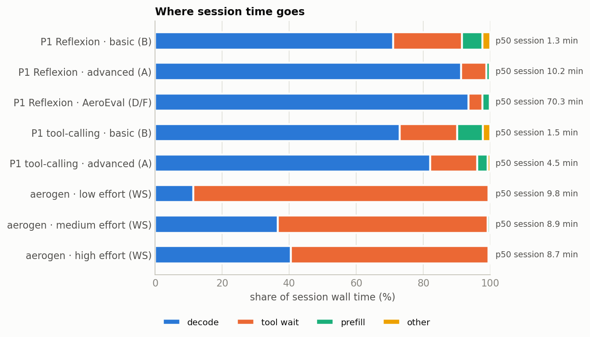
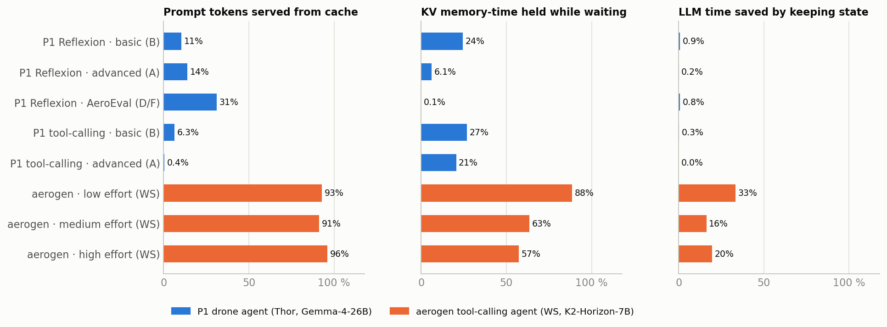
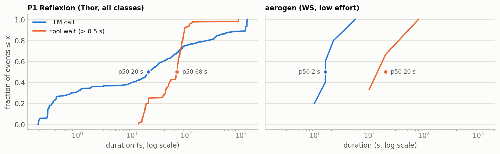
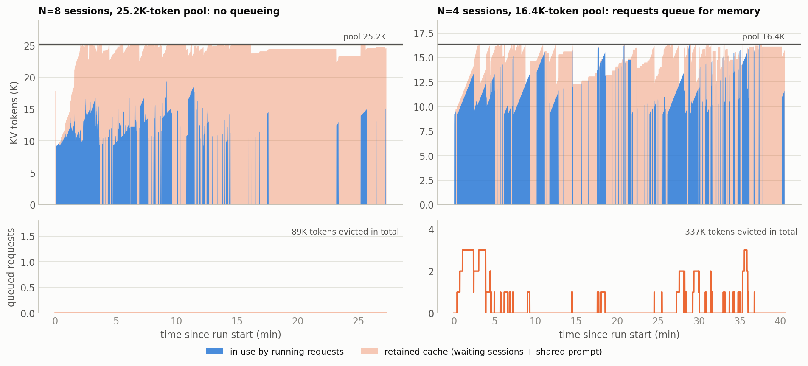
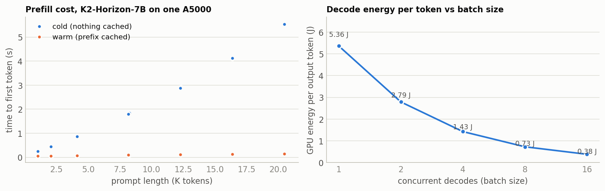

# Do the drone workloads create a retained-state opportunity?

> **Update 2026-10-04.** The cache-miss anomaly in §2 (point 6) has a better explanation than
> sliding-window state: 45 of the 47 Reflexion runs with a KV-cache eviction contain a call that
> looped to the 32K cap and filled P1's 80K-token pool. The capped calls themselves are repetition
> loops. See [`2026-10-04-drone-runaways`](../2026-10-04-drone-runaways/README.md); current
> numbers and options are in [`2026-10-02-p5-evidence`](../2026-10-02-p5-evidence/README.md).

**JouleServe-WS evidence pack · 2026-10-01 · Sai Sandesh (P5)**, prepared with Claude Code.

Data: P1's Thor traces (read-only copies) and new measurements on the 2×A5000
workstation. Every number is labelled with where it was measured. Methods, definitions and
limitations are in the [appendix](#appendix-methods-definitions-reproducibility).

## Summary

- **P1's drone agents, as implemented, give KV retention almost nothing to do.**
  - In these runs, cache hits saved at most 0.9% of LLM time.
  - Even perfect retention could save no more than the prefill share of LLM time: 1–10%.
  - Their prompts are rebuilt on every call, and thinking decodes take 90–99% of LLM time.
  - This holds for Reflexion and for P1's new tool-calling agent (§2).
- **A tool-calling drone agent with an accumulating context is different.** `aerogen_mcp`
  ran on the workstation with real-time flight pacing (§4.1):
  - 93% of prompt tokens come from cache;
  - 88% of KV memory-time is held while the drone flies;
  - keeping state saves 33% of LLM time. Most of that is a 9.1K-token system prompt shared
    by all sessions. Each session's *private* state is worth 12%.
- **Under concurrency, consolidation is the big energy lever, and the KV budget bounds it**
  (§4.2).
  - Live: 8 sessions on one GPU used 2.2× less GPU energy per passed mission than one
    session (27.8 → 12.6 kJ), at the same median mission time.
  - Live energy per mission swings with trajectories: the N=2 and N=4 runs drew long
    missions, some of which outgrew the pool. On fixed missions the simulator shows a
    2.5–3.5× drop from N=1 to N=16.
  - On the full pool, the shared prompt kept memory pressure low.
  - Capping the pool to an edge-like 16.4K brought queueing and 20.5K re-prefilled tokens
    per mission. Missions whose context exceeds the pool fail at any concurrency.
- **Simulated policy headroom** (§4.2; the memory model reproduces live re-prefill within
  7–25% when replaying the same missions):
  - dropping state at every wait costs 6–11% more energy than LRU on the full pool;
  - pinning everything stalls missions (44 min instead of 10 at N=8);
  - an exact-flight-ETA eviction oracle is no better than LRU.

  **So eviction order is not a contribution here: SGLang's default already gets most of
  the value of the state.** Whether budget-aware *admission* beats the default is the open
  hypothesis; we have not tested it yet.
- **Recommendation: Option A (§6).** Make an accumulating-context drone agent with paced
  physical waits the primary workload. Point JouleServe at admission and retention under an
  edge memory budget, and at the edge-only effects (unified memory shared with tools,
  hybrid state, board-level idle power). Keep P1's agents as the decode-dominated contrast.
  Decisions needed: §7.

---

## 1. What counts as an opportunity

A session that pauses for a tool holds KV state. The serving system can keep it, drop it
and recompute it later, offload it (CPU or SSD), or compress it. It can also change
admission and preemption for everyone else. **An opportunity exists when both hold:**

1. the best action changes with conditions we can observe (state size, wait length,
   memory pressure, how much of the state is reused), inside the realistic range; and
2. the best *fixed* rule loses meaningfully to an adaptive one. We compare against the
   best fixed rule and against SGLang's default. If the default is already as good as an
   oracle, a controller has nothing to add.

Quantities reported for each workload:

- **Prompt tokens served from cache:** how much of each prompt repeated state that was
  still cached.
- **LLM time saved by keeping state:** the prefill time those cache hits avoided, as a
  share of the LLM time the session would have spent with nothing kept.
- **Upper bound for any retention policy:** the prefill share of LLM time. A policy can
  at most remove prefill.
- **Share of KV memory-time held while waiting:** tokens held × seconds between LLM calls,
  over the same sum including the calls. It shows how much memory is at stake.

## 2. P1's drone workloads, as implemented

**Data.**
- **Reflexion:** 143 Gemma-4-26B-A4B runs from P1's final sweep on the Jetson AGX Thor
  (SGLang 0.5.16, one session at a time, cache flushed before each run, thinking on,
  `max_tokens` 32,768). By class: basic B 36 runs (33 pass), advanced A 72 (61 pass),
  AeroEval D/F 35 (8 pass).
- **Tool calling:** the first 18 runs of P1's new tool-calling sweep (started 2026-10-01
  00:17; B 12, A 6, all pass).





**What the traces show.**

1. **Decode dominates.** Thinking decodes take 71–94% of session wall time and 90–99% of
   LLM time. A Reflexion generator call writes a median 8,061 tokens (p90: the 32,768
   cap), and 115 of 1,030 Reflexion calls hit the cap.
2. **Prompts are rebuilt on every call.** Each role (generator, evaluator, reflector)
   builds a fresh prompt, so only 11% (B), 14% (A) and 31% (D/F) of prompt tokens were
   served from cache.
   - P1's tool-calling agent has the same shape. Each attempt starts a fresh prompt and
     makes exactly one `execute_and_observe` call carrying the whole program, followed by
     two evaluator calls. Reuse is 6% (B) and 0.4% (A).
3. **Retention is worth little here.**
   - The cache hits we observed saved 0.87% (B), 0.16% (A) and 0.84% (D/F) of LLM time;
     tool calling 0.28% and 0.01%.
   - Even a perfect policy, catching every miss and sharing prefixes across sessions,
     could only remove prefill: 7.9%, 1.0% and 2.3% of LLM time for Reflexion, and 9.6% and
     3.7% for tool calling.
   - The structural reason: on the Thor, prefill runs at ≈1,805 tokens/s and decode at
     ≈28 tokens/s, so recomputing a token costs about 1/65 of generating one.
4. **Concurrency should not rescue it.** This is argued from the single-session traces;
   P1 ran one session at a time, so it is not measured.
   - Paused sessions hold 0.1–27% of KV memory-time, and that state is cheap to rebuild.
   - Dropping it frees memory at almost no cost.
   - Offloading it spends PCIe transfers to avoid a near-free recompute, and on unified
     memory "offload to CPU" frees nothing.
   - SGLang's default already drops idle state first.
5. **What P1 stresses is active decode.** A-class calls peak at a median 21.7K tokens
   (max 40K), and D/F at 54K. Under concurrency these long decodes fill the pool, so the
   lever is admission and batching (H1).
   - On the WS, decode energy per output token falls 14× from batch 1 to 16 (§5). That
     curve is for a dense 7B model on an A5000; the Thor's curve for P1's MoE model still
     has to be measured.
6. **One anomaly worth checking on the devices.** A same-role call with an almost
   identical prompt should hit the cache, yet most missed (`analysis/p1_cache_misses.py`):
   - A: 73 of 116 missed, 38 of them right after a 32K-token decode;
   - D/F: 105 of 182 missed, 69 after a 32K decode.

   Our guess is that Gemma's sliding-window state is lost after long decodes (a hybrid
   effect, H3). It is not verified. The cost is small (0.26% and 1.1% of LLM time).


*Left:* a P1 Reflexion session is one long decode ramp and a short wait. The next call
starts from a smaller, rebuilt prompt. *Right:* an aerogen mission (§4) holds a growing
context through every flight leg, and each LLM step appends a little to it.



## 3. What the prior work ran

| Property | Almost all prior work | P1 drone agents |
|---|---|---|
| Context | Grows across turns (ReAct, tool calling, chat): INFERCEPT, Continuum, Autellix, Pensieve, Adaptive KV Retention (τ²-bench), KAIROS, AgentServe, CacheScout. KVFlow and TokenCake reuse fixed per-agent prefixes | Rebuilt for every role call; 0.4–31% reused |
| Output length | Tens to hundreds of tokens, reasoning off, so prefill-heavy | Thinking on, up to 32K; 71–94% of time is decode |
| Tool waits | Real tools take ms to ~2 s (Continuum: 0.9 s SWE-bench, 1.9 s BFCL). **Long waits are synthetic**: INFERCEPT's chatbot/image/TTS 17–29 s (estimated), Pensieve 60 s think time, Adaptive KV Retention ~30 min lognormal, TokenCake's latency table | Real simulator time: median 17 s (B), 72 s (A), 113 s (D/F); tail to ~15 min |
| Load | Poisson or closed-loop arrivals, tens to hundreds of sessions | One session |
| Hardware | Datacenter GPUs with large host DRAM over PCIe | Thor (unified memory) |

P1's workloads sit outside the regime these systems target, on both reuse and output
length. Injected waits are standard practice in the strongest prior work, so pairing an
accumulating-context workload with measured physical waits is a defensible design.
Details per system are in [`review/systems/`](../../review/systems/README.md).

## 4. A drone agent with accumulating context: `aerogen_mcp` on the WS

**What it is.** `aerogen_mcp` (by mayankarya, on the Thor, never run at scale before) is a
native tool-calling drone agent.
- The model flies the drone through 20 MCP tools (`takeoff`, `go_to_point`, `follow_path`,
  `hover`, `deploy_analytics`, `run_inference`, …), one call at a time.
- Every assistant turn and tool result is appended to one `messages` list per mission.
- A world-envelope guard rejects unsafe manoeuvres, and the model corrects them.

**What we changed.**
- **Agent logic:** unchanged.
- **One code change:** the kinematic sim now *waits* for the flight time it computes (real
  time; max speed 2 m/s).
- **At runtime, the driver:**
  - points the agent at K2-Horizon-7B and sets K2's sampling;
  - logs every call;
  - **removes the random system-prompt prefix** the agent adds to defeat cloud prompt
    caching. A deployed agent would not carry it, and removing it is what lets sessions
    share the system prompt in the cache. Every concurrency result below depends on that.

Details: [A2](#a2-aerogen-setup-on-the-ws).

### 4.1 One session at a time (E1: 5 tasks × 3 seeds at low effort, × 1 at medium and high)

| | Low reasoning effort | Medium | High |
|---|---|---|---|
| Missions (validator pass) | 15 (11 pass) | 5 (3 pass) | 5 (3 pass) |
| Median mission | 9.8 min, 8 LLM calls | 8.9 min, 8 calls | 8.7 min, 10 calls |
| Time share: waiting on flights / decode / prefill | 88% / 11% / 0.5% | 63% / 37% / 0.7% | 59% / 40% / 0.4% |
| First prompt → peak context (median) | 9.3K → 12.5K tokens | 9.3K → 17.1K | 9.3K → 19.1K |
| Prompt growth per LLM call (median) | 294 tokens | 668 | 667 |
| Largest context | 17.9K | 25.2K (= the pool) | 25.2K (= the pool) |
| Prompt tokens served from cache | **93%** | 91% | 96% |
| KV memory-time held while waiting | **88%** | 63% | 57% |
| LLM time saved by keeping state: all / private only | **33% / 12%** | 16% / 6% | 20% / 10% |
| GPU energy per mission (per passed mission) | 20.4 kJ (27.8 kJ); 29% of it while no call ran | 46.9 kJ (78.1 kJ) | 51.8 kJ (86.3 kJ) |

"Private only" counts just the cache hits beyond the 9.1K-token shared system prompt.

What this shows:

- **The retention trade-off is real here.** A session spends 88% of its time in flight
  holding a ~12K-token context, and 93% of the next prompt comes from the cache.
  - Dropping everything would cost a third of the session's LLM time, about 40× P1's best
    case.
  - Dropping only the session's private state would cost 12%.
- **Most of the reused state is shared.** About 9.1K of the ~12.5K tokens are the system
  prompt and tool schemas, identical for every session.
  - Under concurrency, SGLang's radix cache holds them once, and every call touches them,
    so they stay hot under any policy that is not a flush.
  - What competes for memory is each session's private history, which grows ~290 tokens
    per call at low effort and ~670 at medium/high (reasoning stays in K2's history).
- **This setup cannot judge whether reasoning effort pays off.**
  - Medium and high effort cost 2.3–2.5× the GPU energy per mission.
  - Their extra failure (task t0) was a context cut off at 25.2K tokens, the size of the
    one-GPU pool (`finish_reason=length`). That is a memory limit, not reasoning quality,
    and each effort level ran only 5 missions.
  - Reasoning-heavy concurrency does not fit one A5000, so the concurrency experiments use
    low effort.
- **Energy while no call runs is a large, attributable share.** In a single session, 29% of
  GPU energy is drawn while nothing is running: ~10 W between calls on this GPU, against
  ~181 W during calls. That is the per-session tool-wait energy no prior system reports
  (F7). On a Jetson it is board power.
- **Task 2 (radio-tower inspection with analytics) failed in every single-session run.**
  K2 ran out of its 40-turn budget. It passed once under concurrency (N=4). This is a model
  limit, not a harness issue.

### 4.2 Many sessions on one GPU (E2: closed loop, low effort, 15 missions per run)

Each row is a single live run on one A5000 running K2-Horizon-7B under SGLang's default
policy (LRU radix cache). N=1, N=2 and N=4 ran on GPU1; N=8 and the two capped-pool runs
ran on GPU0 (A2):

| Run | KV pool (tokens) | Missions: completed / errored / passed | GPU energy per mission | per passed mission | Missions per hour | Median mission | Re-prefilled tokens per mission |
|---|---|---|---|---|---|---|---|
| N=1 | 25,427 | 15 / 0 / 11 | 20.4 kJ | 27.8 kJ | 5.4 | 9.8 min | ~0 |
| N=2 | 25,427 | 7 / 3 / 6 | 34.3 kJ | 40.0 kJ | 6.9 | 6.5 min | 3.2K |
| N=4 | 25,427 | 14 / 1 / 9 | 20.5 kJ | 31.9 kJ | 17.5 | 8.4 min | 4.8K |
| **N=8** | 25,227 | 14 / 1 / 11 | **9.9 kJ** | **12.6 kJ** | **30.9** | 9.4 min | 1.8K |
| N=4, pool capped | 16,384 | 12 / 3 / 6 | 22.4 kJ | 44.8 kJ | 17.8 | 9.5 min | 20.5K |
| N=4, pool capped | 13,312 | 10 / 5 / 7 | 22.4 kJ | 32.0 kJ | 17.9 | 8.1 min | 10.6K |

- **"Errored"** means a prompt longer than the pool was refused (e.g. 26.6K tokens against
  a 25.4K pool). Such a mission fails at any N and under any policy: it is a property of
  the budget.
- **Re-prefilled tokens** are the previous prompt's tokens that the next call had to
  recompute. They are ~0 for a single session, so what is counted is caused by memory
  pressure.



1. **Consolidation is the largest energy lever.** From 1 to 8 sessions, GPU energy per
   passed mission fell 2.2× (27.8 → 12.6 kJ) and throughput rose 5.8×, with the same median
   mission time. A lone session leaves the GPU idle while the drone flies; more sessions
   fill that time and share the GPU's power (§5).
   - The two runs used different GPUs. GPU0 (N=8) idles higher than GPU1 (N=1), so the
     comparison is, if anything, conservative.
   - The N=2 and N=4 runs drew unusually long trajectories, so their energy is not
     comparable to N=1/N=8 directly:
     - At N=2, three of ten missions grew contexts of 25.5K–37.6K tokens, outgrew the pool
       and errored. Their energy is charged to the run, so its 34.3 kJ per completed
       mission is worse than N=1.
     - At N=4, two missions ran 34–38 LLM calls, and 31% of the run's time was decoding,
       against 11–14% in the other runs.
   - Every configuration ran once, at temperature 1.0, with no confidence intervals.
     Repeat runs are needed before any number here is cited.
2. **On the full pool, the shared prompt keeps pressure low.**
   - LRU fills the pool with retained cache (orange), but N=8 never queued.
   - The 89K evicted tokens over 27 minutes cost ~1.8K re-prefilled tokens per mission,
     about 90 J or 1% of mission energy.
3. **A capped, edge-like pool brings pressure.** At 16.4K with N=4:
   - requests queued (up to 3);
   - 337K tokens were evicted, and each mission re-prefilled 20.5K tokens (~1 kJ);
   - 3 of 15 missions errored (5 of 15 at 13.3K), because their contexts were larger than
     the pool.

   Energy per passed mission does not move monotonically with the cap (44.8 kJ at 16.4K,
   32.0 kJ at 13.3K). With one run each, trajectory variance and the timing of failures
   dominate.

**Simulated policy headroom.** `analysis/headroom_sim.py` replays measured missions as N
closed-loop sessions sharing one KV pool.
- **Calls:** each call needs its whole context resident. A dropped reusable prefix is
  re-prefilled at the calibrated rate.
- **Memory:** the 9.1K-token shared prompt is held once.
- **Energy:** 181 W while any call runs, and a between-call power when none does.
- **Policies:** LRU (SGLang's default), drop at every wait, keep all until resume, and an
  oracle that evicts the session whose flight will end last.

*Validation, in two modes:*
- **Same trajectories.** Replaying each live run's own missions, with that run's pool and
  measured power, reproduces its re-prefill within 6.5% (N=4, full pool), 6.8% (16.4K),
  12.9% (13.3K) and 25% (N=2).
  - At N=8, where re-prefill is small, the simulator gives half the live value (0.9K vs
    1.8K tokens per mission).
  - Energy per mission is within −23% to +38%, so the energy model is good for trends and
    rankings, not absolute levels.
- **A fixed sample.** The figure below replays the *15 single-session missions* at every N.
  Its absolute levels depend on that sample. Live missions under concurrency ran longer,
  and the fixed sample under-predicts their re-prefill by 3–34× and their energy by up to
  ~40%. It is used only to compare policies on identical missions.


The figure uses 20 W between calls. Ranges below cover 10–30 W, the measured spread: ~10 W
at N=1 and 20–32 W between calls in the concurrent runs.

- **Keeping state is worth a little.** Dropping state at every wait costs 6–11% more
  energy per mission than LRU on the full pool. On the 16.4K pool the gap is 12% at N=4
  and 0–3% at N≥8, where LRU is already evicting most of it.
- **Pinning everything is harmful.** Keep-until-resume queues calls behind held memory:
  - at N=4 on the full pool, +5–10% energy;
  - at N=8, +68–132% energy, and mission time grows from ~10 to 44 min.
- **Knowing the exact flight ETA does not help.** The oracle matches LRU within 0–6% (the
  6% only at N=16).
  - With heavy-tailed waits, the session that has waited longest is usually still far from
    resuming, so LRU's victim is already a good one (cf. INFERCEPT's elapsed-time proxy at
    93% of oracle).
  - The oracle's +19% throughput at N=16 is an end-of-run artifact: queueing and mission
    time are identical.
- **The budget matters more than the victim.**
  - With LRU at N=8, energy per completed mission is 11.5 kJ on the full pool against
    15.4 kJ on 16.4K (+34%).
  - About 15 points of that come from the 8 of 60 missions that cannot fit 16.4K at any N.
  - The consolidation curve itself (LRU, full pool) falls 2.5–3.5× from N=1 to N=16.

**So, for this workload:**
- Retained state is worth keeping, and SGLang's default already keeps it well. By §1's
  test, eviction order shows no headroom.
- What the budget changes is how far consolidation can go, plus a hard failure mode
  (contexts larger than the pool).
- Whether a budget-aware **admission** policy beats default admission is the open
  hypothesis. That covers how many sessions to co-host on a given budget, when to queue
  instead of evict, and how to handle a context that will not fit. We have not simulated
  or run admission policies yet; that is the next experiment.

## 5. Serving costs on the WS, and what changes on the edge

Measured on one A5000 (GPU0) with K2-Horizon-7B (bf16, SGLang 0.5.20, nothing else
running):



| Quantity | Measured |
|---|---|
| Cold prefill | 4,106 tokens/s at 8–20K tokens (8K: 1.8 s; 20K: 5.6 s), ≈ 0.050 J per token |
| The same prompt fully cached | 0.10–0.16 s to first token |
| Decode energy per output token | batch 1: 5.36 J (38 tok/s) · 2: 2.79 · 4: 1.43 · 8: 0.73 · 16: 0.38 J (539 tok/s); GPU power stays ~205 W throughout |
| Power with no request | 20 W on GPU0 at calibration; ~10 W between calls on GPU1 in the single-session run; 20–32 W between calls in the concurrent runs (clocks stay up) |
| KV state | 144 KiB per token (bf16); a 25,427-token pool (3.5 GiB) on one A5000 at `--mem-fraction-static 0.88` |

- **Recompute is not free here.** Re-prefilling a dropped 12K-token aerogen context costs
  ~3 s and ~600 J, about 60% of the decode energy of a typical low-effort turn (~186
  output tokens at batch 1).
- **Batching is the biggest energy lever.** Decode is bandwidth-bound, so the GPU draws
  the same ~205 W at batch 16 as at batch 1 while producing 14× the tokens. Memory held by
  paused sessions cannot hold more concurrent decodes.

**What changes on Orin/Thor** (from `review/systems/README.md` §6):
- **Speed:** Orin has ~4× less memory bandwidth than the A5000, so decode is slower and
  the same tool wait is relatively shorter.
- **Memory:** unified memory means there is no host tier, so "offload" is a copy inside
  the same DRAM. Only keep, drop and recompute, compress, or NVMe remain. Co-located
  simulators and perception models compete with KV (H4, edge only).
- **Energy:** Jetson rails measure the whole board, including CPU, DRAM and the simulator,
  so idle power during tool waits is a board-level quantity.
- **Models:** the edge models are hybrid (Gemma-4 sliding window; Qwen3.8 linear
  attention), with separate state pools and checkpoint-granular reuse. K2-Horizon-7B is a
  dense full-attention baseline.

## 6. Options

| Option | Primary workload | Why | Risks | Effort to first result |
|---|---|---|---|---|
| **A (recommended)** | An accumulating-context drone agent (`aerogen_mcp` style) with paced physical waits | Keeps the drone story and P1's devices. Waits come from flight physics. State is worth 12–33% of LLM time. The sim is pure Python, so it runs on the WS and on Jetson unchanged | Only 5 tasks today (needs a task set, or CLGSCE tasks ported to it). Owner's OK needed. The default policy already does well, so the contribution must come from admission under a budget and edge effects; that is not yet shown | Days: this report's harness already runs it |
| **A + τ²-bench** | As A, plus τ²-bench as the comparability workload | τ²-bench is what Adaptive KV Retention (the closest long-wait competitor) evaluates on | Needs a user-simulator model; waits are injected | ~1 week more |
| **B** | τ²-bench (or BFCL / ALFWorld) with injected waits | Safest comparability, established tasks | Weak edge story; every wait is synthetic | ~1 week |
| **C** | P1's agents as they are | No new workload. The lever is admission and batching of long thinking decodes (H1), which P1's predictor could drive | Not a retained-state study; close to KAIROS | Days |

In every option, P1's agents stay in the evaluation as the decode-dominated contrast. A
controller has to recognise that retention is worthless there and not make things worse.

## 7. Decisions needed

1. **Workload direction:** option A, A + τ²-bench, B or C (above).
2. **How P1 is used:** agree that P1's current agents are the decode-dominated contrast
   case, and the source of devices, measured waits and (later) the predictor.
3. **Scope:** retention only, or admission and retention under a memory budget, which is
   where the remaining value appears to be.
4. **aerogen:** ask mayankarya for permission to use and extend `aerogen_mcp`, and decide
   how to grow its task set.
5. **WS model:** keep dense K2-Horizon-7B as the baseline, and add a hybrid model (the
   Qwen3.8 family) so that hybrid state (H3) is exercised before the devices return.
6. **Statistics and thresholds:** repeat runs per configuration (seeds × N × budget) with
   confidence intervals, and go/no-go thresholds for the next stage (`planning/PLAN.md`
   §2.2).

---

## Appendix: methods, definitions, reproducibility

### A1. Definitions

- **Session:** one task attempt (P1: one run of a task instance; aerogen: one mission).
- **LLM time:** the sum of LLM call durations.
  - **Prefill** on the Thor is P1's measured time to first token.
  - On the WS it is modelled: uncached prompt tokens ÷ the calibrated cold-prefill rate
    (4,106 tokens/s), capped at the call duration. Client-side TTFT is not a clean prefill
    measure there, because the tool-call parser emits a tool call only once it is
    complete.
  - **Decode** is the rest of the call.
- **Tool wait:** a tool call longer than 0.5 s. Bookkeeping tools (connect, arm, get_pose,
  validate) return in milliseconds; they are excluded from wait statistics but not from
  session time.
- **Prompt tokens served from cache:** Σ cached prompt tokens ÷ Σ prompt tokens, from
  SGLang's `cached_tokens` usage field.
- **KV memory-time.** During a call, (prompt + completion/2) × duration. Between calls,
  (prompt + completion of the last call) × gap, i.e. what a keep-everything policy holds.
  We report the paused share.
- **LLM time saved by keeping state:** S / (LLM time + S), where S = Σ cached tokens ÷ the
  device's cold-prefill rate (Thor 1,805 tokens/s, WS 4,106 tokens/s). "Private only"
  replaces each call's cached tokens with max(0, cached − 9,103).
- **Prompt growth per LLM call:** (last prompt − first prompt) ÷ (LLM calls − 1), median
  over completed missions.
- **Re-prefilled tokens:** Σ over consecutive calls of max(0, min(prompt_i,
  prompt_{i−1}) − cached_i), per completed mission. The previous output is left out
  because K2's re-rendered history differs from the generated tokens at the think tag
  (low effort), so it is recomputed even without pressure.

### A2. aerogen setup on the WS

- **Agent:** `aerogen_mcp` by mayankarya, a private copy from the Thor
  (`/media/ssd/drone/aeroeval`, snapshot 2026-10-01). It is not vendored into this repo.
  - One `messages` list per mission; ≤40 turns, ≤80 tool calls.
  - 20 MCP tools over an AeroStack2-shaped API, with the pure-Python kinematic `sim`
    backend and the radio-tower world.
  - The deterministic mission validator runs over the executed trace.
- **Changes to the author's code:** one 6-line hook. The sim's `_advance(dt)` sleeps
  `dt / AEROGEN_PACE_SPEEDUP` seconds; all runs use real time (1.0).
- **Changes at runtime, by the driver** (`jsw/workloads/aerogen_driver.py`):
  - removes the agent's random system-prompt prefix, which exists to defeat cloud prompt
    caching. This enables cross-session prompt sharing;
  - sets sampling to K2's model-card values (temperature 1.0, top-p 0.95, seed 42 + run);
  - sets reasoning effort (low / medium / high) and `max_tokens` (16,384);
  - streams responses, and logs every LLM call and tool call with monotonic timestamps;
  - replays the reasoning under `reasoning_content`, because K2's chat template requires a
    thinking field on every assistant message and SGLang forwards only that field.
- **Server:** SGLang 0.5.20, K2-Horizon-7B bf16, tp=1 per A5000.
  - `--mem-fraction-static 0.88` gives a KV pool of 25,427 tokens on GPU1 and 25,227 on
    GPU0.
  - `--context-length 65536`, `k2_horizon` reasoning and tool parsers, metrics and cache
    report on.
  - The capped pools used `--max-total-tokens 16384` and `13312`.
- **GPU split** (independent replicas; `env/queue*.sh` record the order):
  - **GPU1, port 30000:** E1 low effort, E2 N=4, E2 N=2.
  - **GPU0, port 30001:** cost calibration, E1 high and medium effort, E2 N=4 at the 16.4K
    and 13.3K pools, E2 N=8.
- **Runs:**
  - E1: single session, with the cache flushed before each mission.
  - E2: closed loop with N session slots and staggered starts (15–30 s), with the cache
    flushed at the start of each run.
  - Each run directory holds `manifest.json`, `events.jsonl`, `nvml.jsonl` (10 Hz),
    `sglang_metrics.jsonl` (2 Hz), and per mission `llm_calls.jsonl`, `tool_calls.jsonl`,
    `mission.json`, `summary.json`.

### A3. Reproduce

```bash
# WS: serve (optionally with --max-total-tokens N to cap the pool), calibrate, run
env/launch_k2_tp1.sh 1 30000                                  # GPU1
env/launch_k2_tp1.sh 0 30001 --max-total-tokens 16384         # GPU0, capped pool
python -m jsw.costs.calibrate --base-url http://127.0.0.1:30001/v1 --gpu 0 --out calib.json
python -m jsw.workloads.aerogen_driver --out runs/e1_low_n1 --runs 3 --concurrency 1 \
    --effort low --flush-each --flush-start --gpu 1
python -m jsw.workloads.aerogen_driver --out runs/e2_low_n4 --runs 3 --concurrency 4 \
    --stagger-s 20 --effort low --flush-start --gpu 1
# local: copy runs to data/ws_runs/, then
python3 -m analysis.report_figures     # figures + report_data.json
python3 -m analysis.sim_validate       # simulator validation, policy headroom, headroom.png
python3 -m analysis.p1_cache_misses    # §2 point 6
```

### A4. Data

- `data/p1_thor_drone/`: P1 Reflexion sweep, lightweight files. Copied 2026-09-30, with
  D3/F1 added 2026-10-01.
- `data/p1_thor_toolcalling/`: the first 18 runs of P1's tool-calling sweep (2026-10-01).
- `data/ws_runs/`: the WS runs in this report.

All three are git-ignored. The Thor copies are read-only copies of P1's files.

### A5. Limitations

- **One run per configuration.** Every configuration ran once (15 or 5 missions) at
  temperature 1.0, with no confidence intervals. Trajectories vary a lot (see N=4).
  Repeat runs are needed before citing any number.
- **Different platforms.** The P1 numbers come from Gemma-4-26B-A4B (hybrid MoE) on a Thor
  with SGLang 0.5.16. The aerogen numbers come from K2-Horizon-7B (dense) on an A5000 with
  SGLang 0.5.20. Ratios (reuse, time shares) transfer better than absolute times; the
  batching curve has to be re-measured on the edge.
- **P1's concurrency behaviour is argued, not measured.** P1 ran one session at a time.
- **Small task set.** aerogen has 5 tasks in one world: a feasibility signal, not a
  benchmark. The P1 tool-calling sample is the first 18 runs of a sweep in progress.
- **GPU-only energy, and two GPUs.** WS energy is NVML GPU energy (no CPU, DRAM or
  simulator). The two A5000s idle differently, and runs were split across them (A2).
- **The simulator.** Its memory model is validated on identical trajectories (re-prefill
  within 7–25%; 2× low at N=8, where re-prefill is small); its energy model is good to
  −23%…+38%. It ignores batching's per-step slowdown and SGLang's
  retraction path, and it has no admission policies yet.
- **Low-effort history mismatch.** K2's re-rendered history uses the high-effort think tag,
  so at low effort each turn's last output is re-prefilled (a few hundred tokens). The
  re-prefill metric excludes it (A1).
