# JouleServe (P5): drone and traffic evidence, and options

**2026-10-05 · Sai Sandesh (P5)**, prepared with Claude Code.

This is the repo copy of the Claude Doc
[JouleServe (P5): drone and traffic evidence, and options](https://claude.ai/code/artifact/474eee56-2e2f-44f9-8b97-f7bb51b588c7),
which is private until Sandesh shares it. It merges the detailed reports, which remain the reference for methods:
[`2026-10-01-workload-opportunity`](../2026-10-01-workload-opportunity/README.md),
[`2026-10-01-p1-task-overview`](../2026-10-01-p1-task-overview/README.md),
[`2026-10-02-stepwise-d1`](../2026-10-02-stepwise-d1/README.md),
[`2026-10-03-admission-sim`](../2026-10-03-admission-sim/README.md),
[`2026-10-04-drone-runaways`](../2026-10-04-drone-runaways/README.md) and
[`2026-10-05-p1-repo`](../2026-10-05-p1-repo/README.md) (P1's repository, drone and traffic).

- The doc's charts and diagrams appear here as tables, figures and Mermaid diagrams.
- P1's figures are unpublished, so they are kept out of this public repository. The doc embeds them; here a
  one-line note names the P1 slide or file, and the images live in the git-ignored `../*/p1_figures/`.
- Rewritten on 2026-10-05 with P1's repository (drone and traffic). The professor meeting planned for
  Mon 5 Oct is postponed (P1's deadline is Sat 10 Oct, and other lab projects too); its new date is not set.

P1's agents, drone and traffic, leave an edge serving system little retained state to manage. The traffic
agent keeps one growing conversation and gets 56–82% of each prompt from the prefix cache, yet keeping its
state saved only 1–4% of LLM time on P1's Jetsons, and no retention policy could save more than 1.7–7.2%. With
1–8 agents per device at each device's real KV pool, no memory policy beats SGLang's default by more than 2.4%
(simulated): the drone result (at most 9.9%) holds for traffic too. Where memory binds, on the Orins, the loss
is capacity, which configuration recovers: doubling the pool cuts energy per completed task by 31–46% at 8
agents.

The energy is in runaway decodes. Calls that hit their output-token limit take 38–69% of the board energy on
Thor gemma (67–69% for the drone agents, 38% for traffic) and 33% on Orin 32 gemma-E4B traffic, against 0–19%
everywhere else. In drone runs they are repetition loops (121 of
122 Reflexion calls, 127 of 127 tool-calling calls capped at 32K); in traffic the waste is a capped tool call
that is dropped and retried until it caps again. P1's paper now reports the loop finding itself, with an
offline detector and a stop-at-first-cap bound, and has dropped its early-abort plan. We still lean towards
option A, decode-side energy on P1's agents, coordinated with P1. The professor makes that call; the meeting is
postponed.

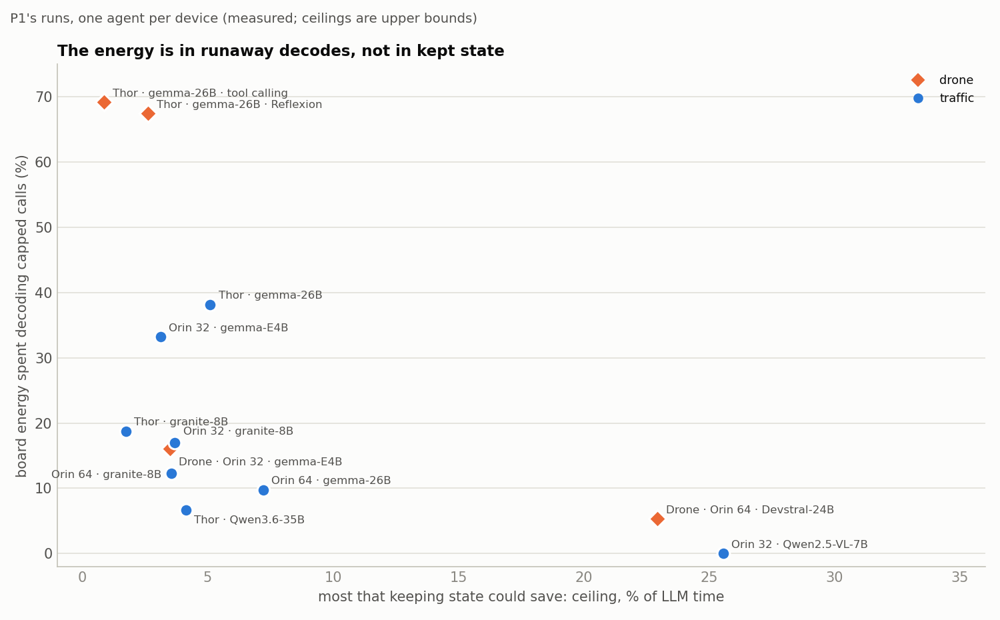

## Summary

1. **P1's repository arrived on Mon 5 Oct.**
   - 2,055 runs in 11 configurations, 434 h and 21.3 kWh of measurement (P1's inventory).
   - 3 drone cells are graded; the 8 traffic cells are not, so a traffic run "completes" or fails.
   - Thor drone tool calling is not in it; we keep using our copy (104 runs).
2. **P1's drone agents leave nothing to manage.**
   - Any retention policy could save at most 2.1% (Reflexion) or 0.6% (tool calling) of their LLM time
     (Thor traces, r ≈ 67).
   - The prefix cache actually saved 0.5% and 0.2%.
3. **The traffic agent keeps one growing conversation.**
   - Every prompt repeats the previous one: the cached tokens equal the previous prompt in 81–100% of
     call pairs.
   - The context grows a median 0.4–2.7K tokens per step, 67–90% of it tool output, up to 106K tokens on
     Thor.
4. **But keeping its state is worth 1–4% of LLM time** (measured; ceiling 1.7–7.2% at each configuration's
   own price of a generated token; Qwen2.5-VL 15% and 26%).
   - Outputs are a median 424–999 tokens per call, reasoning included (107 for Qwen2.5-VL).
   - A generated token costs 117–312 prefilled ones in time on these Jetsons.
   - The state idles a median 1.0–2.8 s between calls.
5. **No prompt is shared between traffic sessions.** Every system prompt opens with the current date and
   time, so two sessions share about 39 characters.
6. **The vision tool fills the KV pool at one agent per device.**
   - `ask_vlm` sends a median 8–23 and up to 45 concurrent requests to the agent's own server.
   - On Orin 64 gemma it fills 99.5% of the 12.4K-token pool and evicts the paused context before all 62
     calls that follow it: 90% of the prefix is recomputed, 0.6% of LLM time.
7. **Many agents per device: SGLang's default matches every policy** (simulated at real KV pools).
   - Traffic: within 2.4% in 48 cells (1–8 agents, 6 configurations). Drones: within 9.9% in 455 cells.
   - On the Orins the gap to unlimited memory reaches 33–64% at 8 agents. Doubling the pool, about what an
     FP8 KV cache buys, cuts energy per completed task by 31–46%.
8. **Capped calls hold the energy on gemma:** 38–69% of board energy on Thor gemma (drone 67–69%, traffic
   38%) and 33% on Orin 32 gemma-E4B traffic; 0–19% everywhere else (Orin 64 gemma traffic 10%; measured).
9. **Drone runaways are repetition loops.**
   - 121 of 122 capped Reflexion calls (with P1's 144th run) and 127 of 127 tool-calling calls capped at
     32,768.
   - An online loop stop would save 43.5% and 35.7% of board energy (upper bound) and stop no call that
     finished on its own.
10. **Traffic caps are repeated tool-call caps.**
    - A cap inside a tool call drops the call, and the agent retries: 121 of Thor gemma's 158 capped calls
      follow a capped call.
    - Stopping a run at its second consecutive cap saves 27% (Thor gemma, 1 completed run lost) and 25%
      (Orin 32 gemma-E4B, 7 lost).
11. **The agent design is still the big lever on drones.** A step-wise agent uses 5–13× less energy per
    success than P1's Reflexion on P1's delivery tasks, 0.9–9.6× under the strict check (projected to the
    Thor).
12. **P1's paper and P5 now overlap on loops.**
    - P1 reports the loop finding with an offline detector and a stop-at-first-cap bound (50.2%, losing 22
      passing runs), and has dropped its early-abort plan. It assumes one request in flight.
    - Five corrections go back to P1 (below): the vision tool's mechanism, the loop threshold, the Orin 32
      evaluator caps, the Orin 64 context guard and Devstral's cache.

**The most kept state could save** (P / (P + r·O) as a share of LLM time, at the Thor's r ≈ 67; the doc's
summary chart):

| Agent | Data | Ceiling | Of which: each drone's private history |
| --- | --- | --- | --- |
| P1 Reflexion | Thor, 143 runs | 2.1% | none (prompts rebuilt each call) |
| P1 tool calling | Thor, 104 runs | 0.6% | none (prompts rebuilt each call) |
| aerogen on its own tasks, K2-Horizon-7B low effort | WS, 15 missions | 50% | 13% |
| Step-wise on P1's D1: Qwen3.5-9B, no thinking, greedy | WS, 6 missions | 71% | 7.7% |
| Step-wise on P1's D1: Qwen3.5-9B, no thinking, sampled | WS, 9 missions | 68% | 10% |
| Step-wise on P1's D1: Qwen3.5-9B, thinking, sampled | WS, 9 missions | 53% | 11% |
| Step-wise on P1's D1: K2-Horizon-7B, low effort | WS, 9 missions | 49% | 9.9% |
| Step-wise on P1's D1: K2-Horizon-7B, high effort | WS, 9 missions | 36% | 16% |
| Step-wise on P1's D1: Qwen3.5-9B, thinking, greedy (one runaway) | WS, 6 missions | 20% | 2.9% |

- P is the reused prompt tokens, O the output tokens, and r the cost of one output token over one
  prefilled token.
- The private part is what a retention policy decides about under memory pressure; the rest is the shared
  prompt, which the radix cache keeps once.
- The traffic agent, which is P1's own and not step-wise drone flying, is in §"Traffic" below: 1.7–7.2% at
  each configuration's own r.

## What P5 asks

P5 (JouleServe) asks how an edge LLM serving system should manage the state an agent session holds while it
waits for a tool. The goal is to minimise **energy per successful task** on Jetson Orin and Thor.

- **The state:** the KV cache, plus the sliding-window or recurrent state of hybrid models such as Gemma-4
  and Qwen3.6.
- **The choices:** keep it, drop it and recompute it later, offload or compress it, or change admission so
  that idle state does not block active work.
- **Where a contribution must come from:**
  - Generic "keep KV across tool pauses" is published: INFERCEPT, Continuum, TokenCake, Adaptive KV
    Retention and CacheScout, plus KAIROS for energy.
  - What the edge changes is still open: unified memory, shared bandwidth and power, hybrid models, tools
    that run models on the same board, and waits of seconds to minutes. Thermal state is out at room
    temperature: P1 saw no throttling in 434 h.
- **Dependence on P1:** P5 uses the devices and workloads of P1 (EdgeAgentBench: closed-loop drone and
  traffic tasks on Orin and Thor). The devices stay with P1 until its deadline (Sat 10 Oct), so P5 works on
  a 2×A5000 workstation ("the WS") in the meantime.

**Why prior work does not settle it.** P1's agents sit outside the regime the published systems target.

| | Published KV-retention systems | P1's drone agents | P1's traffic agent |
| --- | --- | --- | --- |
| Context | Grows across turns (ReAct, tool calling, chat) | Rebuilt for every role call | Grows across steps; each prompt repeats the previous one |
| Output per call | Tens to hundreds of tokens, reasoning off | Thinking on, up to 32,768 tokens | Thinking on, median 424–999 tokens, cap 8,000 |
| Tool waits | Real tools ms to ~2 s; long waits injected (17 s to ~30 min) | Simulated flights: median 17–113 s, up to ~15 min | Most tools 0.5–3 s; the vision tool a median 53–158 s |
| Load | Tens to hundreds of concurrent sessions | One session per device | One agent per device, but the vision tool sends 8–45 requests at once |
| Hardware | Datacenter GPUs with host DRAM over PCIe | Jetson AGX Thor, unified memory | Thor, Orin 64 and Orin 32; windows of 12K–110K tokens |

## When kept state is worth anything

Keeping a paused session's state saves only the prefill of its next call. So the most any retention policy
can save on one call is:

```
saving ≤ P / (P + r · O)
```

- **P** is the prompt tokens of the next call that repeat state already cached. How the agent builds its
  prompts sets it.
- **O** is the output tokens of the next call, reasoning included. How much the model thinks sets it.
- **r** is the cost of one output token over one prefilled token.
  - On the Thor it is about 67 for P1's drone agent: cold prefill runs at 1,811 tokens/s against decode at
    ~27 tokens/s (Gemma-4-26B-A4B, P1's traces).
  - Across P1's 12 configurations it is 52–312 by time (measured: each configuration's cold-prefill
    tokens/s over its batch-1 decode tokens/s).
  - P1's energy fits put it at 46–1,335× (average and marginal prices).
  - Batching makes each decoded token cheaper, which lowers r and raises every ceiling; at batch 16 on the
    WS the energy ratio is about 8.

The task enters neither P nor O. It sets how many calls and waits there are, and how long each wait lasts. On
the Thor, re-prefilling a 20K-token context costs as much as decoding ~300 tokens.

**What counts as an opportunity.** Two things must hold:
- the best action changes with conditions a controller can observe (state size, wait length, memory
  pressure, reuse), within the realistic range;
- the best fixed rule, SGLang's default included, loses meaningfully to an adaptive one.

In practice, kept state is worth managing only when four things hold together:

1. the context accumulates across tool calls;
2. there are many waits per task, long enough for state to be evicted;
3. each step's output is short, so prefill is a real share of LLM time;
4. memory is contended: several agents per device, or other models sharing it.

| Condition | P1's drone agents | aerogen on its own tasks | Step-wise agent on P1's D1–D3 | P1's traffic agent |
| --- | --- | --- | --- | --- |
| Context accumulates | No: prompts rebuilt per role call | Yes | Yes | Yes: prompts never shrink |
| Many long waits | No: at most 3 flights per run | Yes: ~14 calls per mission, 88% of time in flight | Yes: 13–22 calls per mission | No: 2–6 calls per run, idle a median 1.0–2.8 s |
| Short steps | No: median 538–3,406 output tokens per call | Yes: median 44 after a wait | Yes: median 55–99 after a wait | No: median 424–999 (107 for Qwen2.5-VL) |
| Memory contended | No: one session per device | Only with a capped pool | Not yet tested (at most 2 sessions) | On the Orins: windows end 11–21% of runs, vision bursts fill the pool |

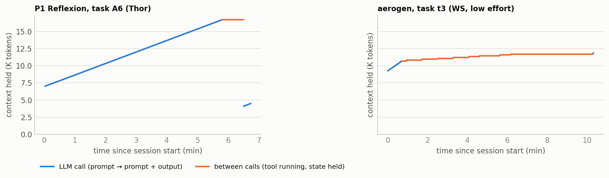

- **Left:** a P1 Reflexion session is one long decode ramp and a short wait. The next call starts from a
  smaller, rebuilt prompt.
- **Right:** an aerogen mission holds a growing context through every flight leg, and each step appends a
  little to it.

## P1's workloads

### Drone

P1's drone set is 16 tasks: 12 CLGSCE tasks in AirSim and 4 AeroEval tasks in Aerostack2 + Gazebo. Each is
run on 3 instances × 3 runs, which is 144 runs per configuration.

- **CLGSCE** (headless AirSim, deterministic validator):
  - basic: B5, B13, B29, B37 (runs of 1–3 min);
  - advanced: A3, A5, A6, A7, A8, A9, A16, A20, which are geometric patterns such as squares and
    figure-eights with 5–9 m legs.
- **AeroEval** (an LLM code validator, then a Gazebo flight check): D1 ordered three-stop delivery, D2
  delivery via a checkpoint, D3 two out-and-back deliveries, F1 farm perimeter survey.
- **Three graded drone configurations are in the repository:**

  | Configuration | Runs | Tasks | Passed |
  | --- | --- | --- | --- |
  | Thor, gemma-4-26B-A4B, Reflexion | 144 | 16 | 71% |
  | Orin 64, Devstral-24B (FP8), tool calling | 144 | 16 | 31% |
  | Orin 32, gemma-4-E4B, tool calling | 108 | 12 (AirSim only) | 47% |

  Our copy of P1's Thor gemma tool-calling sweep (104 runs, 12 CLGSCE tasks) is the fourth; the repository
  does not hold it yet.

**The AeroEval family.** There are 5 original AeroEval missions. P1 wrote 6 variants on 2026-09-04, giving 9
distinct missions, of which P1 kept 4. Flight times are estimates from the task text at 2 m/s, except D1's
measured mission.

| Mission | Origin | In P1's sweep | Needs perception | Real flight time (est.) |
| --- | --- | --- | --- | --- |
| Ordered three-stop delivery | AeroEval delivery, P1 variant | D1 | no | ~13 min (P1's README: a ~770 s mission over a 645 m route) |
| Delivery via a checkpoint | P1 variant | D2 | no | ~5 min |
| Two out-and-back deliveries | P1 variant | D3 | no | ~10 min |
| Farm perimeter survey (14–26 m plot) | AeroEval farm survey | F1 | camera recording only | ~1 min |
| Farm lawnmower survey | P1 variant | no | no | ~15–20 min |
| Concentric circles (radii 75 to 30 m) | P1 variant | no | no | ~24 min |
| Radio towers: search 180 × 240 m, inspect each | AeroEval | no | tower detection | 20+ min |
| Powerline cable following | AeroEval | no | cable detection | open-ended |
| Search 8 × 4 m, then track a person | AeroEval | no | person detection and tracking | open-ended |

P1 kept the small missions and dropped the large-area and perception ones. P1's Gazebo stack has worlds only for
delivery and the small farm plot, and it runs at 10× real time.

**aerogen is related to AeroEval, but it is not P1's workload.**

| | AeroEval (the lab's original) | P1's AeroEval agent | aerogen_mcp (mayankarya) |
| --- | --- | --- | --- |
| What the model produces | One complete drone program | One complete Aerostack2 program per attempt | One tool call per flight action (20 tools) |
| Context across steps | Rebuilt per stage | Rebuilt per role call | One growing conversation |
| Tasks | 5 missions | D1–D3, F1 | 5 samples of its own, in the radio-tower world |
| Simulator | None (static validation) | Gazebo at 10× real time | Kinematic sim, or real Aerostack2 |

Our aerogen runs measure the step-wise paradigm; the deciding test below runs that paradigm on P1's own tasks.
aerogen's author, Mayank Arya, also writes P1's analysis and paper.

### Traffic

P1's traffic agent answers questions about city traffic cameras ("peak hour count", "was there an accident",
"plot a stacked area chart"). It is native tool calling: one growing conversation, at most 20 steps, a
8,000-token output cap per call, temperature 0, thinking on.

- **Tasks:** 28 tasks × 3 instances (camera, day, time window) × 3 repeats = 252 runs per configuration;
  granite runs 21 tasks (no image tasks).
- **Tools (7):** a traffic data query, Python, camera frames, a vision model (`ask_vlm`), location lookup,
  geocoding and web search.
- **Grading:** deterministic scripts exist, but grades are not in the data yet. A run "completes" (no harness
  failure) or ends by giving up after 20 steps (`no_convergence`) or by overflowing the window
  (`input_ceiling`).

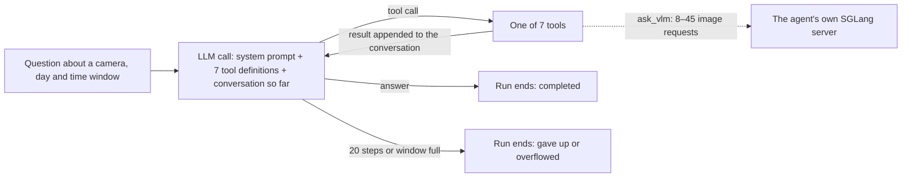

The vision tool calls back into the same server the agent uses (§"The vision tool"), and every prompt repeats
the conversation so far (§"Traffic").

| Configuration | Runs | Tasks | Completed | Hours | kWh | KV pool (tokens) | Window (tokens) |
| --- | --- | --- | --- | --- | --- | --- | --- |
| Thor · gemma-4-26B-A4B | 252 | 28 | 88% | 43.8 | 3.02 | 247K | 110,000 |
| Thor · granite-4.2-8B | 189 | 21 | 84% | 46.1 | 3.51 | 493K | 110,000 |
| Thor · Qwen3.6-35B-A3B (FP8) | 84 (instance A) | 28 | 96% | 11.6 | 0.59 | 2.77M | 110,000 |
| Orin 64 · gemma-4-26B-A4B | 252 (227 traces) | 28 | 67% | 24.5 | 0.72 | 12.4–13.1K | 12,288 |
| Orin 64 · granite-4.2-8B | 189 | 21 | 71% | 52.2 | 2.09 | 32,768 | 26,624 |
| Orin 32 · granite-4.2-8B | 189 (178 traces) | 21 | 70% | 68.4 | 2.82 | 26–27K | 26,624 |
| Orin 32 · gemma-4-E4B | 252 | 28 | 99.6% | 42.1 | 1.50 | 70–71K | 32,768 |
| Orin 32 · Qwen2.5-VL-7B | 252 | 28 | 99% | 3.5 | 0.13 | 114K | 32,768 |

P1's inventory (counts, hours and energy as P1 reports them). Same model on several devices: gemma-4-26B-A4B on
Thor and Orin 64; granite on all three.

## P1's repository

The repository (`dream-lab/edge-agent-bench`, cloned read-only on Mon 5 Oct at `3c47ebc` of Sun 4 Oct 19:02)
holds P1's raw runs, its analysis pipeline and the paper draft.

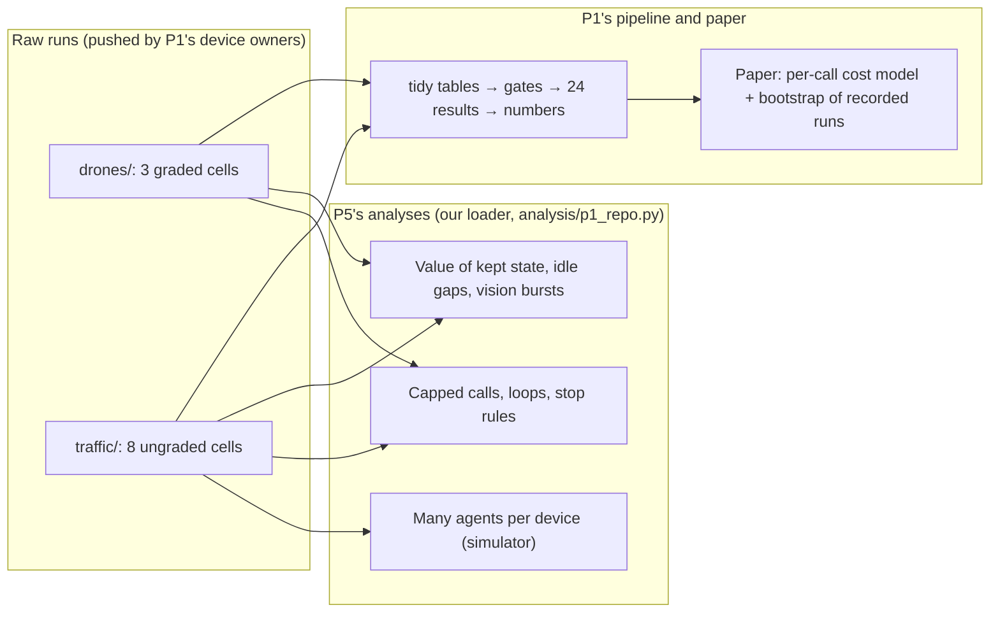

- **What it records per run:**
  - drone: every call's full text, tokens, cached tokens, finish reason, timings and board energy; every
    tool call; device samples and server KV samples every 0.2 s;
  - traffic: per-call tokens, timings and energy; the text in the trace's turns; one vitals stream with 1 s
    KV samples.
- **What is missing:**
  - Thor drone tool calling (planned in P1's tracker);
  - traffic grades (`final_result` is empty everywhere);
  - a finish reason in traffic, so a capped call is one that reached 99% of its granted budget;
  - the text of most capped gemma traffic calls: a cap inside a tool call makes the parser drop the
    partial call;
  - per-call cached tokens on the two Orin drone servers (always 0).
- **Format:** the drone runs are byte-identical to our earlier copies; only gzip support was needed. The
  missing D2 run is complete.
- **P1's pipeline** does not install offline here, so we read the raw files with our own loader. It has no
  concurrency, batching, retention or early-abort code, and its microbenchmarks MB1–MB7 are scripted but not
  run.

## P1's drone agents as they run today

Any retention policy could save at most 0.3–14% of LLM time per task, and 0.3–3.2% on every task longer than
10 minutes.
- **The bound** here is the measured prefill share of LLM time. It exceeds 4% only on the 1–3-minute basic
  tasks.
- **What was actually saved:** the cache hits seen saved ≤ 0.9% per task class, and at most 2.1% on any one
  task (B37).
- **Data:** Thor traces of Gemma-4-26B-A4B on SGLang 0.5.16, one session at a time, cache flushed before
  each run, thinking on, up to 32,768 output tokens per call.

| Task | Reflexion: passed | Reflexion: min per run | Reflexion: bound | Reflexion: 32K-capped calls | Tool calling: passed | Tool calling: min per run | Tool calling: bound | Tool calling: 32K-capped calls |
| --- | --- | --- | --- | --- | --- | --- | --- | --- |
| B5 | 9/9 | 1.2 | 9.9% | 0 | 9/9 | 1.6 | 10.4% | 0 |
| B13 | 9/9 | 1.0 | 14.0% | 0 | 9/9 | 1.4 | 10.4% | 0 |
| B29 | 9/9 | 1.8 | 6.1% | 0 | 9/9 | 1.6 | 8.5% | 0 |
| B37 | 6/9 | 2.8 | 6.5% | 0 | 6/9 | 2.8 | 8.6% | 0 |
| A3 | 9/9 | 2.9 | 4.0% | 0 | 9/9 | 5.2 | 3.2% | 0 |
| A5 | 9/9 | 10.0 | 1.2% | 3 | 9/9 | 4.5 | 3.6% | 0 |
| A6 | 9/9 | 7.3 | 1.7% | 0 | 2/9 | 78.8 | 0.5% | 22 |
| A7 | 8/9 | 36.4 | 1.0% | 6 | 0/9 | 71.5 | 0.7% | 17 |
| A8 | 7/9 | 27.8 | 0.9% | 5 | 6/9 | 61.8 | 0.8% | 17 |
| A9 | 9/9 | 31.8 | 1.0% | 11 | 1/9 | 96.6 | 0.3% | 38 |
| A16 | 1/9 | 68.6 | 0.8% | 21 | 7/8 | 31.1 | 0.9% | 6 |
| A20 | 9/9 | 7.6 | 1.9% | 0 | 3/6 | 102.4 | 0.3% | 27 |
| D1 ordered delivery | 5/9 | 67.5 | 2.2% | 22 | not in sweep | | | |
| D2 checkpoint | 3/8 | 19.5 | 3.2% | 2 | not in sweep | | | |
| D3 out-and-back | 0/9 | 57.0 | 2.3% | 18 | not in sweep | | | |
| F1 farm survey | 0/9 | 72.6 | 2.1% | 27 | not in sweep | | | |

- **Reflexion:** our 143-run copy. The repository's 144th run (D2, instance 3, run 3) ended partial after
  a 32,768-token generator loop and 90,387 evicted tokens.
- **Tool calling:** 104 of the 108 runs of P1's CLGSCE sweep, as of 2026-10-03 16:16.

**Why the bound is so small:**
- **P is small.** Each attempt writes the whole flight program, one tool call executes it, and every role call
  (generator, evaluator, reflector) starts a new prompt. Only 0–53% of prompt tokens come from cache.
- **O is large.** Thinking decodes take 71–94% of session wall time and 86–99% of LLM time per task. A
  generator call writes a median of ~8K tokens.
- **Bigger tasks make it worse.** In the tool-calling sweep, 127 of 571 LLM calls hit the 32K cap. Those calls
  take 70% of all LLM time (43.0 of 61.1 h), and 30 of the 34 failures include one.
- **The AeroEval runs rarely fly.** D1 flew 8 times in 9 runs and F1 never did, because the LLM code
  validator rejected the programs first.
- **There is no memory pressure.** One session per device; its context (≤ 55K tokens) fits P1's 80K-token
  pool. In simulation with 1–16 drones per Thor, P1's agents gain at most 1.6% from kept state.

**The cache-miss anomaly is explained.** Most same-role calls that repeat an earlier prompt missed the cache (73
of 116 for advanced tasks, 105 of 182 for AeroEval), often right after a 32K decode. P1 reports KV-cache
evictions in 33% of its drone runs, and 45 of those 47 runs contain a call that looped to the cap: the loop
and the earlier cached prompts overflow P1's 80K-token pool. It costs 0.3–1.1% of LLM time.

**P1's two agents on the same 12 CLGSCE tasks** (Thor, measured): the tool-calling agent spends 2.9× the energy
per success of Reflexion, and runaway thinking is the reason.

| | Reflexion | Tool calling |
| --- | --- | --- |
| Runs, passed | 108, 94 (87%) | 104, 70 (67%) |
| Board energy per run / per success | 69 / 79 kJ | 155 / 231 kJ |
| Long advanced tasks (A6–A9, A20): passed, median time | 42 of 45, 10 min | 12 of 42, 87 min |
| Calls that hit the 32K cap | 46 of 403, 57% of LLM time | 127 of 571, 70% of LLM time |

## Traffic: the context accumulates, but there is little to save

The traffic agent is the accumulating-context agent our drone analysis said P1 lacked. Keeping its state still
saves only 1–4% of LLM time, because each step decodes hundreds of tokens and the state idles for seconds.

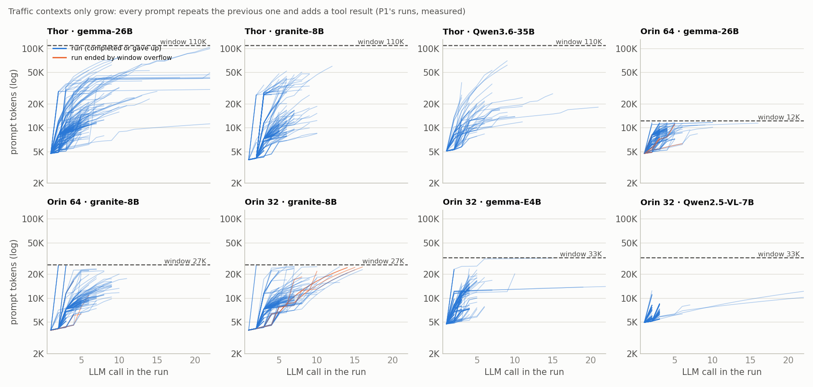

- **The context only grows.** No prompt is shorter than the one before it; the cached tokens equal the
  previous prompt in 81–100% of call pairs (Qwen3.6, a hybrid model reused at checkpoints, is the 81%).
- **Each step adds a median 0.4–2.7K tokens,** 67–90% of it tool output. The first prompt is 3,966–5,117
  tokens, almost all of it the system prompt and the 7 tool definitions.
- **On Orin 64 gemma the 12,288-token window ends runs** (P1: 21% of its runs overflow; 14% and 11% for
  granite on Orin 64 and Orin 32).

**What keeping the state saves, all 12 configurations** (the doc's chart):

| Configuration | Saved by the cache (measured) | Ceiling at own r | r (time) |
| --- | --- | --- | --- |
| Drone · Thor · gemma · Reflexion | 0.5% | 2.6% | 63 |
| Drone · Thor · gemma · tool calling | 0.2% | 0.9% | 52 |
| Drone · Orin 64 · Devstral | 8.7%* | 22.9% | 86 |
| Drone · Orin 32 · gemma-E4B | 1.2%* | 3.5% | 64 |
| Traffic · Thor · gemma | 3.9% | 5.1% | 147 |
| Traffic · Thor · granite | 1.1% | 1.7% | 312 |
| Traffic · Thor · Qwen3.6 | 3.0% | 4.1% | 276 |
| Traffic · Orin 64 · gemma | 4.2% | 7.2% | 118 |
| Traffic · Orin 64 · granite | 2.6% | 3.5% | 127 |
| Traffic · Orin 32 · granite | 2.8% | 3.7% | 127 |
| Traffic · Orin 32 · gemma-E4B | 2.1% | 3.1% | 147 |
| Traffic · Orin 32 · Qwen2.5-VL | 14.6% | 25.6% | 117 |

\* The Orin drone servers report no cached tokens: what a working cache would save, from the share of each
prompt that repeats an earlier prompt's text.

- **Saved by the cache:** cached tokens at the configuration's own cold-prefill rate, as a share of what LLM
  time would have been with nothing kept. **Ceiling:** P / (P + r·O) over every call after a run's first, P =
  all its prompt tokens (an upper bound).
- Source: P1's runs, one agent per device (`analysis/p1_opportunity.py`).

**Why traffic still has little to save:**

| Configuration | Calls per run | Output per call (median) | Prefill share of LLM time | Prompt from cache | Idle gap median / p90 | Paused share of KV time |
| --- | --- | --- | --- | --- | --- | --- |
| Thor · gemma | 5 | 844 | 2.4% | 82% | 2.2 / 23 s | 3.6% |
| Thor · granite | 5 | 906 | 1.4% | 71% | 2.1 / 3.1 s | 1.3% |
| Thor · Qwen3.6 | 4 | 424 | 2.1% | 75% | 2.8 / 56 s | 17.0% |
| Orin 64 · gemma | 3 | 592 | 4.0% | 58% | 1.2 / 81 s | 16.4% |
| Orin 64 · granite | 5 | 963 | 1.5% | 72% | 1.0 / 4.0 s | 1.5% |
| Orin 32 · granite | 6 | 999 | 1.3% | 78% | 1.1 / 7.3 s | 0.9% |
| Orin 32 · gemma-E4B | 3 | 545 | 1.8% | 62% | 1.2 / 74 s | 8.4% |
| Orin 32 · Qwen2.5-VL | 2 | 107 | 15.5% | 56% | 1.0 / 4.0 s | 14.2% |

- **Decode dominates:** prefill is 1.3–4.0% of LLM time (15.5% for Qwen2.5-VL, which writes 107 tokens per
  call), and a generated token costs 117–312 prefilled ones in time.
- **The state idles for seconds:** most tools take 0.5–3 s. The long gaps (p90 up to 81 s) are the vision tool,
  which keeps the server busy (next section).
- **Paused state is a small share of KV memory-time** (1–17%): the KV is mostly held by calls that are
  running.
- **No shared prefix:** every traffic system prompt opens with "CURRENT DATE/TIME (UTC): …", so two sessions
  share about 39 characters. The fixed part (system text and tool definitions, 3,926–5,071 tokens) is private
  to each session; on Orin 64 gemma it is 38% of the window (P1's figure).

P1's figure (repo, `why09_window_budget`): the fixed tool definitions take 38% of Orin 64 gemma's window. Not in
this repository.

## The vision tool fills the KV pool at one agent per device

P1 describes `ask_vlm` as a second model on the same GPU. The server's own counters show something else: during
an `ask_vlm` call, the agent's own SGLang server runs many requests at once. On a small pool the burst evicts
the paused agent's context.

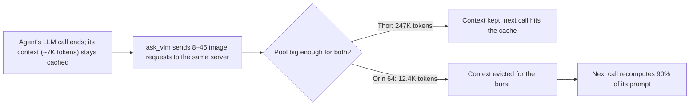

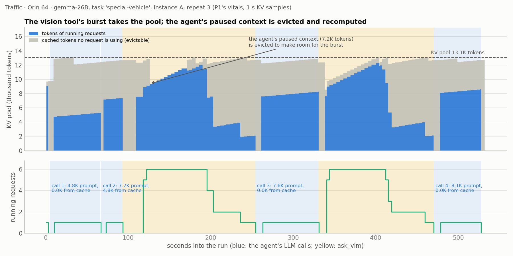

| Configuration | ask_vlm calls | Running requests during it (median / max) | Peak KV in use during it (share of pool) | Next call missed its prefix (> 64 tokens) | Prefix recomputed | Recompute, share of LLM time |
| --- | --- | --- | --- | --- | --- | --- |
| Traffic · Thor · gemma | 82 | 18 / 45 | 48.9K (20%) | 0 of 82 | 0.0% | 0.0% |
| Traffic · Thor · Qwen3.6 | 91 | 10 / 12 | 32.2K (1%) | 17 of 81 | 15% | 0.13% |
| Traffic · Orin 64 · gemma | 64 | 8 / 20 | 12.3K (99.5%) | 62 of 62 | 90% | 0.56% |
| Traffic · Orin 32 · gemma-E4B | 50 | 23 / 24 | 52.0K (73%) | 12 of 50 | 30% | 0.06% |

- **The mechanism.** During the tool, 81–90% of samples have more than one running request, against at most
  0.4% outside its windows. After any other tool, misses are absent (0 of 498 calls on Orin 64 gemma).
  Qwen3.6 also misses after other tools (51 of 274): its hybrid state is reused only at checkpoints.
- **Why it costs little:** prefill is cheap. 421K recomputed tokens on Orin 64 gemma are 0.6% of its LLM
  time.
- **Why it matters for P5:** it is the clearest case in P1's data of memory that changes during one agent's
  run (option D). The burst is predictable, since the tool is known when it is called, so the paused context
  could be pinned or the burst admitted at lower concurrency. The prize is bounded by the same prefill
  economics.
- **The tool's energy:** P1 measures `ask_vlm` as 5% of traffic tool calls but 62% of tool energy (median 73
  s and 3.7 kJ per call). In our energy split it is 20–24% of board energy on Orin 64 gemma and Thor Qwen3.6.
- **Caveat:** "same server" is read from `kv_num_running_reqs` on the agent's SGLang endpoint during the tool's
  window; we have not read the tool's code.

P1's figure (deck of 3 Oct, slide 401): `ask_vlm` is 5% of tool calls and 62% of tool energy. Not in this
repository.

## Capped calls: loops in drone, repeated caps in traffic

Calls that hit their output-token limit hold the energy in both domains. In drone runs they are repetition
loops that an online stop can cut without touching a finished call. In traffic the waste is a capped tool call
that is dropped and retried until it caps again.

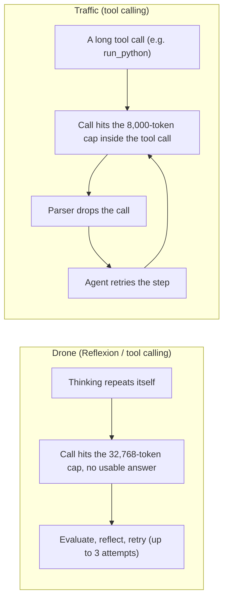

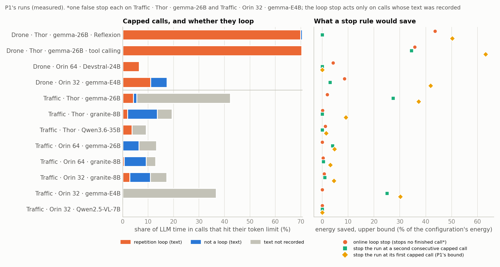

| Configuration | Capped calls | Share of LLM time | Loops (our detector) / with text | P1's rule | Online loop stop | Stop at 2nd consecutive cap | Stop at first cap (P1's bound) |
| --- | --- | --- | --- | --- | --- | --- | --- |
| Drone · Thor · Reflexion | 122 | 71% | 121 / 122 | 94 / 122 | 43.5%, 0 finished calls stopped | 0.0% | 50.2%, 22 passing runs lost |
| Drone · Thor · tool calling | 143 (16 at 1,024) | 71% | 127 / 143 | 78 / 127 | 35.7%, 0 | 34.5%, 7 lost | 63.1%, 16 lost |
| Drone · Orin 32 · gemma-E4B | 93 (88 at 1,024) | 17% | 5 / 93 | 5 / 5 | 8.6%, 0 | 3.0%, 0 | 41.9%, 4 |
| Traffic · Thor · gemma | 158 | 42% | 16 / 21 | 16 / 51 | 2.0%, 1 | 27.3%, 1 | 37.2%, 4 |
| Traffic · Thor · granite | 41 | 19% | 4 / 29 | 8 / 41 | 0.1%, 0 | 0.0% | 9.1%, 3 |
| Traffic · Orin 64 · gemma | 66 (all at the context guard) | 13% | 0 / 30 | 0 / 7 | 0.0% | 4.0%, 0 | 4.8%, 0 |
| Traffic · Orin 32 · gemma-E4B | 76 | 37% | 0 / 1 | 0 / 66 | 0.0%, 1 | 25.0%, 7 | 30.1%, 10 |

Savings are upper bounds on the configuration's measured board energy, assuming the rest of each run goes as
recorded. Runs lost still passed (drone) or completed (traffic). All 12 configurations are in
`../2026-10-05-p1-repo/README.md` §5.

**Drone runaways are loops.**
- Our online detector flags 121 of Thor Reflexion's 122 capped calls (P1's missing run is a loop too) and none
  of 173 long calls that finished. It fires at a median 35% of the call.
- P1's offline rule (last 6,000 characters below 10% compressed) finds 94. Of the 28 it misses, 27 compress to
  0.10–0.18: long-period loops.
- On the Orin 32 drone cell, 88 of the 93 "capped" calls are thinking-off evaluator calls at a 1,024-token cap
  that echo JSON state. They are not runaways; its 5 capped generator calls are loops.

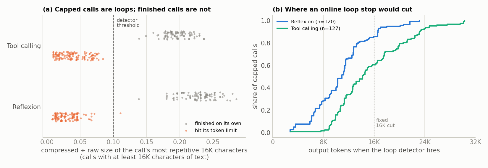

**Traffic caps are mostly something else.**
- Where the cap hit inside the reasoning, text survives: Thor gemma's capped reasoning loops (16 of 21);
  granite's mostly does not (4 of 29 on Thor).
- On gemma, most caps hit inside a tool call and the text is lost (137 of 158 on Thor, 75 of 76 on Orin 32
  E4B).
- The agent then retries and caps again: 121 of Thor gemma's 158 capped calls follow a capped call, and 64 of
  E4B's 76. Stopping a run at its second consecutive cap saves 27% and 25% and loses 1 and 7 completed runs;
  P1's first-cap rule saves a little more but loses 4 and 10.
- All 66 capped calls on Orin 64 gemma ended at a budget the context guard had lowered because the window was
  nearly full: capacity, not runaway decoding.

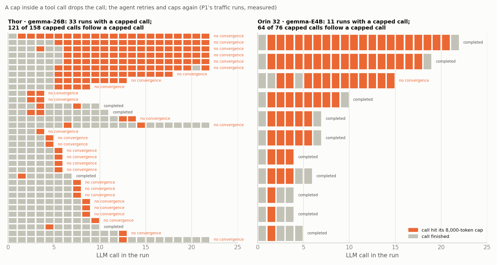

P1's figure (deck of 3 Oct, slide 396): runs with a capped call rarely finish (drone 39% vs 92%; traffic a
median 16% vs 99%). Not in this repository.

**Why the loops happen, and what it means:**
- **The likely cause is greedy decoding.** Every P1 configuration runs at temperature 0 with thinking on. On
  the WS, Qwen3.5-9B with thinking ran away only under greedy decoding, never in 21 sampled missions. Qwen's
  model cards warn that greedy decoding in thinking mode causes endless repetition. Whether Gemma-4 still loops
  under sampling is not measured.
- **For P1**, it is a cheap fix to report: sampling as the model card recommends, or a repetition stop.
- **For option A**, it is a concrete, safe mechanism, but it cuts both ways: if the fix is configuration, it is
  not research, and P1's paper now reports the finding with its own stop bound.
- **Method** (`analysis/p1_loops.py`, `analysis/p1_caps.py`): the detector compresses the last 4,000 or 16,000
  characters every 1,000 characters and fires when the result stays below 10% of the window for 3 checks in a
  row. Savings are the call's decode energy past the stop point, over the configuration's measured board
  energy.

## Step-wise agents (1): aerogen on its own tasks

aerogen_mcp flies one action per tool call (takeoff, go_to_point, hover, run_inference and 16 more) and keeps one
growing conversation per mission. We ran it on the WS on 2026-10-01 with K2-Horizon-7B, its kinematic sim paced
to real flight time; the agent logic is unchanged, with a 6-line pacing hook, and the random prompt prefix the
agent adds to defeat cloud caching was removed at runtime.

**One session** (low effort, 15 missions):
- 88% of mission time is waiting on flights, and 93% of prompt tokens come from cache.
- 29% of the GPU energy is drawn while no call runs: about 10 W between calls against 181 W during them.
- Kept state saved 33% of LLM time: 12% from each mission's private history, the rest from the 9.1K-token
  system prompt all sessions share. At the Thor's r the ceiling would be 50% (13% private).
- Medium and high effort used 2.3–2.5× the GPU energy per mission.

**Many sessions on one GPU** (live, low effort, one run per configuration; GPU energy from NVML):

| Sessions on one GPU | Completed / errored / passed | GPU energy per completed mission | GPU energy per passed mission | Missions per hour | Re-prefilled tokens per mission |
| --- | --- | --- | --- | --- | --- |
| 1 | 15 / 0 / 11 | 20.4 kJ | 27.8 kJ | 5.4 | ~0 |
| 2 | 7 / 3 / 6 | 34.3 kJ | 40.0 kJ | 6.9 | 3.2K |
| 4 | 14 / 1 / 9 | 20.5 kJ | 31.9 kJ | 17.5 | 4.8K |
| 8 | 14 / 1 / 11 | 9.9 kJ | 12.6 kJ | 30.9 | 1.8K |
| 4, pool capped at 16.4K | 12 / 3 / 6 | 22.4 kJ | 44.8 kJ | 17.8 | 20.5K |
| 4, pool capped at 13.3K | 10 / 5 / 7 | 22.4 kJ | 32.0 kJ | 17.9 | 10.6K |

- Eight sessions used 2.2× less GPU energy per passed mission than one (27.8 to 12.6 kJ), at the same median
  mission time.
- Live energy swings with the missions drawn; replaying the same missions, the simulator shows 2.5–3.5× less
  energy from 1 to 16 sessions.
- In that simulation, dropping state at every wait costs 6–11% more energy than LRU on the full pool, and an
  eviction oracle that knows exact flight times is no better than LRU (within 0–6%).

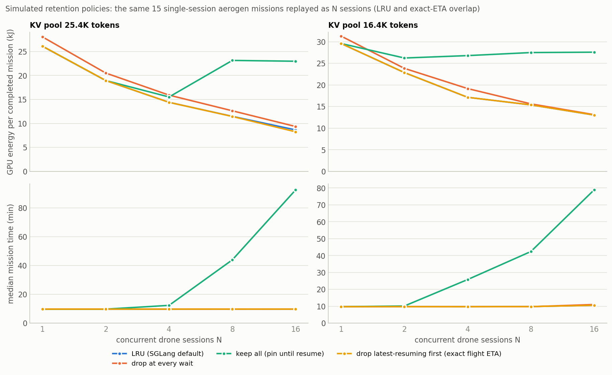

## Step-wise agents (2): the deciding test on P1's delivery tasks

A step-wise agent on P1's own tasks keeps its steps short in every configuration tested: after a tool wait, the
model writes a median of 55–99 output tokens.

**Setup** (WS, 2026-10-02): aerogen's agent loop, unchanged, given P1's D1–D3 task texts verbatim and the
delivery-world files of P1's AeroEval agent; Qwen3.5-9B (thinking on and off, greedy and sampled) and
K2-Horizon-7B (low and high effort); 108 missions on the kinematic sim at 50× real time; a strict checker using
P1's Gazebo geometry (order, a descent and a 10 s hold, no flight through a building).

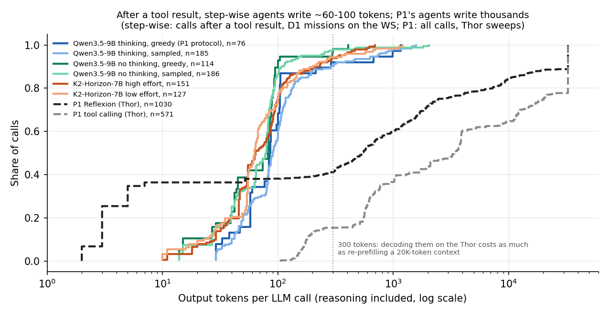

**D1, per configuration:**

| Configuration | Missions | Delivered all / strict pass | LLM calls per mission | Planning call: longest output | Prompt: first → peak (median) | Prompt reuse | Ceiling after a wait (Thor r) | Ceiling on the WS (mission) | Measured saving on the WS |
| --- | --- | --- | --- | --- | --- | --- | --- | --- | --- |
| Qwen3.5-9B thinking, greedy (P1's protocol) | 6 | 2 / 0 | 13.7 | 24,236 (runaway) | 11.3K → 18.0K | 92% | 57% | 13% | 11% |
| Qwen3.5-9B thinking, sampled | 9 | 6 / 2 | 21.6 | 1,998 | 11.3K → 17.6K | 96% | 57% | 37% | 34% |
| Qwen3.5-9B no thinking, greedy | 6 | 4 / 0 | 20.0 | 28 | 11.3K → 15.7K | 94% | 71% | 58% | 53% |
| Qwen3.5-9B no thinking, sampled | 9 | 7 / 5 | 21.7 | 97 | 11.3K → 15.7K | 96% | 67% | 53% | 48% |
| K2-Horizon-7B high effort | 9 | 5 / 5 | 17.8 | 12,159 | 9.4K → 18.3K | 82% | 72% | 24% | 14% |
| K2-Horizon-7B low effort | 9 | 6 / 4 | 15.1 | 2,178 | 9.4K → 12.9K | 97% | 62% | 35% | 33% |

**What the test shows:**
- **Steps after a wait are short everywhere:** over D1–D3 the median is 55–99 tokens and the p90 at most 394;
  only 17 of 1,649 such steps exceed 1K tokens.
- **Thinking concentrates in the planning call:** with thinking on, that call writes a median of 546–5,147
  tokens (21–82% of all output); without thinking, 28.
- **Greedy thinking can run away:** one greedy planning call ran to 24K tokens and filled the KV pool, the same
  failure mode as P1's capped calls. Sampled thinking showed no runaway in 21 missions.
- **What kept state is worth,** at the Thor's r: 56–72% of the LLM time after a wait and 20–72% of a mission's;
  each drone's private history is 3–16% of a mission's LLM time.
- **The agent is not mission-ready in P1's world:** 72% of missions delivered every package, but only 27% pass
  the strict check; 56% collide, because the sim has no buildings.

## Many agents on one box: does a memory controller help?

No, for drones or traffic. In simulations of N agents sharing one device, replaying P1's and our recorded runs,
no memory policy beats SGLang's default by more than 9.9% (drones, 455 cells) or 2.4% (traffic, 48 cells), short
of the suggested 15% bar.

### Drones (2026-10-03, [`2026-10-03-admission-sim`](../2026-10-03-admission-sim/README.md))

- **Workloads:** the step-wise D1–D3 runs, aerogen's own tasks, and P1's Reflexion and tool-calling traces,
  replayed by 1–16 drones.
- **Thor costs** from P1's runs: prefill 1,811 and decode 27 tokens/s; board power 71.9 W while a call runs and
  38.6 W otherwise; Gemma's experts make batching weak (a 16-request decode step takes about 5.3× as long as
  one).
- **Memory:** state budgets of 1–16 GiB in Gemma's layout, with Qwen3.5 and dense layouts as checks; 12
  policies, unlimited memory as the bound, 5 seeds per point.
- **Validation:** LLM time within 2–3% of 887 Thor calls; energy within −8% to +10% of five live WS runs.


| Policy | Best gain over the default |
| --- | --- |
| Eviction order by value per byte, online | 3% (6% with exact wake times) |
| Budget-aware admission | 5% for step-wise agents; up to 52% worse on P1's long decodes |
| Concurrency caps of 1–8 calls | 0.2% |
| Paused state stored at half size | 10% |
| FP8 KV cache for all state (a configuration) | 10–34% at 1–4 GiB |

- Keeping state matters more as the box fills (19–29% at 16 step-wise drones), but the default already keeps
  it; with 8 GiB for state the default matches unlimited memory up to 16 step-wise drones.
- P1's drone agents gain nothing from kept state at any drone count (0–1.3%).

**The agent design is the big lever** (Thor costs; P1's D1–D3 only):

| | P1 Reflexion (measured) | Step-wise agent (projected) |
| --- | --- | --- |
| Board energy per run | 82–277 kJ | 20–43 kJ |
| Board energy per success | 219–499 kJ (D3: no passes) | 22–68 kJ |
| Median mission time | 19–72 min, 91–97% of it LLM | 9–15 min |
| Drones per Thor within 1.5× p95 mission time | 2 | 4–16 |
| Energy per success, 1 → 16 drones | 3.1–3.2× lower | 4.7–8.5× lower |

The step-wise side counts a mission as a success if it delivered and returned. With the strict check its energy
per success rises to 52–242 kJ, and the ratio to P1's Reflexion falls from 5–13× to 0.9–9.6×.

### Traffic (2026-10-05, [`2026-10-05-p1-repo`](../2026-10-05-p1-repo/README.md) §4)

- **Workloads:** every recorded traffic run of 6 configurations, replayed by 1–8 agents per device; no prefix
  shared between agents; success = completed.
- **Devices:** each configuration's own cold-prefill rate and decode fit (`t1·f(batch) + c·context`, gemma by
  its experts, dense models as on the WS), board power during calls (30–77 W) and during non-vision tools
  (15–35 W).
- **Memory:** the configuration's real KV pool in tokens, at ½, 1 and 2×; 12 policies plus unlimited memory; 3
  seeds of 24 h.

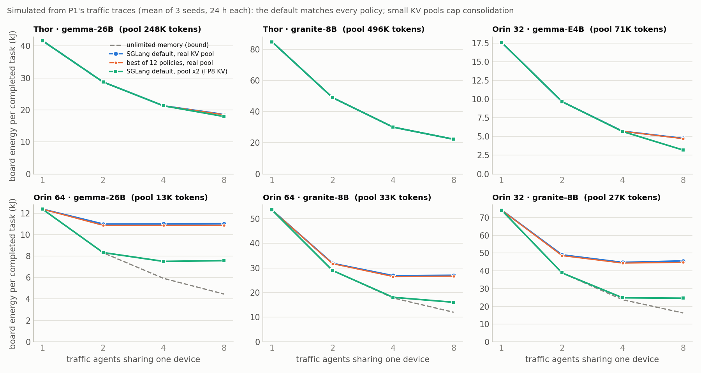

| Configuration (KV pool) | 1 agent | 8 agents, default | 8 agents, best policy | 8 agents, pool × 2 | 8 agents, unlimited memory |
| --- | --- | --- | --- | --- | --- |
| Thor · gemma (248K) | 41.7 kJ | 18.6 | 18.6 | 17.9 | 17.9 |
| Thor · granite (496K) | 84.9 | 22.3 | 22.3 | 22.3 | 22.3 |
| Orin 32 · gemma-E4B (71K) | 17.6 | 4.7 | 4.7 | 3.2 | 3.2 |
| Orin 64 · gemma (13K) | 12.4 | 11.0 | 10.9 | 7.6 | 4.5 |
| Orin 64 · granite (33K) | 53.5 | 27.0 | 26.6 | 16.1 | 12.0 |
| Orin 32 · granite (27K) | 74.3 | 45.6 | 44.8 | 24.6 | 16.3 |

- **No policy helps:** in the 48 cells with ≤ 1% failures, the best of 12 policies beats the default by at most
  2.4%, eviction by value per byte by 0.9% (0.4% with exact wake times), and budget-aware admission never beats
  the best fixed rule. Keeping state is worth −2% to +11%.
- **Capacity binds on the Orins:** at the real pool, energy per completed task stops falling after 2–4 agents on
  the three small-pool configurations, and at 8 agents the 95th-percentile task takes 12–13× as long as alone.
  With half the pool, 25–90% of runs no longer fit. Doubling the pool cuts energy per completed task by 31–46%
  at 8 agents.
- **On Thor the pool is ample:** consolidation gives 2.2× (gemma, whose experts make batching weak) and 3.8×
  (granite) from 1 to 8 agents.
- **Caveats:** the vision tool's own requests are modelled as tool time, which understates contention on the 7
  image tasks; board power is held at its batch-1 level.

**Not tested yet:** longer drone missions, memory that changes over time inside the simulator, Gemma's own
step-wise token counts, mixed agents on one box, and power modes.

## P1's repository and paper

P1's own numbers reproduce from the same files, and three more of its points need correcting. P1's paper
("Measuring the Task, Not the Trajectory", SIGMETRICS 2027, due Sat 10 Oct) now reports the loop finding itself.

| Quantity | P1 (repository, 4 Oct) | Ours (same files) |
| --- | --- | --- |
| Drone Thor Reflexion: runs passed | 71% | 71% (102 of 144) |
| Drone Thor: LLM time in capped calls; pass rate with / without one | 71%; 39% / 92% | 71%; 39% / 92% |
| Drone Thor: prompt tokens from cache; prefill share of LLM time | 26%; 1.8% | 26%; 1.8% |
| Drone Thor: a generated token's energy ÷ a prefilled one's | 75× average, 90× marginal | 74× |
| Drone Thor: P1's loop rule | 94 of 122 (77%) | 94 of 122 |
| Stop at first capped call: drone Thor / traffic Thor gemma | 50.2% (22 lost) / 37.3% (4) | 50.2% (22) / 37.2% (4) |
| Traffic prompt tokens from cache, 8 configurations | 55.8–82.2% | 56–82%, the same per configuration |
| Traffic prefill share of LLM time | 1.3–15.5% | 1.3–15.5% |
| Traffic Thor gemma: capped calls, share of LLM time | 158, 42.3% | 158, 42% |
| Capped calls on Orin 64 gemma traffic | 0 (cap = 8,000 only) | 66, all at budgets the context guard lowered |

P1's figure (deck of 3 Oct, slide 394): a generated token costs 46–121 prefilled ones on average (cloud prices:
5×). P1's figure (slide 398): prefill is 1.3–4% of LLM time while the cache holds, 23% on Devstral, whose server
reports no cache hits. Neither is in this repository.

**What P1's paper claims, and where it touches P5:**
- **Loops:** "Many capped calls are not a task that needs more room but a model that is looping"; "A loop
  detector would keep the runs that cap and recover". Rated High novelty × High impact; its remedy is "stop or
  retry at the first capped call" (an upper bound of 50.2% that loses 22 runs). Its loop replay (MB4) is not run.
- **No early abort:** an online stop predictor "needs … regret under a control policy, and is out of scope".
  P1 has no predictor of remaining iterations or energy.
- **One request in flight:** P1 assumes batch size 1 and calls concurrency controls (KAIROS) levers the edge
  lacks. Its own vision tool contradicts that, and multi-agent edge boxes are P5's case.
- **Capacity:** P1 reports window overflows and proposes "fewer or shorter tool definitions, tools loaded on
  demand, capped tool outputs or an FP8 KV cache" (MB5, not run). It deferred its KV-pool sweep and warm-cache
  arm, both P5 territory.
- **Not cited by P1:** INFERCEPT, Continuum, TokenCake, CacheScout, Adaptive KV Retention, or any
  reasoning-length work.

**Corrections for P1** (the note for Sandesh to forward: [`NOTES_FOR_P1.md`](../2026-10-05-p1-repo/NOTES_FOR_P1.md)):
1. **`ask_vlm` is a burst of requests to the agent's own server, not a second model:** 8–23 running requests
   (median), up to 45; on Orin 64 gemma it evicts the paused context before all 62 following calls. It also
   qualifies the paper's "batch size is one".
2. **The loop rule misses long-period loops:** 27 of the 28 Thor Reflexion capped calls it misses compress to
   0.10–0.18 on its window. An online detector flags 121 of 122, and none of 173 long finished calls.
3. **The drone Orin 32 "capped calls" are evaluator calls at 1,024 tokens:** 88 of 93. Its 17% capped share
   and 41.9% stop saving measure evaluator truncation; only 5 generator calls loop.
4. **Orin 64's context guard truncates calls the 8,000-token rule does not count:** 66 on Orin 64 gemma (13% of
   its LLM time; P1 reports 0), 22 more on Orin 64 granite, 18 on Orin 32 granite, 12 on Orin 32 E4B.
5. **Devstral's prefix cache is off:** 0 hits throughout, though 57% of each prompt repeats an earlier prompt;
   a working cache would save about 9% of its LLM time. Orin 32's cache works; only its per-call counts are
   missing.

**Other points:**
- **No thermal throttling:** 0 throttle samples in 434 h; hottest GPU 81.3 °C (P1's paper). P1's figure (deck
  slide 405) shows GPU temperature over each sweep; not in this repository.
- **Repeats differ at temperature 0:** P1 traces it to inputs (a timestamp in the traffic prompt, simulator noise
  fed back to the drone agent), except gemma-E4B on Orin 32, where inference itself varies.
- **Timeline:** P1's last runs end on Thu 8 Oct and its paper is due on Sat 10 Oct. Thor-1 (drone) runs gemma,
  then granite, then Devstral tool calling; some Orin units are free from Tue 6 Oct "for re-runs".

## Serving costs and what changes on the edge

Decode is the energy sink and batching is the lever. On P1's Jetsons, prefill is 0.7–3.4% of board energy except
Devstral (21%) and Qwen2.5-VL (14%). Capped decodes alone are 38–69% on Thor gemma and 33% on Orin 32 gemma-E4B
traffic, 0–19% everywhere else.

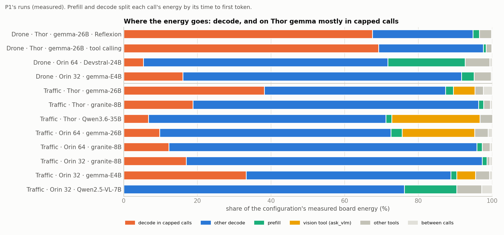

Shares of P1's measured board energy (each call's energy split into prefill and decode by its time to first token):

| Configuration | Decode in capped calls | Other decode | Prefill | Vision tool | Other tools |
| --- | --- | --- | --- | --- | --- |
| Drone · Thor · gemma · Reflexion | 67% | 27% | 2% | 0% | 3% |
| Drone · Thor · gemma · tool calling | 69% | 28% | 1% | 0% | 2% |
| Drone · Orin 64 · Devstral | 5% | 66% | 21% | 0% | 7% |
| Drone · Orin 32 · gemma-E4B | 16% | 76% | 3% | 0% | 5% |
| Traffic · Thor · gemma | 38% | 49% | 2% | 6% | 2% |
| Traffic · Thor · granite | 19% | 78% | 1% | 0% | 2% |
| Traffic · Thor · Qwen3.6 | 7% | 64% | 2% | 24% | 4% |
| Traffic · Orin 64 · gemma | 10% | 63% | 3% | 20% | 4% |
| Traffic · Orin 64 · granite | 12% | 84% | 1% | 0% | 2% |
| Traffic · Orin 32 · granite | 17% | 80% | 1% | 0% | 1% |
| Traffic · Orin 32 · gemma-E4B | 33% | 56% | 2% | 5% | 4% |
| Traffic · Orin 32 · Qwen2.5-VL | 0% | 76% | 14% | 0% | 7% |

Devstral's "other tools" is 7% (the energy map of 2026-10-05 counted its `validate_drone_code` tool's inner LLM
call twice and showed 20%; corrected the same day).

**The workstation** (one A5000, SGLang 0.5.20, measured):

| Quantity | Value |
| --- | --- |
| K2-Horizon-7B cold prefill | 4,106 tokens/s at 8–20K tokens, ≈ 0.05 J per token |
| The same prompt fully cached | 0.10–0.16 s to first token |
| K2-Horizon-7B decode energy per output token | 5.36 J at batch 1 (38 tokens/s); 0.38 J at batch 16 (539 tokens/s) |
| Power with no request | 10–20 W idle; 20–32 W between calls under concurrency |
| K2-Horizon-7B KV state | 144 KiB per token; a 25,427-token pool (3.5 GiB) at mem fraction 0.88 |
| Qwen3.5-9B (hybrid) | prefill 4,646 tokens/s, decode ~38 tokens/s; a 35.5K-token pool; at most 3 concurrent requests |

**P1's Jetsons** (traffic configurations, measured on P1's calls at batch 1):

| Configuration | Cold prefill (tokens/s) | Decode (tokens/s) | r (time) | Board power: calls / other tools | KV pool | Window |
| --- | --- | --- | --- | --- | --- | --- |
| Thor · gemma-26B | 3,431 | 23.3 | 147 | 69 / 34 W | 248K | 110,000 |
| Thor · granite-8B | 4,078 | 13.1 | 312 | 77 / 35 W | 496K | 110,000 |
| Orin 64 · gemma-26B | 1,198 | 10.2 | 118 | 29 / 15 W | 13K | 12,288 |
| Orin 64 · granite-8B | 1,056 | 8.3 | 127 | 41 / 15 W | 33K | 26,624 |
| Orin 32 · granite-8B | 1,047 | 8.2 | 127 | 42 / 17 W | 27K | 26,624 |
| Orin 32 · gemma-E4B | 1,632 | 11.1 | 147 | 37 / 16 W | 71K | 32,768 |

Drone Thor gemma: 1,811 and 27 tokens/s, 71.9 W while a call runs and 38.6 W otherwise (fit over 178 P1 runs).

**What changes on Orin and Thor:**
- **Speed:** Orin decodes 8–11 tokens/s on these models against 13–23 on Thor, so the same tool wait is a
  smaller share of an Orin run.
- **Memory:** unified memory has no host tier, so "offload to CPU" is a copy inside the same DRAM. On Orin 64,
  gemma-26B in bf16 leaves a 12,288-token window; the fixed prompt takes 38% of it. An FP8 KV cache, a smaller
  fixed prompt or capped tool outputs buy capacity; the simulation says capacity is what binds.
- **Co-located work:** the vision tool runs on the agent's own server and fills the pool on Orin 64 (§"The
  vision tool").
- **Energy:** Jetson rails measure the whole board (CPU, DRAM, tools), so idle power during waits is a board
  number: 15–35 W during non-vision tools on P1's boards.
- **Models:** gemma-4 (sliding window), Qwen3.6 (hybrid, reused at checkpoints) and dense granite all appear;
  long-context decode costs 13–22% for full-attention models at 20K tokens but ≤ 2% for sliding-window or linear
  attention (P1's fit).

## Options left for P5

Both simulations answer the memory-controller question for P1's workloads: SGLang's default is within 2.4%
(traffic) and 9.9% (drones) of every policy tried. On P1's agents there is little to manage at all: kept state is
worth 1–4% of LLM time. What remains is a choice of what P5 studies, and the professor makes it.

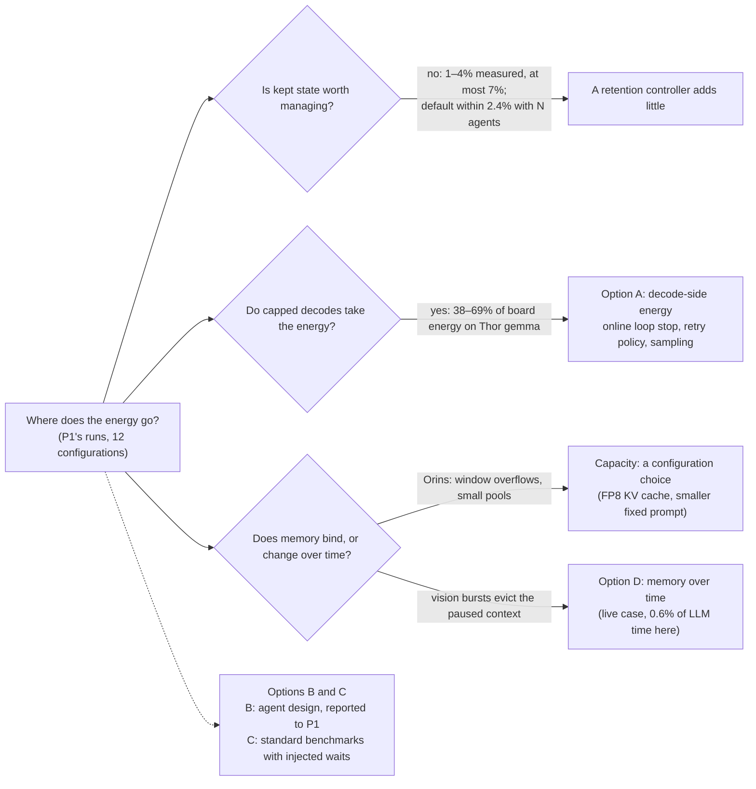

| Option | What P5 studies | Evidence for | Against |
| --- | --- | --- | --- |
| **A. Decode-side energy on P1's agents (our lean)** | Stopping runaway decodes online, thinking budgets, retrying dropped tool calls, admitting and batching long decodes | Capped calls take 38–69% of board energy on Thor gemma (drone 67–69%, traffic 38%) and 33% on Orin 32 gemma-E4B traffic; 0–19% elsewhere. Drone caps are loops: an online stop saves 43.5% / 35.7% with no finished call stopped, against 50.2% and 22 lost runs for P1's first-cap rule. Traffic caps repeat: stopping at the second consecutive cap saves 27% / 25% (1 / 7 runs lost) | P1's paper now reports the loop finding and a stop bound. The loops likely come from greedy decoding, so the fix may be configuration. Traffic is ungraded. Reasoning-length control is an active area we have not reviewed |
| B. A step-wise agent on P1's tasks | The agent design itself | 5–13× less energy per success on P1's delivery tasks (0.9–9.6× strict), 4–16 drones per Thor instead of 2 | The win belongs to the agent, which is P1's territory; a memory controller adds at most about 10%. Needs a building-aware sim |
| C. Standard benchmarks (τ²-bench, BFCL) with injected waits | The original question on another workload | Easy comparison with prior work | P1's real tools take 0.5–3 s; long waits would be synthetic, and the same capacity and decode limits probably apply. Loses the drone and traffic story |
| D. Memory that changes over time | Admission and retention when tools that run models (the vision tool) or co-located models take and release unified memory | P1's data has a live case: the vision burst evicts the paused context on Orin 64 (62 of 62 calls). Small pools cap consolidation (gap to unlimited memory 33–64% at 8 agents) | The recompute it causes is 0.6% of LLM time; the capacity gains are configuration (FP8 KV, smaller prompts). Needs a device or a WS emulation |

- **P1's agents stay in every option** as the case where a controller must not make things worse.
- **What A must add beyond P1's paper:** an online stop that preserves runs, evaluated as a control policy
  (energy per success, runs lost); a retry policy for traffic's dropped tool calls; sampling against greedy
  decoding; batching long decodes when several agents share a box.

**Why A still.** It is where P1's measured energy goes, on P1's devices, with P1's agents unchanged. B's finding
and the five corrections go to P1. D is the alternative if P5 should stay on retained state; the vision-burst
case makes it testable, but its measured prize is small.

**Where A could be wrong:**
1. **Success.** A stop or a budget may cost runs: P1's first-cap rule loses 22 passing drone runs; our loop stop
   loses none on these traces, but traffic success is not graded.
2. **Novelty.** P1 now reports the loops; thinking budgets and early exit are studied for datacenter reasoning
   models; if greedy decoding causes the loops, the fix is configuration. What the edge adds (board power, weak
   batching on mixture-of-experts models, one agent saturating the device) has to carry it.
3. **Overlap with P1.** A has to be agreed with P1: P1 owns the observation; P5 could own the online mechanism
   and its evaluation.
4. **Scope.** It drops P5's original question about retained state. The professor may prefer D.

## Decisions needed

- [ ] **Direction (D12, professor):** option A (decode-side energy), B (the agent design, reported to P1), C
  (standard benchmarks with injected waits) or D (memory that changes over time). The simulations rule out a
  memory controller on fixed budgets for P1's drone and traffic agents. The meeting planned for Mon 5 Oct is
  postponed (P1's deadline is Sat 10 Oct, and other lab projects are due too); no new date is set, so the
  decision stays open.
- [ ] **Scope (professor):** leave retained state for decode-side energy (A), or stay on it with the vision-tool
  bursts and co-located models (D)?
- [ ] **Send the five corrections to P1? (Sandesh):** [`NOTES_FOR_P1.md`](../2026-10-05-p1-repo/NOTES_FOR_P1.md)
  is ready; send it before Sat 10 Oct, or not. And: offer the online loop stop to P1's paper, or keep it for P5?
- [ ] **Repository visibility (Sandesh):** our GitHub repo is public and holds P1's unpublished numbers in
  `reports/`; make it private before pushing the local commits, ahead of P1's double-blind submission?
- [ ] **WS and schedule (Sandesh):** is the WS one of P1's four "workstation" lanes, and is it back up? When do
  the devices return to P5 after Sat 10 Oct, and what are the ISP milestones?
- [ ] **P1's mentor:** is a step-wise agent with flight-level tools in P1's scope, and may P5 run P1's AeroEval
  tasks (D1–D3 and F1, then lawnmower and circles) with one, keeping P1's agents as the contrast? Which 8
  AeroEval tasks are meant (we found 5 original missions and 6 P1 variants)?
- [ ] **aerogen (mayankarya):** permission to use and extend aerogen_mcp. Until then it stays a private copy on
  the WS.
- [ ] **Deployment assumption:** how many drones one edge box serves, which sets the memory pressure, and the
  go/no-go thresholds for the next stage.

## Next steps

**Either way:**
1. When the professor meeting is rescheduled, take the direction decision (D12) with this doc and the reference deck, then rewrite master-plan milestones M3–M5 for it.
2. When P1 pushes its Thor drone tool-calling cells (gemma, granite, Devstral) or the traffic grades, rerun
   `analysis.p1_repo` (refresh) and the four analyses.
3. When the WS is back: Qwen3.5 energy calibration, one live memory-pressure test to anchor the simulators (with a
   vision-style burst of concurrent requests), and one long mission (lawnmower or circles).

**If A:**
1. Test whether sampling as the model card recommends removes the loops, on Gemma itself (a device, or a
   quantized Gemma on the WS).
2. Build the online loop stop into the serving path and evaluate it as a control policy (energy per success,
   runs lost), with a retry rule for traffic's dropped tool calls; use traffic grades when they come.
3. Agree the split with P1, whose paper now claims the loop finding.
4. Review the reasoning-budget and early-exit literature.
5. Measure batching of long decodes on the WS, and on a Jetson when one is free.

**If B, as a finding for P1:** a building-aware sim guard, the large farm tasks (lawnmower, concentric circles),
and Gemma-4-26B-A4B's output per step on a device.

**If C:** stand up τ²-bench on the WS, one GPU as the agent and one as the user simulator, with waits drawn from
P1's measured tool and flight times.

**If D:** emulate the vision burst on the WS (an agent plus concurrent image-like requests on one server, a
small pool); compare pinning the paused context with admitting the burst at lower concurrency; extend the
simulator to a budget that changes over time.

## Data, methods and limitations

| Source | What | When |
| --- | --- | --- |
| P1's repository | Raw runs: drone Thor Reflexion (144), Orin 64 Devstral (144), Orin 32 gemma-E4B (108); traffic 8 configurations (1,659 rows, 1,627 traces); P1's pipeline outputs and paper draft | `3c47ebc`, 4 Oct 2026; cloned 5 Oct |
| Our copy of P1's Thor traces | Reflexion (143 runs) and tool calling (104 of 108 runs); Gemma-4-26B-A4B | to 2026-10-01 and 2026-10-03 16:16 |
| P1's deck | P1's results and figures (EdgeAgentBench, slides 387–406) | 2026-10-03 |
| WS runs: aerogen | K2-Horizon-7B on aerogen's own 5 tasks, real-time pacing; 1–8 sessions per GPU | 2026-10-01 |
| WS runs: the deciding test | Qwen3.5-9B and K2-Horizon-7B on P1's D1–D3, 108 missions, 50× pacing | 2026-10-02 |
| WS calibration | K2-Horizon-7B prefill and decode time and energy against length and batch | 2026-10-01 |
| Simulations | Drones: 1–16 per box, Thor and WS costs, 12 policies, 5 seeds. Traffic: 1–8 per device, 6 configurations at real KV pools, 3 seeds | 2026-10-03, 2026-10-05 |
| Loop and cap analyses | Every LLM call's text replayed through an online loop detector; four stop rules on 12 configurations | 2026-10-04, 2026-10-05 |

**Reproduce:**
- `python3 -m analysis.p1_repo`, then `analysis.p1_opportunity`, `analysis.p1_caps`, `analysis.traffic_sim`
  and `analysis.p1_repo_figures` (writes `../2026-10-05-p1-repo/`).
- `python3 -m analysis.stepwise_ceiling` (D1–D3 and the pooled drone ceilings), `analysis.p1_per_task`,
  `analysis.admission_sim all` and `analysis.admission_figures` (drone simulation), `analysis.p1_runaway` and
  `analysis.p1_loops` (drone runaways).

**What the evidence does not show:**
- **Traffic success.** Traffic is ungraded: "completed" counts wrong answers as successes.
- **Traffic text.** Loop counts cover only calls whose text survived, so they are lower bounds for gemma; the
  repeated-cap rule needs no text.
- **The vision tool's code.** Its mechanism is read from the server's request counters, not from its source.
- **P1's own model per step.** Qwen3.5-9B and K2-Horizon-7B stand in for Gemma-4-26B-A4B in the step-wise test.
- **Physical realism.** aerogen's sim has no buildings; P1's Gazebo runs at 10× real time; only delivery
  missions were tested step-wise.
- **The success check** for step-wise drones: the truth is between the lenient and strict counts (0.9–13.5×).
- **Memory pressure** with many agents is simulated, not measured live; device models are fitted at batch 1, and
  batching follows our models, not measurements on these devices.
- **Energy scope.** WS energy is NVML GPU energy; P1's is whole-board energy. Savings are upper bounds that
  assume the rest of each run goes as recorded.
- **Statistics.** 3 repeats per task instance on P1's side, one run per configuration on ours, no confidence
  intervals.
- **P1's paper and plans** are quoted from the repository as of 4 Oct; P1 may change them before Sat 10 Oct.
