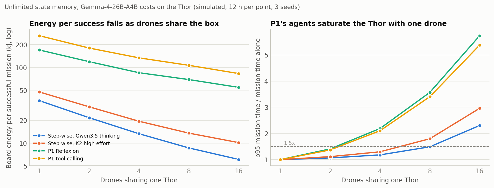
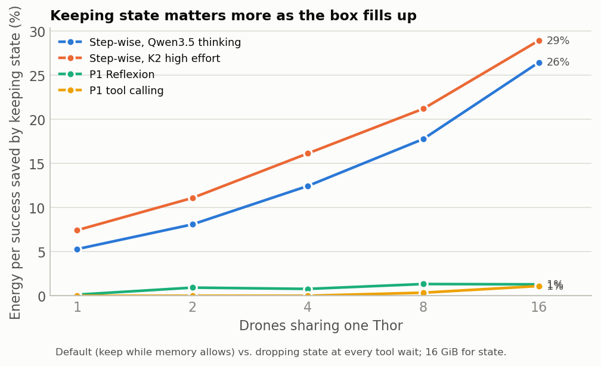
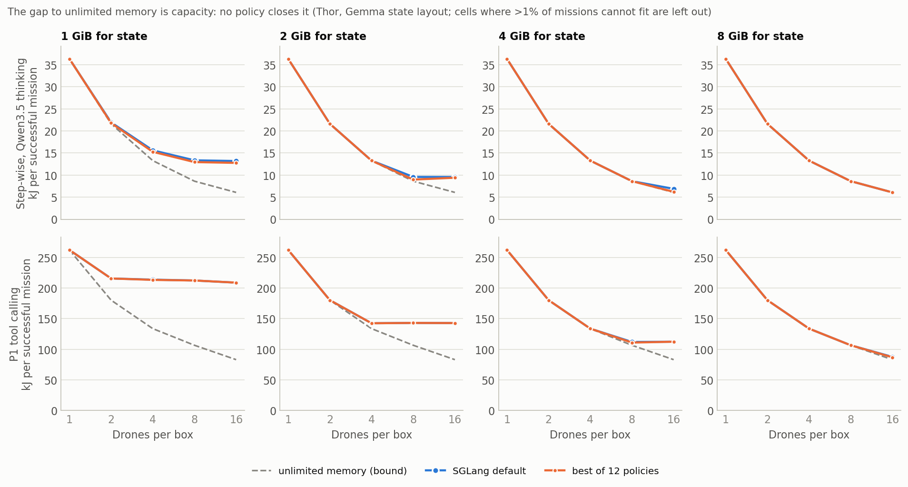

# Can a memory controller beat SGLang's default? N drones sharing one edge box

**2026-10-03 · Sai Sandesh (P5)**, prepared with Claude Code.

**The question.** The merged evidence doc left one hypothesis open: when several drones share
one device's memory, does a controller that manages admission and retained state beat SGLang's
default on energy per successful mission? The bar suggested on 2026-10-02 (pending the
professor's go/no-go threshold, D4): an adaptive policy must beat the best fixed rule by
**≥ 15%** at equal success, in a realistic part of the range.

**Method.** A new simulator, validated against 887 Thor calls and 5 live WS runs, replays
recorded missions as 1–16 drones on one box. It does so for 6 workloads, 4 memory layouts and
budgets of 1–32 GiB, comparing SGLang's default with 11 other policies and with unlimited
memory. All numbers are simulated unless marked as measured.

Data: [`sim.json`](sim.json), [`summary.json`](summary.json); figures: [`figures/`](figures/).

## Answer

1. **No, not with memory decisions.**
   - In no cell does an online policy beat the best fixed rule by more than **9.9%** (all 455
     cells where missions fit).
   - On the Thor with Gemma's state layout, the best of 12 policies beats the default by more
     than 5% in only 4 of 145 cells.
   - The 15% bar is not met anywhere.
2. **Kept state is valuable, but the default already keeps it.**
   - Dropping state at every tool wait instead of keeping it costs step-wise agents 4–7% more
     energy per success with one drone, and **19–29% more at 16 drones**: when the box is busy,
     every recomputed token delays the other drones.
   - SGLang's radix cache keeps that state whenever memory allows. With 8 GiB for state on the
     Thor, the default matches unlimited memory for the step-wise agents at every drone count up
     to 16 (P1's agents need 16 GiB).
3. **Under tight memory the default loses, but to capacity, not to bad decisions.**
   - With 1–4 GiB and 8–16 drones, unlimited memory would cut the default's energy per success
     by up to 60%. That gap comes from how many sessions' state fits at once.
   - What the policies recover (Thor, Gemma layout):
     - eviction order: ≤ 3% (≤ 6% with exact wake times);
     - budget-aware admission: ≤ 5%, and up to 52% *worse* on P1's long decodes;
     - concurrency caps: ≤ 0.2%;
     - storing paused state at half size: ≤ 10% (12% with Qwen3.5's recurrent-state layout).
   - A static FP8 KV cache recovers 10–34% at 1–4 GiB: that is configuration, not control.
4. **P1's agents gain nothing from keeping state at any drone count:** 0–1.3% of energy per
   success, and ≤ 1.6% even with dense-model batching.
   - So the earlier claim that "batching could lift P1's ceiling to about 15%" is not supported.
   - P1's agents keep the Thor 94–98% busy with one drone.
5. **The big lever is the agent design, not the serving layer.** Thor costs throughout; the
   first three rows are P1's D1–D3 only, the last two each workload's full task set:

   | | P1 Reflexion (Thor, measured) | Step-wise agent (Thor costs, projected) |
   | --- | --- | --- |
   | Energy per run | 82–277 kJ | 20–43 kJ |
   | Energy per success | 219–499 kJ (D3: no passes) | 22–68 kJ |
   | Median mission time | 19–72 min, 91–97% of it LLM | 9–15 min |
   | Drones per Thor at ≤ 1.5× p95 mission time | 2 | 4–16 |
   | Energy per success, 1 → 16 drones | 3.1–3.2× lower | 4.7–8.5× lower |

**What this means for Monday.**
- **A retention-and-admission controller on top of SGLang is not a contribution** on these
  workloads and Thor/Orin-class memory. This is a negative result, reported as such.
- **Option B's value is the agent design.** On P1's delivery tasks it gives roughly 5–13× less
  energy per success, and 2–8× more drones per box. That is a finding about P1's benchmark,
  not a serving controller; the controller adds ≤ 10% on top.
- **What is left for P5's question:**
  1. **The decode side (option A's lever).** It is where P1's energy is. Calls that hit the
     32K cap take 57% (Reflexion) and 70% (tool calling, 104 runs) of P1's LLM time on the 12
     CLGSCE tasks, and stopping them at 16K tokens would save about 27–34% of board energy
     (upper bound, §5). P1's agents also saturate the Thor.
  2. **Capacity on memory-tight devices.** This means the precision or compression of retained
     state, mostly configuration.
  3. **Things this run could not test** (see "What could still change this").



## Results

### 1. Energy per success falls as drones share a box; P1's agents saturate it

With unlimited memory, on Thor costs (`thor_gemma`):

| Workload | 1 drone | 4 | 8 | 16 | Drones within 1.5× p95 mission time |
| --- | --- | --- | --- | --- | --- |
| Step-wise, Qwen3.5 thinking | 36.3 kJ | 13.3 | 8.6 | 6.1 | 8 |
| Step-wise, Qwen3.5 no thinking | 27.9 | 8.5 | 5.2 | 3.3 | 16 |
| Step-wise, K2 high effort | 47.4 | 19.4 | 13.5 | 10.1 | 4 |
| aerogen's own tasks, K2 low | 39.9 | 12.6 | 8.1 | 5.2 | 8 |
| P1 Reflexion | 169.9 | 85.1 | 69.1 | 54.5 | 2 |
| P1 tool calling | 262.3 | 133.7 | 106.5 | 83.0 | 2 |

- **Most of the gain is the box's baseline power** (38.6 W whenever no call runs) spread over
  more drones. Batching adds a little: Gemma's experts make it weak, with 16 requests per step
  costing 5.3× the time of one.
- **The p95 mission time grows once the decoder is saturated.** For step-wise thinking it is
  1.49× at 8 drones and 2.3× at 16. P1's agents are already 94–98% busy with one drone, so a
  second drone makes p95 missions 1.4× longer and a fourth 2.2×.
- **The binding resource on the Thor is decode throughput, not memory.**

### 2. Keeping state is worth more as the box fills, but the default keeps it

The value of keeping state is the default (keep while memory allows) against dropping state at
every tool wait, with 16 GiB for state:

| Workload | 1 drone | 4 | 8 | 16 |
| --- | --- | --- | --- | --- |
| Step-wise, Qwen3.5 thinking | 5.3% | 12.4% | 17.8% | 26.5% |
| Step-wise, K2 high effort | 7.4% | 16.1% | 21.2% | 28.9% |
| Step-wise, Qwen3.5 no thinking | 3.9% | 8.6% | 11.5% | 18.8% |
| aerogen's own tasks, K2 low | 5.3% | 10.3% | 14.7% | 25.1% |
| P1 Reflexion | 0.1% | 0.8% | 1.3% | 1.3% |
| P1 tool calling | 0.0% | 0.0% | 0.3% | 1.1% |

- **With one drone,** a re-prefill costs only the gap between active and idle power, so
  keeping state is worth a few percent.
- **With a saturated box,** re-prefill takes decode time from the other drones, so it costs
  the full active power and slows every mission.
- **The step-wise ceiling (20–72% of LLM time, 2026-10-02) shows up here as 19–29% of
  board energy at 16 drones.** It is smaller because board power while waiting is a large
  share.



### 3. Where the default loses, the loss is capacity

The table shows the share of the default's energy per success that unlimited memory would save,
on the Thor with Gemma's layout, at 4 / 8 / 16 drones (x: more than 1% of missions cannot fit):

| Workload | 1 GiB | 2 GiB | 4 GiB | 8 GiB | 16 GiB |
| --- | --- | --- | --- | --- | --- |
| Step-wise, Qwen3.5 thinking | 15 / 35 / 54% | 0 / 10 / 36% | 0 / 0 / 12% | 0 / 0 / 0 | 0 / 0 / 0 |
| Step-wise, K2 high effort | 27 / 47 / 60% | 0 / 20 / 40% | 0 / 0 / 26% | 0 / 0 / 0 | 0 / 0 / 0 |
| P1 Reflexion | x | 22 / 37 / 50% | 0 / 13 / 32% | 0 / 0 / 16% | 0 / 0 / 0 |
| P1 tool calling | 37 / 50 / 60% | 6 / 26 / 42% | 0 / 5 / 26% | 0 / 0 / 5% | 0 / 0 / 0 |

How much of that gap each policy recovers (best case anywhere on the Thor with Gemma's layout):

| Policy family | Best gain over the default | Note |
| --- | --- | --- |
| Eviction order (value per byte), online | 2.9% | 6.0% with exact wake times; confirms the 2026-10-01 result that an exact-ETA oracle ≈ LRU |
| Budget-aware admission | 5.1% (step-wise) | P1's agents: up to 52% *worse*. Reserving each running call's expected output under-admits 32K-token decodes, and the default's optimistic admission with cheap retraction wins |
| Concurrency caps (1, 2, 4, 8) | 0.2% | up to 191% worse when a cap starves the batch |
| Pinning paused state | none | up to 107% worse: pinned state blocks admission |
| Paused state at half size | 9.9% | only at the edge of pressure (4 GiB, 16 drones); nothing where running calls alone fill memory |
| FP8 KV cache for everything (configuration) | 10–34% | at 1–4 GiB, step-wise |



- **Other layouts give the same picture.**
  - Hybrid recurrent state (Qwen3.5) and dense KV (K2) on Thor costs: the best online policy
    beats the best fixed rule by ≤ 5.9% and ≤ 8.4%.
  - With dense-model batching on the Thor: ≤ 9.7%.
  - On the WS with K2: ≤ 9.5%.
- **Which budgets are realistic** (rough):

  | Device and model | Memory left for state | Regime |
  | --- | --- | --- |
  | Thor 128 GB, Gemma in bf16 | tens of GB (P1's runs used 75 GB in total) | ample: no gap up to 16 drones |
  | Orin 64 GB, Gemma in bf16 (~52 GB of weights) | a few GB after the OS, CUDA and the simulator | tight from 8 drones |
  | Orin 32 GB | Gemma only fits quantized; Orin's slower decode is not modelled | unknown |

### 4. Validation

| Check | Result |
| --- | --- |
| LLM time per call, one session, Thor (887 P1 calls) | simulated within 2–3% of measured (pooled) |
| LLM time per call, one session, WS (K2, 271 calls) | within 0.4–1.3% |
| Energy per mission, one P1 drone, Thor | +5% (Reflexion), +6% (tool calling) against P1's measured board energy |
| Live WS runs with 2–8 sessions and capped pools, replayed with their own missions | energy per mission −8% to +10%, missions per hour −3% to +7% |
| Re-prefilled tokens in those runs | 0.35–1.5× of live; about half of live under capped pools |

- **The simulator's default loses less under pressure than real SGLang** (it re-prefills about
  half of what live SGLang did with capped pools).
- **The headroom may therefore be slightly understated.** On the Thor a re-prefilled token
  costs about 0.04 J (71.9 W at 1,811 tokens/s), so an extra 10K tokens per mission is about
  0.4 kJ, or 4% of a 10 kJ mission. This does not lift any cell near the bar.
- **The board-power fit used P1's own runs,** so the one-drone energy check is a consistency
  check, not independent.

### 5. P1's two agents on the same tasks: runaway thinking is the energy sink

Measured on the Thor (Gemma-4-26B-A4B), on the 12 CLGSCE tasks both sweeps share, with P1's
tool-calling sweep refreshed to 104 of its 108 runs on 2026-10-03 16:16
(`python3 -m analysis.p1_runaway`, [`p1_agents.json`](p1_agents.json)):

| | Reflexion | Tool calling |
| --- | --- | --- |
| Runs, passed | 108, 94 (87%) | 104, 70 (67%) |
| Board energy per run / per success | 69 / 79 kJ | 155 / 231 kJ |
| Long advanced tasks (A6–A9, A20): passed, median time | 42 of 45, 10 min | 12 of 42, 87 min |
| Calls that hit the 32K cap | 46 of 403, 57% of LLM time | 127 of 571, 70% of LLM time |
| Failed runs that include a capped call | 10 of 14 | 30 of 34 |
| Had those calls stopped at 16K tokens | 27% less board energy | 34% less board energy |

- **Every capped call ended at the token limit** (finish reason "length"), so none produced a
  usable answer.
- **The last row is an upper bound.** It is the decode time those calls spent past 16K
  tokens, at the board's 71.9 W while a call runs, assuming the rest of each run goes as
  recorded.
- **A fixed 16K cut would also stop** 14 (Reflexion) and 32 (tool calling) calls that finished
  on their own; at 8K it would stop 54 and 86. A useful stop rule has to predict runaways
  early, which is option A's first question.
- **No other P1 activity on the Thor since 2026-10-01:** no Qwen3.8 runs, no new folders.

## What could still change this

1. **Longer missions.** Lawnmower and concentric circles (est. 20–150 steps) grow each drone's
   private state, which raises pressure at the same budget. They have not been run.
2. **Memory that changes over time.** Co-located perception or VLM models take and release
   memory (H4). Every budget here is static. A controller that adapts admission to a moving
   budget is untested, and it is the most plausible remaining memory-side opportunity.
3. **Gemma's own step-wise behaviour.** The step-wise token counts come from Qwen3.5-9B and K2
   replayed at Gemma's speeds. More thinking per step would make decode a larger share and
   state a smaller one.
4. **Mixed agents on one box** (P1's agents and step-wise agents together), latency deadlines,
   and power modes or DVFS (root on Jetson). None is modelled.
5. **Engine details.** The model assumes FCFS, prefill before decode, whole-session eviction
   and SGLang 0.5.20's retraction. Live SGLang evicts at token granularity and loses more under
   pressure (validation).

## How the simulation works

`analysis/admission_sim.py` is a token-driven event simulator. It replaces the 2026-10-01
headroom simulator for this question; that one replayed measured call durations and had no
batching, growth or retraction.

**Workloads** are recorded missions, replayed by N drones in a closed loop: when a drone
finishes a mission, it draws the next one at random from the same pool.

| Workload | Missions | Source | Shared prompt |
| --- | --- | --- | --- |
| Step-wise, Qwen3.5-9B thinking | 21 | P1's D1–D3 on the WS, 2026-10-02 (sampled arms) | 11.1K tokens |
| Step-wise, Qwen3.5-9B no thinking | 21 | same | 11.1K |
| Step-wise, K2 high effort | 20 | same | 9.2K |
| aerogen's own tasks, K2 low effort | 15 | WS, 2026-10-01 | 9.1K |
| P1 Reflexion | 143 | Thor traces (Gemma-4-26B-A4B) | none modelled |
| P1 tool calling | 104 | Thor traces, 104 of the 108 runs of P1's sweep (refreshed 2026-10-03 16:16) | none modelled |

- Per LLM call the trace gives prompt, cached and output tokens. Between calls it gives the
  tool wait at real time: the step-wise runs were paced 50×, so flight times come from the
  sim clock.
- A mission's success is taken from its recorded run (all stops delivered and back at the
  depot for the step-wise runs; P1's verdict for P1's runs). The simulator can only add
  failures: a call that does not fit even alone.

**Devices.**
- **Thor, the main case.** Cold prefill 1,811 tokens/s and decode 27 tokens/s at batch 1
  (Gemma-4-26B-A4B, P1's traces). Board power is 71.9 W while a call runs and 38.6 W
  otherwise, from a least-squares fit over 178 P1 runs (0.4% median error).
- **Decode batching on the Thor** follows a bandwidth model of Gemma's mixture of experts:
  each step reads the non-expert weights (about 4.5 GB), every distinct expert the batch routes
  to (128 experts, top 8), and each request's KV. With uniform routing a 16-request step takes
  5.3× as long as a single one, so batching cuts the decode cost per token only 3×. A
  sensitivity run uses dense-model batching instead (the WS curve, 16 requests for 1.13× the
  step time).
- **WS A5000 with K2** uses the calibration from 2026-10-01: prefill 4,106 tokens/s, decode
  steps measured at batch 1–16, 206 W while running, 20 W idle.

**State memory.** One byte budget holds all retained state.

| Layout | Bytes per token | Fixed per session | Source |
| --- | --- | --- | --- |
| Gemma-4-26B-A4B (main) | 20 KiB (5 full-attention layers) | 200 MiB: the 1,024-token window of 25 sliding-window layers | P1's run metadata, model config |
| Gemma, FP8 KV | 10 KiB | 100 MiB | half of the above |
| Qwen3.5-9B | 32 KiB (8 full-attention layers) | 54 MB recurrent-state slot; a running call holds 5 slots | WS server log |
| K2-Horizon-7B (dense) | 144 KiB | none | WS |

- The shared system prompt is stored once.
- A session's private state is evicted whole: without its window or recurrent slot it cannot
  resume from cache, so the whole private history is prefilled again.
- A running call grows by one token per decode step. When memory runs out, paused state goes
  first, then running calls are retracted (fewest decoded tokens first) and later recompute
  their prompt and decoded tokens, as in SGLang 0.5.20.

**Policies** (serving decisions only; the agent and the model stay fixed):

| Policy | What it does |
| --- | --- |
| default | SGLang-like: FCFS; admit while memory minus a reserve of 0.3 × 4,096 tokens per running call allows; evict paused state LRU; retract when full |
| drop | default, but discard state at every tool wait |
| keep | default, but paused state is pinned |
| cap1, cap2, cap4, cap8 | default with at most k calls running (KAIROS-style) |
| value | default admission; evict the paused state with the least re-prefill saved per byte-second, with waits predicted per tool online |
| value_exact | value with exact wake times |
| adaptive | budget-aware admission (projected peak of the running calls, from an online p90 of output length) + value eviction |
| oracle | adaptive with exact output lengths and wake times |
| compress | default, but paused state is stored at half size (FP8) and expanded on resume |
| unlimited memory | the bound: no memory policy can do better at the same number of drones |

"Online" policies use only what a gateway sees while running. "Best fixed rule" is the best
of default, drop, keep and the four caps, picked per cell with hindsight, which flatters the
fixed rules.

**Grid.**
- Budgets of 1–16 GiB (2–32 GiB for the dense layout; 1.5–10 GiB on the WS).
- 1, 2, 4, 8 and 16 drones.
- Each point is the mean of 5 seeds. Each seed runs 24 simulated hours (72 h for P1's longer
  missions) after a 2-hour warm-up.
- Energy per success is energy per hour divided by successful missions per hour.
- Cells where more than 1% of missions cannot fit at all are left out of every comparison:
  there, "energy per success" rewards failing the expensive missions early.

**The paradigm comparison** (Answer, item 5):
- **P1's side** is measured: P1's D1–D3 Reflexion runs on the Thor (Gemma, Gazebo at 10×
  real time, so its flights are compressed; real-time flights would only add to P1's energy).
- **The step-wise side** projects the 2026-10-02 missions onto the Thor:
  - their token counts at Gemma's prefill and decode rates;
  - their flights at real time;
  - P1's board power.
- **What differs between the two:** the models (Qwen3.5 or K2 against Gemma), the simulators
  (aerogen's kinematic sim has no buildings) and the success checks (our delivery check against
  P1's evaluator).

## Reproduce

```bash
python3 -m analysis.admission_sim all     # validation + grid (~20K simulations, ~15 min on 20 cores)
python3 -m analysis.admission_figures     # figures + summary.json (incl. the paradigm comparison)
python3 -m analysis.p1_runaway            # P1's two agents and the runaway-cut estimate (p1_agents.json)
```

Inputs: `data/ws_runs/` (WS runs and the K2 calibration), `data/p1_thor_drone/`,
`data/p1_thor_toolcalling/` and
`reports/2026-10-01-workload-opportunity/report_data.json`.
