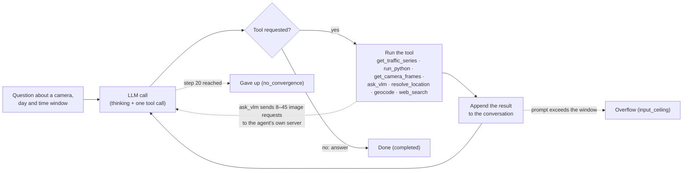
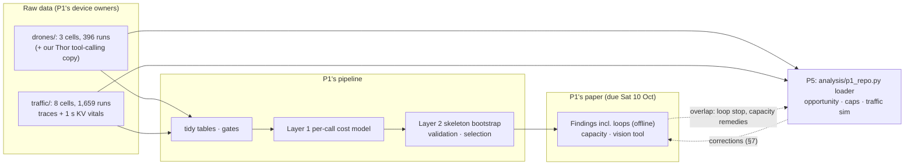
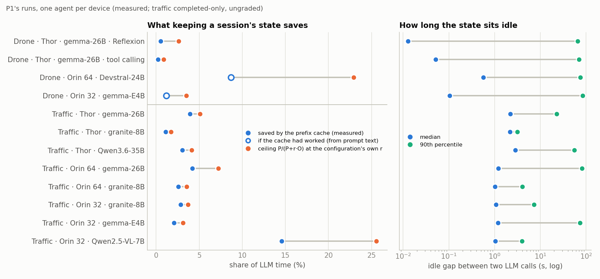
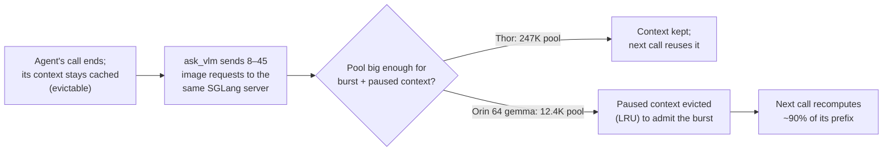
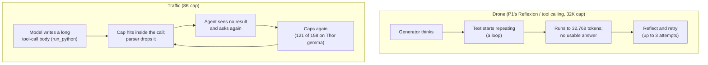
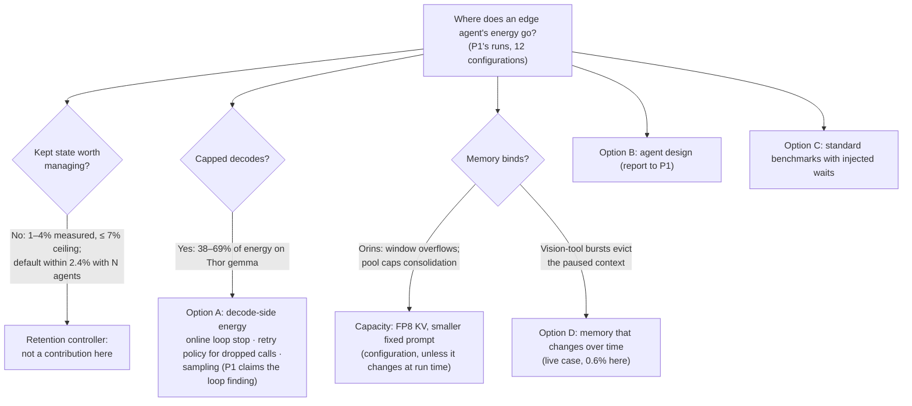

# P1's repository: drone and traffic data, and what changes for P5

**2026-10-05 · Sai Sandesh (P5)**, prepared with Claude Code.

P1's repository (`dream-lab/edge-agent-bench`, cloned read-only into the git-ignored
`data/edge-agent-bench`, HEAD `3c47ebc` of Sun 4 Oct 19:02) holds 2,055 runs in 11 configurations: 3 graded
drone cells and 8 traffic cells, which are not graded yet. This report reruns our analyses on all of it, plus
our own copy of P1's Thor drone tool-calling sweep (104 runs, which the repository does not hold).

The traffic agent is the accumulating-context agent our drone analysis said P1 lacked. Its prompts never
shrink, and 56–82% of their tokens come from the prefix cache. Yet kept state is still worth little:
- the cache saved 1–4% of LLM time (15% for Qwen2.5-VL, which writes 107 tokens per call);
- the most any retention policy could save is 1.7–7.2% (26% for Qwen2.5-VL) at each configuration's own price
  of a generated token;
- an agent's state sits idle for a median 1–3 s between calls.

With 1–8 traffic agents per device, simulated at each device's real KV pool, no policy beats SGLang's
default by more than 2.4%. That extends the 2026-10-03 negative result to traffic. Two edge effects are
real, though:
- **Small KV pools cap consolidation on the Orins.** Doubling the pool, which is what an FP8 KV cache buys,
  cuts energy per completed task by 31–46% at 8 agents. That is capacity, a configuration choice.
- **The vision tool fills the pool at one agent per device.** It sends 8–45 requests at once to the agent's
  own server. On Orin 64 gemma it filled 99.5% of the 12,415-token pool and evicted the paused agent's
  context before all 62 calls that followed it. The recompute cost is small (0.6% of LLM time), because
  prefill is cheap.

Capped calls are where the energy goes in both domains, but in different ways. Drone runaways are
repetition loops: 121 of 122 on Thor Reflexion, the same counts as before plus P1's missing run. In traffic,
where text survives, capped calls are mostly not text loops; the waste is step-level repetition. A cap inside
a tool call drops the call, the agent retries and caps again, which happened in 121 of 158 capped calls on Thor
gemma. Stopping a run at its second consecutive capped call would save 27% of that cell's energy and lose 1
completed run.

P1's paper reports the loop finding itself, but with an offline detector and as an upper bound, not as a
control policy; it has dropped its early-abort plan. Details are in §8. Five corrections for P1 are in §7 and,
ready to forward, in [`NOTES_FOR_P1.md`](NOTES_FOR_P1.md).


Each dot is one configuration (P1's measured runs, one agent per device). Across the x-axis is the most that
keeping a session's state could save; up the y-axis, the share of board energy spent decoding calls that hit
their token limit. Every configuration sits far from the top right.

## Summary

1. **The repository** holds raw data, a full analysis pipeline and the paper draft (§1).
   - Thor drone tool calling is not in it; we keep using our copy.
   - Traffic is ungraded, so "ok" means completed without a harness failure.
   - Traffic text is incomplete for many capped calls.
2. **Traffic contexts accumulate** (§2).
   - Every prompt repeats the previous one: 100% of call pairs, with the cached tokens equal to the previous
     prompt in 81–100%.
   - The context grows a median 0.4–2.7K tokens per step, 67–90% of it tool output.
   - Up to 106K tokens (prompt plus output) on Thor.
3. **Kept state is worth 1–4% of traffic LLM time** (measured), with a ceiling of 2–7% (§2).
   - Outputs are a median 107–999 tokens per call, including reasoning.
   - Decode is 84–99% of LLM time.
   - Idle gaps are a median 1.0–2.8 s.
   - The paused share of KV memory-time is 1–17%.
4. **The vision tool is a burst of requests to the agent's own server, not a second model** (§3).
   - It runs a median 8–23 and up to 45 concurrent requests.
   - On Orin 64 gemma the burst evicts the paused context every time (62 of 62 calls after it miss, 90% of
     the expected prefix recomputed).
   - On Orin 32 gemma-E4B it does so sometimes (12 of 50); on Thor, never.
5. **Many traffic agents per device: SGLang's default matches every policy within 2.4%** (§4).
   - That holds in all 48 cells without failures (1–8 agents, 6 configurations, real and doubled pools).
   - On the Orins the gap to unlimited memory reaches 33–64% at 8 agents, but it is capacity. Doubling the
     pool recovers most of it; no policy does.
6. **Capped calls** (§5).
   - **Drone:** loops.
     - Thor Reflexion: 121/122. Thor tool calling: 127/143 (the other 16 are 1,024-token evaluator calls).
     - The online loop stop saves 43.5% / 35.7% of board energy and stops no finished call.
   - **Traffic:** where text survives, few loops.
     - 16/21 on Thor gemma, 4/29 on Thor granite, 0 on the Orin gemma cells.
     - Text is missing for most capped calls on gemma, because the cap hit inside a tool call.
     - Repeated caps are the waste: stopping at the second consecutive cap saves 27% on Thor gemma (1 run
       lost) and 25% on Orin 32 E4B (7 lost).
7. **Drone update** (§6).
   - P1's 144th Thor Reflexion run is a loop too.
   - Devstral (Orin 64) is the one drone cell where retention could matter:
     - prefill is 20% of its LLM time;
     - its server reported no cache hits at all;
     - 57% of each prompt repeats an earlier one, worth about 9% of LLM time if the cache worked.
8. **P1's numbers reproduce** from the same files (§7): cache hit, prefill share, capped share, P1's loop
   rule and stop bound. Three of P1's points need correcting:
   - the vision tool's mechanism;
   - their loop threshold misses long-period loops;
   - the drone Orin 32 "capped calls" are mostly 1,024-token evaluator calls, not runaways.

## 1. What the repository holds (task 1)

**Data** (raw, read-only; pushed by P1's device owners; the table is P1's inventory).

| Domain | Configuration | Runs | Tasks | Pass / completed | Hours | kWh | KV pool (tokens) | Window |
| --- | --- | --- | --- | --- | --- | --- | --- | --- |
| Drone | Thor · gemma-4-26B-A4B · Reflexion | 144 | 16 | 71% pass | 62.9 | 4.37 | 80,000 | 65,536 |
| Drone | Orin 64 · Devstral-24B (FP8) · tool calling | 144 | 16 | 31% pass | 37.4 | 1.20 | 40,000–60,000 | 40,960–65,536 |
| Drone | Orin 32 · gemma-4-E4B · tool calling | 108 | 12 | 47% pass | 42.0 | 1.40 | 40,000 | 40,960 |
| Traffic | Thor · gemma-4-26B-A4B | 252 | 28 | 88% completed | 43.8 | 3.02 | 247K | 110,000 |
| Traffic | Thor · granite-4.2-8B | 189 | 21 | 84% | 46.1 | 3.51 | 493K | 110,000 |
| Traffic | Thor · Qwen3.6-35B-A3B (FP8) | 84 | 28 (instance A) | 96% | 11.6 | 0.59 | 2.77M | 110,000 |
| Traffic | Orin 64 · gemma-4-26B-A4B | 252 (227 traces) | 28 | 67% | 24.5 | 0.72 | 12.4–13.1K | 12,288 |
| Traffic | Orin 64 · granite-4.2-8B | 189 | 21 | 71% | 52.2 | 2.09 | 32,768 | 26,624 |
| Traffic | Orin 32 · granite-4.2-8B | 189 (178 traces) | 21 | 70% | 68.4 | 2.82 | 26–27K | 26,624 |
| Traffic | Orin 32 · gemma-4-E4B | 252 | 28 | 99.6% | 42.1 | 1.50 | 70–71K | 32,768 |
| Traffic | Orin 32 · Qwen2.5-VL-7B | 252 | 28 | 99% | 3.5 | 0.13 | 114K | 32,768 |

- **Per-run files.**
  - Drone: every call's full text, tokens, cached tokens, finish reason, timings and board energy, plus
    tool calls, 0.2 s device samples and 0.2 s server KV samples.
  - Traffic: per-call tokens, timings and energy; text from the trace's turns; a vitals stream with 1 s KV
    samples. There is **no finish reason** in traffic.
- **What is missing.**
  - Thor drone tool calling is not in the repository or its history; P1's tracker marks it as planned. We
    keep using our 104-run copy.
  - Traffic grades: `final_result` is empty everywhere.
  - Text for capped traffic calls: when the 8K cap hits inside a tool call, the parser drops the partial
    call. 9 Thor gemma traces were also rebuilt without turns.
  - The two Orin drone servers report 0 cached tokens on every call. The Orin 32 server's own hit rate
    reaches 0.999, so its cache works but per-call reporting is missing. Devstral's hit rate is 0
    throughout (P1's open question Q-D7).
- **Format.** Drone runs are identical to our copies (the 143 we had are byte-identical; the missing D2 run
  is complete). Only gzip support was needed.

**Pipeline.**
- Flow: tidy tables → gates → a registry of 24 results → every number in the paper as a macro.
- The per-call cost model ("Layer 1"):
  - prefill `a0 + a1·n + a2·n(n+2h)`;
  - decode `b0 + b1·(p + g/2)` per token;
  - energy `P_pre·ttft + P_dec·decode`.
- An offline bootstrap of recorded runs ("Layer 2") predicts task cost distributions, validated
  leave-one-task-out and leave-one-device-out.
- It does not install offline here, so we read the raw files with our own loader
  (`analysis/p1_repo.py`).
- No concurrency, batching, retention or early-abort code exists, and the server KV time series is never
  used. The microbenchmarks MB1–MB7 are scripted but not run.

**Paper** ("Measuring the Task, Not the Trajectory", SIGMETRICS 2027, due Sat 10 Oct 17:30 IST).
- The thesis is that per-token or per-turn costs and replayed runs cannot price an agent's task. Cost splits
  into a device-dependent per-call model and a device-independent behaviour model, so D devices × M models
  need D + M campaigns.
- It assumes one request in flight throughout.
- Its own claims that touch P5 are in §8.

**Schedule** (P1's docs, 3 Oct).
- P1's last runs end Thu 8 Oct. Thor-1, the drone device, runs gemma tool calling (99/144 on 3 Oct), then
  granite, then Devstral.
- After the deadline nothing is written down. Some Orin units are free from Tue 6 Oct "for re-runs".
- Deferred but not cancelled: the KV-pool sweep (E4), warm vs cold cache (E5), clocks on/off (E10) and
  runtime control. E4 and E5 overlap P5.

**People.** P1's analysis and paper are written by Mayank Arya (`mayankarya`), the author of aerogen; drone
runs by Aayushi, traffic by Priyanshu.

**The traffic agent** (P1's harness, as recorded in the traces). It answers one question about a city's
traffic cameras per run, with native tool calling and one growing conversation:



**What P5 takes from the repository, and where it overlaps P1:**



## 2. Traffic: accumulating context, little to save


Every traffic prompt repeats the previous one and adds a tool result (100% of call pairs; the context grows a
median 0.4–2.7K tokens per step, 67–90% of it tool output). On Orin 64 gemma the 12,288-token window cuts runs
short; on Thor, prompts reach 106K tokens.



| Configuration | Calls per run | Output per call (median) | Prefill share of LLM time | Prompt from cache | Saved by the cache | Ceiling (own r) | r | Idle gap median / p90 | Paused share of KV time |
| --- | --- | --- | --- | --- | --- | --- | --- | --- | --- |
| Drone · Thor · gemma · Reflexion | 2 | 536 | 1.8% | 26% | 0.5% | 2.6% | 63 | 0.0 / 66 s | 2.2% |
| Drone · Thor · gemma · tool calling | 3 | 3,406 | 0.7% | 29% | 0.2% | 0.9% | 52 | 0.1 / 70 s | 3.1% |
| Drone · Orin 64 · Devstral | 6 | 112 | 19.8% | not reported | ~8.7%* | 22.9% | 86 | 0.6 / 75 s | 5.4% |
| Drone · Orin 32 · gemma-E4B | 9 | 1,913 | 3.5% | not reported | ~1.2%* | 3.5% | 64 | 0.1 / 85 s | 10.1% |
| Traffic · Thor · gemma | 5 | 844 | 2.4% | 82% | 3.9% | 5.1% | 147 | 2.2 / 23 s | 3.6% |
| Traffic · Thor · granite | 5 | 906 | 1.4% | 71% | 1.1% | 1.7% | 312 | 2.1 / 3.1 s | 1.3% |
| Traffic · Thor · Qwen3.6 | 4 | 424 | 2.1% | 75% | 3.0% | 4.1% | 276 | 2.8 / 56 s | 17.0% |
| Traffic · Orin 64 · gemma | 3 | 592 | 4.0% | 58% | 4.2% | 7.2% | 118 | 1.2 / 81 s | 16.4% |
| Traffic · Orin 64 · granite | 5 | 963 | 1.5% | 72% | 2.6% | 3.5% | 127 | 1.0 / 4.0 s | 1.5% |
| Traffic · Orin 32 · granite | 6 | 999 | 1.3% | 78% | 2.8% | 3.7% | 127 | 1.1 / 7.3 s | 0.9% |
| Traffic · Orin 32 · gemma-E4B | 3 | 545 | 1.8% | 62% | 2.1% | 3.1% | 147 | 1.2 / 74 s | 8.4% |
| Traffic · Orin 32 · Qwen2.5-VL | 2 | 107 | 15.5% | 56% | 14.6% | 25.6% | 117 | 1.0 / 4.0 s | 14.2% |

\* Not reported by the server. This is what a working cache would save, from the share of each prompt that
repeats an earlier prompt's text (§6).

**Definitions and data sources** (P1's measured runs, one agent per device):
- **Saved by the cache:** cached tokens at the configuration's own cold-prefill rate, as a share of what LLM
  time would have been with nothing kept.
- **Ceiling:** P/(P + r·O) over every call after a run's first, with P all its prompt tokens. This is an
  upper bound, since any prompt token could at best have been kept.
- **r:** the configuration's measured cold-prefill tokens/s over its batch-1 decode tokens/s. At r = 67,
  the drone reports' value, the traffic ceilings are 6.5–15% (37% for Qwen2.5-VL).

**Why traffic still has little to save.**
- **Shape.** Contexts accumulate (above), but each step writes a median 424–999 tokens with reasoning, and
  decode is 96–99% of LLM time except for Qwen2.5-VL.
- **Price.** On a Jetson a generated token costs 117–312 prefilled ones in time (P1's energy prices for traffic:
  46–121× average, 138–1,335× marginal).
- **Waits.** The state is idle for seconds: most tools take 0.5–3 s. Only the vision tool (median 53–158 s)
  and some data queries are long, and the vision tool keeps the server busy (§3).
- **No shared prefix between agents.** Every traffic system prompt opens with "CURRENT DATE/TIME (UTC): …",
  so two sessions share about 39 characters, which is nothing to deduplicate.
  - The fixed part of the prompt (system text and 7 tool definitions) is 3,926–5,071 tokens per session.
    On Orin 64 gemma that is 38% of the 12,288-token window (P1's figure, reproduced).

## 3. The vision tool fills the KV pool at one agent per device

P1 describes `ask_vlm` as a second model on the same GPU. The server's own counters (the vitals stream's
1 s KV samples) show something else.




| Configuration | ask_vlm calls | Running requests during it (median / max) | KV used during it, peak (share of pool) | Next call missed its prefix (> 64 tokens) | Prefix recomputed | Recompute, share of LLM time |
| --- | --- | --- | --- | --- | --- | --- |
| Traffic · Thor · gemma | 82 | 18 / 45 | 48.9K (20%) | 0 of 82 | 0.0% | 0.0% |
| Traffic · Thor · Qwen3.6 | 91 | 10 / 12 | 32.2K (1%) | 17 of 81 | 15% | 0.13% |
| Traffic · Orin 64 · gemma | 64 | 8 / 20 | 12.3K (**99.5%**) | **62 of 62** | **90%** | 0.56% |
| Traffic · Orin 32 · gemma-E4B | 50 | 23 / 24 | 52.0K (73%) | 12 of 50 | 30% | 0.06% |

- **The mechanism.** During an `ask_vlm` call the agent's own server runs many requests at once: 81–90% of
  samples have more than one running request, against at most 0.4% of samples outside the tool's windows. On a small pool the burst pushes the
  paused agent's context out, and the next call recomputes it.
  - After any other tool, misses are absent: 0 of 498 calls on Orin 64 gemma.
  - Qwen3.6 also misses after other tools (51 of 274). That is its hybrid state, which is reused only at
    checkpoints.
- **Why it costs little.** Prefill is cheap: 421K recomputed tokens on Orin 64 gemma are 0.6% of its LLM
  time.
- **Why it matters for P5.** It is the clearest case in P1's data of memory that changes over time inside one
  agent's run (option D):
  - the burst is predictable (the tool is known when it is called);
  - it could be admitted at lower concurrency, or the paused context pinned.

  The prize is bounded by the same prefill economics.
- **Caveat.** We infer "same server" from `kv_num_running_reqs` on the agent's SGLang endpoint during the
  tool's window. We have not read the tool's code.

## 4. Many traffic agents per device

The 2026-10-03 simulator (`analysis/admission_sim.py`) replays P1's traffic traces as N closed-loop agents
per device (`analysis/traffic_sim.py`).
- **Calibration** per configuration, from its own calls:
  - cold prefill rate;
  - decode time per step `t1·f(batch) + c·(context tokens)`, fitted with P1's form (gemma by its experts,
    dense models as on the WS);
  - board power during calls and during non-vision tools.
- **Budget:** its real KV pool in tokens, at ½, 1 and 2×.
- **Policies:** 12, plus unlimited memory; 3 seeds of 24 h each.
- **Not shared:** no prefix between agents.
- **Success:** completed.


| Configuration (KV pool) | 1 agent | 8 agents, default | 8 agents, best policy | 8 agents, pool × 2 | 8 agents, unlimited memory |
| --- | --- | --- | --- | --- | --- |
| Thor · gemma (248K) | 41.7 kJ | 18.6 | 18.6 | 17.9 | 17.9 |
| Thor · granite (496K) | 84.9 | 22.3 | 22.3 | 22.3 | 22.3 |
| Orin 32 · gemma-E4B (71K) | 17.6 | 4.7 | 4.7 | 3.2 | 3.2 |
| Orin 64 · gemma (13K) | 12.4 | 11.0 | 10.9 | 7.6 | 4.5 |
| Orin 64 · granite (33K) | 53.5 | 27.0 | 26.6 | 16.1 | 12.0 |
| Orin 32 · granite (27K) | 74.3 | 45.6 | 44.8 | 24.6 | 16.3 |

- **No policy helps.** Across the 48 cells with ≤ 1% failures (real and doubled pools, 1–8 agents):
  - the best of 12 policies beats the default by at most 2.4%;
  - eviction by value per byte by 0.9% (0.4% with exact wake times);
  - budget-aware admission never beats the best fixed rule.
- **Keeping state** (the default against dropping it at every wait) is worth −2% to +11% of energy per
  completed task.
- **Capacity binds on the Orins.** At the real pool, energy per completed task stops falling after 2–4 agents
  on the three small-pool configurations (Orin 64 gemma and granite, Orin 32 granite), and at 8 agents the
  95th-percentile task takes 12–13× as long as alone. With half the
  pool, 25–90% of runs no longer fit at all. Doubling the pool cuts energy per completed task by 31–46% at
  8 agents.
- **On Thor the pool is ample.** Consolidation gives 2.2× (gemma, whose experts make batching weak) and 3.8×
  (granite) from 1 to 8 agents.
- **Caveats:**
  - the vision tool's own requests are modelled as tool time, which understates contention on the 7 image
    tasks;
  - success is "completed";
  - board power is held at its batch-1 level.

## 5. Capped calls: loops in drone, repeated caps in traffic




| Configuration | Capped calls | Share of LLM time | Loops (our detector) / with text | P1's rule | Online loop stop | Stop at 2nd consecutive cap | Stop at first cap (P1's bound) |
| --- | --- | --- | --- | --- | --- | --- | --- |
| Drone · Thor · Reflexion | 122 | 71% | 121 / 122 | 94 / 122 | 43.5%, 0 finished calls stopped | 0.0% | 50.2%, 22 passing runs lost |
| Drone · Thor · tool calling | 143 (16 at 1,024) | 71% | 127 / 143 | 78 / 127 | 35.7%, 0 | 34.5%, 7 lost | 63.1%, 16 lost |
| Drone · Orin 64 · Devstral | 3 | 6% | 3 / 3 | 3 / 3 | 4.2%, 0 | 0.0% | 0.0% |
| Drone · Orin 32 · gemma-E4B | 93 (88 at 1,024) | 17% | 5 / 93 | 5 / 5 | 8.6%, 0 | 3.0%, 0 | 41.9%, 4 |
| Traffic · Thor · gemma | 158 | 42% | 16 / 21 | 16 / 51 | 2.0%, 1 | **27.3%, 1** | 37.2%, 4 |
| Traffic · Thor · granite | 41 | 19% | 4 / 29 | 8 / 41 | 0.1%, 0 | 0.0% | 9.1%, 3 |
| Traffic · Thor · Qwen3.6 | 5 | 9% | 2 / 2 | 1 / 5 | 1.2%, 0 | 0.0% | 1.5%, 3 |
| Traffic · Orin 64 · gemma | 66 (all at the context guard) | 13% | 0 / 30 | 0 / 7 | 0.0% | 4.0%, 0 | 4.8%, 0 |
| Traffic · Orin 64 · granite | 36 | 13% | 1 / 27 | 1 / 25 | 0.3% | 0.4%, 1 | 3.2%, 4 |
| Traffic · Orin 32 · granite | 50 | 17% | 6 / 31 | 7 / 38 | 0.8% | 1.0%, 1 | 4.5%, 5 |
| Traffic · Orin 32 · gemma-E4B | 76 | 37% | 0 / 1 | 0 / 66 | 0.0%, 1 | **25.0%, 7** | 30.1%, 10 |

Savings are upper bounds on the configuration's measured board energy, assuming the rest of each run goes as
recorded. Runs lost are runs that still passed (drone) or completed (traffic).

**Drone runaways are loops.**
- Our online detector flags 121 of Thor Reflexion's 122 capped calls (P1's missing run is a loop too) and none
  of 173 long finished calls. It fires at a median 35% of the call.
- P1's offline rule (last 6,000 characters below 10% compressed) finds 94. Of the 28 it misses, 27 compress
  to 0.10–0.18, which are long-period loops.
- On the Orin 32 drone cell, 88 of the 93 "capped" calls are thinking-off evaluator calls at a 1,024-token
  cap that echo JSON state. They are not runaways; its 5 capped generator calls are loops.

**Traffic caps are mostly something else.**
- **Text that survives.** Where the cap hit inside the reasoning, text survives:
  - Thor gemma's capped reasoning loops (16 of 21);
  - granite's mostly does not (4 of 29 on Thor; 1 of 27 and 6 of 31 on the Orins).
- **Text that is lost.** On gemma, most caps hit inside a tool call (a long `run_python` body) and the text
  is lost: 137 of 158 on Thor, 75 of 76 on Orin 32 E4B.
- **The waste is the retry.**
  - The agent retries and caps again: 121 of Thor gemma's 158 capped calls follow a capped call, and 64 of
    E4B's 76.
  - Stopping a run at its second consecutive cap saves 27% (Thor gemma) and 25% (E4B) of energy and loses 1
    and 7 completed runs.
  - P1's first-cap rule saves a little more but loses 4 and 10.
- **Orin 64's caps are the context guard.** All 66 capped calls on Orin 64 gemma ended at a budget the guard
  had lowered because the window was nearly full. That is capacity, not runaway decoding.

**Where each configuration's energy goes** (P1's measured board energy; each call's energy split into prefill and
decode by its time to first token; `energy_map.json`):


| Configuration | Decode in capped calls | Other decode | Prefill | Vision tool | Other tools |
| --- | --- | --- | --- | --- | --- |
| Drone · Thor · gemma · Reflexion | 67% | 27% | 2% | 0% | 3% |
| Drone · Thor · gemma · tool calling | 69% | 28% | 1% | 0% | 2% |
| Drone · Orin 64 · Devstral | 5% | 66% | 21% | 0% | 20% |
| Drone · Orin 32 · gemma-E4B | 16% | 76% | 3% | 0% | 5% |
| Traffic · Thor · gemma | 38% | 49% | 2% | 6% | 2% |
| Traffic · Thor · granite | 19% | 78% | 1% | 0% | 2% |
| Traffic · Thor · Qwen3.6 | 7% | 64% | 2% | 24% | 4% |
| Traffic · Orin 64 · gemma | 10% | 63% | 3% | 20% | 4% |
| Traffic · Orin 64 · granite | 12% | 84% | 1% | 0% | 2% |
| Traffic · Orin 32 · granite | 17% | 80% | 1% | 0% | 1% |
| Traffic · Orin 32 · gemma-E4B | 33% | 56% | 2% | 5% | 4% |
| Traffic · Orin 32 · Qwen2.5-VL | 0% | 76% | 14% | 0% | 7% |

Prefill, the only part kept state can save, is 0.7–3.4% of energy everywhere except Devstral (21%) and
Qwen2.5-VL (14%), which barely generate. Decode in capped calls takes 38–69% of board energy on Thor gemma (traffic, drone), 33% on Orin 32
gemma-E4B traffic, and 0–19% elsewhere.

## 6. Drone update

- **Thor Reflexion with P1's 144th run.** The run (D2, instance 3, run 3) ended partial after a 32,768-token
  generator loop and 90,387 evicted tokens. Every Reflexion number in the 2026-10-04 report moves by at most
  a point:
  - capped calls 71% of LLM time;
  - loops 121/122;
  - loop stop 43.5% over 16 tasks;
  - P1's first-cap bound 50.2% with 22 runs lost, P1's exact numbers.
- **Devstral on Orin 64 is the drone cell where retention could matter.**
  - It does not think: median 112 output tokens per call, 87 after the first.
  - So prefill is 20% of its LLM time, and its ceiling is 23%.
  - Its server reported no cache hits at all.
  - 57% of each prompt's text repeats an earlier prompt in the run, which is about 8.7% of LLM time if the
    cache had worked.
  - It passes 31% of runs, so this is a configuration problem worth reporting to P1 (their Q-D7), not a
    policy result.
- **gemma-E4B on Orin 32.** 40% of each prompt repeats an earlier one, worth about 1.2% of LLM time.

## 7. Cross-check with P1's numbers

| Quantity | P1 (repo, 4 Oct) | Ours (same files) |
| --- | --- | --- |
| Traffic prompt tokens from cache, 8 configurations | 55.8–82.2% | 56–82%, the same per configuration |
| Traffic prefill share of LLM time | 1.3–15.5% | 1.3–15.5% |
| Thor gemma traffic: capped calls, share of LLM time | 158, 42.3% | 158, 42% |
| Drone Thor: P1's loop rule | 94 of 122 (77%) | 94 of 122 |
| Stop at first capped call: drone Thor / traffic Thor gemma | 50.2% (22 lost) / 37.3% (4) | 50.2% (22) / 37.2% (4) |
| Capped calls on Orin 64 gemma traffic | 0 (cap = 8,000 only) | 66, all at budgets the context guard lowered |

**Corrections to send to P1** (with evidence and code, ready to forward: [`NOTES_FOR_P1.md`](NOTES_FOR_P1.md)).
1. `ask_vlm` is a burst of concurrent requests to the agent's own server, not a second model (§3).
2. Their loop threshold misses long-period loops. Our detector finds 121 of 122 drone Thor loops against
   their 94.
3. The drone Orin 32 capped calls are evaluator calls at 1,024 tokens. Their 41.9% first-cap saving measures
   evaluator truncation.
4. Orin 64 traffic calls are cut by the context guard, which their 8,000-token rule does not count.
5. Devstral's prefix cache is off or broken (hit rate 0), costing about 9% of its LLM time.

## 8. Where P1's paper and P5 overlap

- **Loops are P1's finding now.**
  - The paper says "Many capped calls are not a task that needs more room but a model that is looping" and
    "A loop detector would keep the runs that cap and recover". It rates it High novelty × High impact.
  - Its remedy is "stop or retry at the first capped call", an upper bound of 50.2% that loses 22 runs; MB4
    (replay capped calls with more budget) is not run.
  - **What remains for P5:**
    - an online detector that stops a call mid-generation and loses no runs;
    - evaluating it as a control policy;
    - sampling instead of greedy decoding;
    - the traffic case, where the waste is repeated caps rather than text loops.
- **No early abort.** The paper says an online stop predictor "needs … regret under a control policy, and is
  out of scope", and P1 has no predictor of remaining iterations or energy. Our HANDOFF's note that P1 plans
  an early-abort policy is out of date.
- **One request in flight.**
  - P1 assumes batch size 1 and dismisses concurrency controls (KAIROS) as levers the edge lacks.
  - Its own vision tool contradicts this (§3), and multi-agent edge boxes are P5's case (§4).
- **Capacity.**
  - P1 reports window overflows (21% of Orin 64 gemma runs) and proposes "fewer or shorter tool definitions,
    tools loaded on demand, capped tool outputs or an FP8 KV cache" (MB5, not run).
  - P1 deferred the KV-pool sweep (E4) and the warm-cache arm (E5). Both are P5 territory.
- **Not cited by P1:** INFERCEPT, Continuum, TokenCake, CacheScout, Adaptive KV Retention, and any
  reasoning-length work.

## 9. What changes for P5's options



- **A memory controller is not a contribution on P1's workloads, drone or traffic.** Kept state is worth
  1–4% of LLM time per agent. With many agents, SGLang's default is within 2.4% of every policy. The large
  gaps are capacity: FP8 KV, smaller fixed prompts, capped tool outputs.
- **Option A (decode-side energy)** still holds the large numbers: 37–50% of energy in capped calls on Thor
  gemma in both domains. But:
  - P1 now claims the loop finding;
  - the traffic waste is repeated caps, whose text P1's harness drops;
  - an online, run-preserving stop and a retry policy for dropped tool calls are what remain.
- **Option D (memory that changes over time)** has a live case in P1's data: the vision tool's bursts evict
  the paused context on Orin 64. It is predictable and cheap to avoid, but worth only 0.6% of LLM time here.
- **Capacity on the Orins** is the edge effect with the largest numbers (31–46% at 8 agents). But it is
  configuration (pool size, KV precision, prompt size), unless a controller must trade it against something
  that changes at run time.

## 10. Method, data and caveats

| Piece | Code | Output |
| --- | --- | --- |
| Loader for all 12 configurations | `analysis/p1_repo.py` | `data/p1_cache/*.pkl` (git-ignored) |
| Opportunity, waits, vision-tool bursts, prefix reuse | `analysis/p1_opportunity.py` | `opportunity.json` |
| Capped calls, loops, stop rules | `analysis/p1_caps.py` (reuses `p1_loops.detect`) | `caps.json` |
| Many traffic agents per device | `analysis/traffic_sim.py` (reuses `admission_sim.simulate`) | `traffic_sim.json` |
| Figures and the energy map | `analysis/p1_repo_figures.py` | `figures/`, `energy_map.json` |
| Notes for P1 | (this report) | [`NOTES_FOR_P1.md`](NOTES_FOR_P1.md) |

```
python3 -m analysis.p1_repo          # parse (about 2 s once cached)
python3 -m analysis.p1_opportunity   # about 10 s (reads the vision-tool vitals)
python3 -m analysis.p1_caps
python3 -m analysis.traffic_sim      # 2,808 simulations
python3 -m analysis.p1_repo_figures
```

- **Data.**
  - The repository at `3c47ebc` (drone 3 cells, traffic 8 cells, main run directories only).
  - Our copy of P1's Thor drone tool calling, 104 runs to 2026-10-03 16:16.
  - 32 traffic rows without a trace are left out (they carry no calls).
- **Traffic is ungraded.** "Completed" counts wrong answers as successes.
- **Traffic text gaps.** Loop counts cover only calls whose text survived, so they are lower bounds for
  gemma. The step-level rule needs no text.
- **Energy** is P1's whole-board energy. Savings are upper bounds that assume the rest of a run goes as
  recorded.
- **Simulation.** Device models are fitted on batch-1 calls; batching follows our earlier models, not
  measurements on these devices. The vision tool's requests are tool time.
- **P1's paper and plans** are quoted from the repository as of 4 Oct. P1 may change them before
  10 Oct.
- **P1's own figures** (from its 3 Oct deck and repository) are used in P5's private docs and deck only.
  They are kept out of this public repository, in the git-ignored `p1_figures/`.
