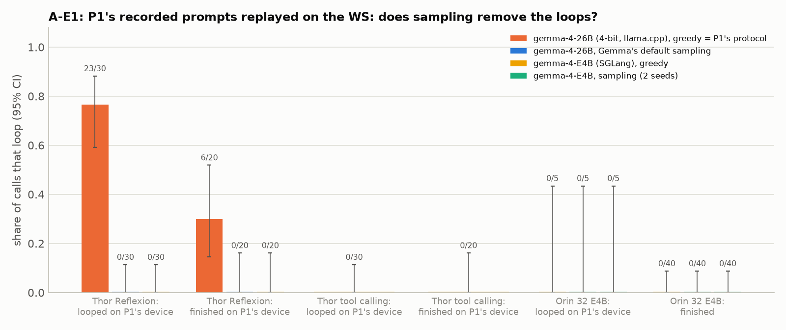
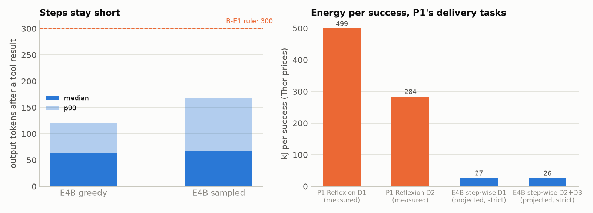
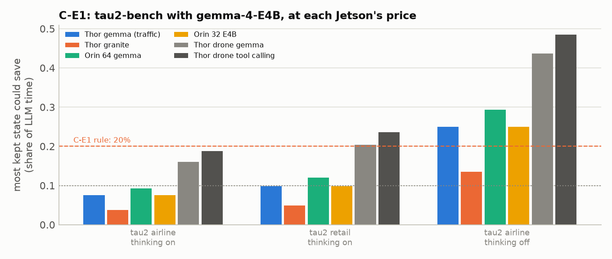
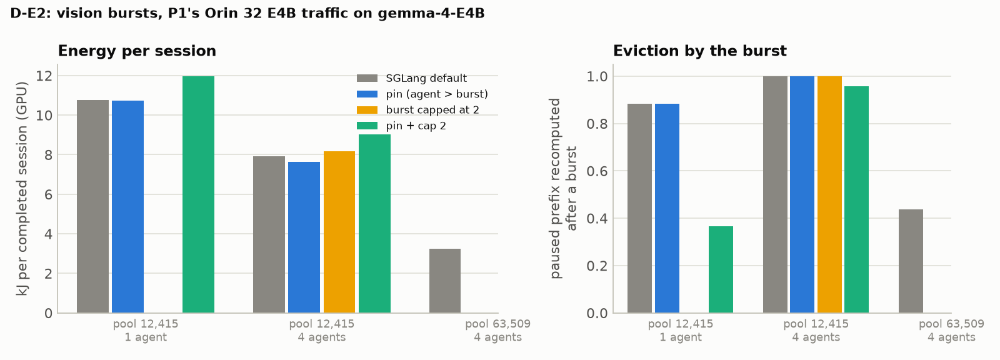
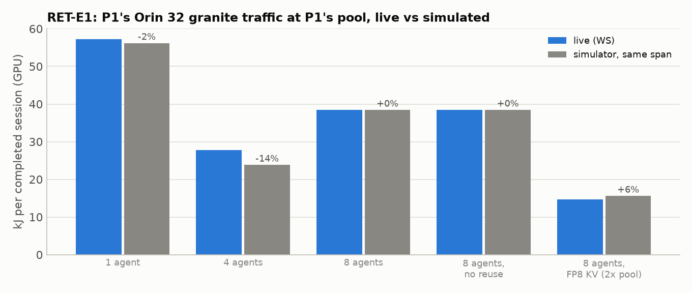

# P5's options side by side: the evidence for and against each

**CMP-2, 2026-10-06 · Sai Sandesh (P5)**, prepared with Claude Code. Plan:
[`../../planning/OPTIONS_PLAN.md`](../../planning/OPTIONS_PLAN.md) (G1); task status:
[`../../planning/TRACKER.md`](../../planning/TRACKER.md).

This doc lays out every option P5 could take, with the same criteria and the same template, so the professor
can choose with the pros, cons and open gaps side by side. Each option's gaps were filled this week (5-6 Oct)
with the cheapest experiment that could close them, on the workstation and on P1's recorded data, each with a
decision rule fixed before it ran (plan D15). It is a separate doc for now, to be merged into the evidence doc
and the deck later. Our own lean is stated once, at the end (§9), and nowhere else.

**What this week found, in one line per option** (details and sources in §3-§8):
- **A. Decode-side energy:** P1's drone runaways are a decoding setting. On P1's 26B, greedy decoding loops on
  77% of P1's loop prompts and Gemma's own default sampling on none; an online stop plus one resample recovers
  every looping call, at 60% of the capped cost. What is left for P5: traffic's repeated capped tool calls
  (31-33% of gemma traffic LLM energy), the safety net, and batching (13x less energy per token at batch 16).
- **B. Agent design:** with P1's own gemma-4-E4B, a step-wise agent keeps steps after tool results at a median
  63-68 tokens and passes the strict check 9 of 11 times greedy; projected 11-19x less energy per strict success
  than P1's Reflexion.
- **C. Benchmarks:** tau2-bench's contexts accumulate (92-96% reuse), but with a thinking agent kept state is
  worth 7.5-9.9% of LLM time at E4B's Jetson price; without thinking, 25%. Thinking decides.
- **D. Memory over time:** the vision burst's eviction reproduces live (88-100% recomputed); pinning plus a
  burst cap prevents it (37%) but costs 11% more energy than recomputing.
- **CAP. Capacity:** the largest measured edge effects. Live, an FP8 KV cache doubles granite's pool and cuts
  energy per completed session 62% at 8 agents (2.6x the sessions per hour); a 5x larger pool cuts it 2.4x at 4
  agents. But FP8 KV for Gemma-4 does not run on Ampere (the Orins) in SGLang 0.5.20, and FP8 quality on these
  agents is unmeasured.
- **RET (the retention controller):** the simulator behind "no policy beats SGLang's default" holds live: on P1's
  Orin 32 granite traffic at P1's pool it is within 14% of the live engine at 1-8 agents (2% except at 4 agents)
  and predicted the FP8 pool's effect within 6%. At 8 agents the default keeps no state at all (0 of 102 calls
  reuse a cached prefix), so dropping state costs the same: capacity binds, not retention.

Source tags: **[P1-meas]** measured on P1's Jetsons (board energy); **[WS-meas]** measured on our workstation
(NVML GPU energy); **[sim]** our simulator; **[proj]** projected with a cost model; **[lit]** a paper (depth as
stated in the literature notes `lit_*.md`; re-check against the PDF before citing).

## 1. The decision

P5 asked how an edge serving system should manage the state an agent holds while it waits for a tool, to
minimise energy per successful task on Jetson Orin and Thor. On P1's agents, that question is answered mostly
"no": kept state is worth 1–4% of LLM time, and no memory policy beats SGLang's default by more than 2.4%
(traffic) or 9.9% (drones) in simulation, a simulator that held live this week (RET, §8). So the professor chooses what P5 studies instead, or whether
it stays with retained state in another form:

| Option | In one line |
| --- | --- |
| **A. Decode-side energy** | Stop runaway decodes online in the serving layer, retry well, budget thinking, batch long decodes |
| **B. Agent design** | A step-wise agent with flight-level tools uses far less energy per success than P1's whole-program agents |
| **C. Standard benchmarks with injected waits** | The original retained-state question, on τ²-bench/BFCL with P1-like waits |
| **D. Memory that changes over time** | Admission and retention when model-backed tools or co-located models take and release unified memory |
| **CAP. Capacity** | KV precision, fixed-prompt size and tool-output caps as levers, as configuration or chosen at run time |

Combinations are possible (§8).

## 2. Side by side

The criteria (plan §2.2, D16): **K1** prize, **K2** evidence strength, **K3** novelty, **K4** edge specificity,
**K5** generality, **K6** feasibility, **K7** dependence on P1, **K8** risk.

| | A. Decode-side | B. Agent design | C. Benchmarks + waits | D. Memory over time | CAP. Capacity |
| --- | --- | --- | --- | --- | --- |
| **K1 Prize** | Capped decodes: 67–69% of board energy (drone, Thor gemma), 38% (traffic, Thor gemma), 33% (Orin 32 E4B traffic), 0–19% elsewhere [P1-meas] | With P1's own E4B: 26–27 kJ per strict success on D1–D3 against P1's Reflexion 284–499 kJ (11–19×) [proj from WS-meas] | Kept state worth 7.5-9.9% of LLM time at E4B's Jetson price with thinking on, 25% with thinking off (tau2) [WS-meas] | Vision burst: 0.6% of LLM time at one agent [P1-meas]; live, burst-aware policies stop the eviction but cost 3-14% more energy per session [WS-meas] | Live: FP8 KV (2x pool) cuts energy per session 62% at 8 agents; a 5x pool cuts it 2.4x at 4 agents; batching cuts J/token 13x [WS-meas]; doubling the pool: −31–46% at 8 agents on Jetsons [sim]; overflows end 11–21% of Orin runs [P1-meas] |
| **K2 Evidence** | Energy measured; P1's 26B (4-bit) on the WS loops on 23/30 of P1's loop prompts under greedy and on 0/30 with Gemma's default sampling [WS-meas] | Step sizes measured with P1's E4B (24 missions) and projected; still no Jetson run | tau2-bench measured on the WS (40 tasks, E4B) | Mechanism and policies measured live on the WS (D-E2, one run per cell, gemma-4-E4B) | Pool-size effect measured live (D-E2, RET-E1, CAP-E1); the simulator holds live within 14%; FP8 quality unmeasured (Gemma-4 FP8 KV cannot run on Ampere) [WS-meas] |
| **K3 Novelty** | Partly covered: loop stop + recovery (Word Salad Chopper), energy-motivated agent stop (AgentStop), stop + restart (Fail-Fast), early exit in SGLang (Dynasor); P1's paper reports the loops [lit] | Direction known (Cost of Dynamic Reasoning, Sustainable Agents, CodeAct, AeroGen); this exact comparison not found [lit] | Generic version published (INFERCEPT, Continuum, TokenCake, Adaptive KV Retention, CacheScout) | Elastic KV (Prism/kvcached, MorphServe) and tool-aware pinning (Continuum, MORI) exist; tool foreknowledge on unified memory not found [lit] | Each lever studied (TriAxialKV, Less-is-More, CarbonCall, Complexity Trap, FP8 KV); a run-time controller across levers not found [lit] |
| **K4 Edge** | Decode is 96–99% of LLM time on Jetsons; board power; weak MoE batching | Drones per device; the price of a generated token | Weak: edge only through injected waits and prices | Strong: unified memory, model-backed tools on one board | Strong: small pools on 32–64 GB boards |
| **K5 Generality** | Any thinking agent; loops depend on model and stack (E4B on the WS never loops) [WS-meas] | Task-dependent; delivery tasks only | High | Agents with model-backed tools | High |
| **K6 Feasibility** | Detector, gateway, decode guard built and run live on P1's 26B | aerogen driver + gateway shim run P1's E4B; needs a building-aware sim | τ²-bench + gateway run end to end | Gateway, replayer and burst policy built and run live | Replayer and calibration built; FP8 path for Gemma blocked on Ampere |
| **K7 Dependence on P1** | High: P1's paper claims the loop finding; split to agree | High: agent design is P1's territory | Low | Medium: P1's answer on `ask_vlm`; devices for real unified memory | Medium: P1 proposed these remedies (MB5, not run) and deferred its KV-pool sweep (E4) |
| **K8 Risk** | Realised for drones: sampling removes the loops (a configuration fix for P1); what is left is smaller | Attributable to agent engineering; strict range includes parity | Waits are synthetic; may collapse like traffic | Realised here: protecting the paused context costs more than recomputing it on these GPUs | A good static setting may capture it all |

## 3. A. Decode-side energy

**What P5 would study.** The serving layer watches each call as it streams, stops a call that has started to
repeat itself, and decides what happens next (return it capped, retry it resampled, nudge it, give it less
budget), judged by energy per successful task and runs lost. Plus thinking budgets, and how long decodes from
several agents share a device.

**The claim a paper could make.** "On edge devices running thinking agents, most energy is spent in decodes
that run to their cap. An online, text-only stop in the serving layer with a retry policy recovers X% of energy
per successful task, losing Y runs, where sampling alone recovers Z%."

**Evidence for.**
- Capped calls take 67–69% of board energy for both drone agents on Thor gemma, 38% for traffic on Thor
  gemma and 33% for Orin 32 gemma-E4B traffic; 0–19% elsewhere [P1-meas].
- In drone runs they are repetition loops: 121 of 122 capped Reflexion calls and 127 of 127 tool-calling
  calls capped at 32,768 [P1-meas, our detector on recorded text].
- An online stop at the detector's firing point would save 43.5% (Reflexion) and 35.7% (tool calling) of
  board energy and stop none of the 173/194 long calls that finished on their own (upper bound; P1's
  first-cap rule saves 50.2% / 63.1% but loses 22 / 16 passing runs) [P1-meas, replayed].
- In traffic, the waste is a capped tool call that is dropped and retried: 121 of 158 capped calls on Thor
  gemma follow a capped call; stopping at the second consecutive cap saves 27% (1 completed run lost), 25% on
  Orin 32 E4B (7 lost) [P1-meas].

**Evidence against.**
- The cause is greedy decoding: on the WS, P1's 26B loops on 77% of P1's loop prompts under greedy and on none
  under Gemma-4's own default sampling (A-E1, below); Qwen3.5 ran away only under greedy too (0 of 21 sampled
  missions) [WS-meas]. So the drone fix is configuration.
- P1's paper now reports the loop finding itself (offline detector, stop-at-first-cap bound).
- The traffic workload is ungraded, so "runs lost" there counts completions, not correct answers.

**Novelty** (`lit_A.md`; 25 works). Partly covered. Published: stopping reasoning that repeats itself and
recovering with a forced conclusion (Word Salad Chopper, EMNLP 2025; Circular Reasoning, 2026), energy-motivated
early termination of local agents (AgentStop, CAIS 2026), stop-and-restart for agents (Fail-Fast
Restart-Smart, 2026), early exit inside SGLang (Dynasor), thinking budgets evaluated on Jetson Orin
(EdgeReasoning). Not found: the combination of an engine-side, training-free text detector for thinking-on agent
calls, a retry policy for capped tool-call bodies, and energy per successful task on Jetson boards, including the
cost of wrong stops. Moderate novelty, mostly empirical.

**Edge specificity.** On P1's Jetsons decode is 96–99% of LLM time and prefill 0.7–3.4% of board energy; board
power stays high through a runaway decode. Weak batching on mixture-of-experts models (a 16-request decode step
takes ~5.3× one on Thor gemma [sim fit]) makes one runaway hold the device. Board energy needs a Jetson; the WS
can replay P1's exact prompts on a stand-in model.

**Dependence on P1.** P1 owns the observation; P5 could own the online mechanism and its evaluation (Sandesh:
build now, agree the split after 10 Oct). The sampling result (A-E1) is a fix P1 can adopt directly.

**What would change our mind.** This happened for the drone agents: sampling removes the loops on P1's 26B
without hurting finished calls (A-E1). A now rests on the traffic agent's repeated caps, a safety net, and
budgets; A-E2 tests the safety net.

**This week.**
- **A-E4, traffic's capped calls** (`a_e4.json`; P1's traces) [P1-meas]:
  - On gemma the waste is a few runs looping through capped `run_python` calls: on Thor gemma 121 of 158 capped
    calls follow a capped call, chains run up to 21 calls, and the repeats after a run's first cap hold 33% of its
    LLM-call energy. Orin 32 E4B: 64 of 76, chains up to 20, 31%.
  - Where the text survives, the cap hits inside a dropped `run_python` body (30 on Thor gemma, 62 of 76 on E4B)
    or inside the reasoning (21 on Thor gemma). Granite caps mostly inside its reasoning and rarely repeats
    (repeats ≤ 3% of energy); Orin 64 gemma's caps are all the context guard (capacity).
  - Runs with a cap complete 4 of 33 times on Thor gemma but 10 of 11 on E4B: on E4B the retries eventually work,
    at great cost, so a blunt stop would lose completions where a better retry might keep them.
- **A-E1, do the loops survive sampling?** (`a_e1.json`; P1's recorded prompts replayed exactly) [WS-meas]:
  - **gemma-4-E4B does not loop on the WS, even greedy:** 0 of 60 of the 26B's Thor loop prompts (95% upper bound
    11%), 0 of 40 controls, and 0 of its own 5 Orin 32 loop prompts under greedy or two sampled seeds. Every call
    finished, in a median 1.9-4.4K tokens. Under the pre-registered rule this is inconclusive (no reproduction),
    and it says loops depend on more than greedy decoding: on the model, and apparently on the serving stack or
    device (E4B looped on all 5 on P1's Orin 32; P1 reports inference varying between repeats there).
  - **P1's gemma-4-26B-A4B through llama.cpp (4-bit GGUF; SGLang cannot run any 26B on our GPUs) reproduces the
    loops under greedy, and Gemma's default sampling removes them** (P1's Thor Reflexion prompts, 30 that looped
    and 20 that finished on P1's device; one sampling seed):

    | | Greedy (P1's protocol) | Gemma's default sampling |
    | --- | --- | --- |
    | Looped on P1's Thor (30) | **23 loop (77%; 95% CI 59-88%)**; 7 finish | **0 loop (0-11%)**; 29 finish, 28/28 programs valid |
    | Finished on P1's Thor (20) | 6 loop (30%) | 0 loop; 20 finish |
    | Output tokens, median (loop prompts) | 11,574 (stopped by the detector) | 8,136 |
    | GPU energy for the 50 prompts | 685 kJ (loops stopped early) | 483 kJ |

    The greedy loops trip the detector at a median 11.6K tokens, as P1's did on the Thor (35% of 32,768). The
    4-bit model loops somewhat more readily than P1's bf16 one (6 of 20 controls). Verdict under the
    pre-registered rule: **sampling removes the loops**.

    

  - **What this means for A.** The largest energy item in P1's drone runs (capped decodes, 67-69% of board energy
    on Thor gemma) looks like a decoding configuration problem: P1 runs temperature 0, the model's own
    generation config samples (temperature 1.0, top_k 64, top_p 0.95). The fix for P1 is one line, and it belongs
    in P1's paper. What remains for P5 under A is the safety net (an online stop for residual loops, A-E2's
    retries), the traffic agent's repeated capped tool calls (A-E4), budgets and batching of long decodes.
- **A-E2, stop and retry** (`a_e2.json`; the 29 prompts that looped under greedy in A-E1, replayed greedy on the
  26B; the gateway stops a call where the detector fires and retries once) [WS-meas]:
  - 17 of 29 looped again (greedy on llama.cpp is not bit-reproducible across its parallel slots, as P1 saw
    repeats differ at temperature 0). **All 17 resampled retries finished with a valid result.** The stop came at a
    median 12.2K tokens and the retry needed 7.7K: 19.7K in all, against P1's recorded 32,768 (about 40% saved).
  - Overall 28 of 29 prompts ended with a valid result (95% CI 83-99%), but only 10 of 29 at half the recorded cost
    or less, so the pre-registered rule (>= 70% at <= 50%) is **not met**. Sampling from the start is cheaper
    (A-E1: a median 8.1K tokens on the same prompts, no loops).
  - So the online stop is a reliable **safety net** for deployments that must decode greedily (a stop plus one
    resample recovers every looping call), not the main energy lever.
  - **A nudge does not break a greedy loop:** retrying greedy with a note that the attempt repeated itself (12
    prompts) re-looped in 7 of the 10 retries; only 2 ended valid. The retry has to change the decoding.
- **A-E5, batching of decodes on one A5000** (`jsw/costs/calibrate2.py`; GPU energy) [WS-meas]: going from batch 1
  to batch 16 cuts the energy per generated token 13x on granite-4.2-8b (5.3 → 0.41 J) and 13.5x on gemma-4-E4B
  (3.40 → 0.25 J), while a decode step takes only 4.5% (granite) and 20% (E4B) longer. Concurrency is the strong
  lever here, which P1's one-request-at-a-time setting leaves unused. (The 26B could not be calibrated in SGLang;
  P1's Thor fit says its experts make batching weaker: a 16-request step ~5.3x one.)

> **WS version (G2).** Built: the streaming loop detector (`jsw/policies/loop_detector.py`; fires at exactly the
> offline position on all 1,620 recorded Thor calls, reproducing the 121 + 127 counts), the gateway
> (`jsw/gateway/`; ~0.3 ms per call) and the decode guard (`jsw/policies/decode_guard.py`: truncate, resample,
> nudge or budget after a stop; a session stop after k consecutive caps), tested end to end against a fake
> engine and run live in A-E1 (stops) and A-E2 (stop + retry on P1's 26B). Not yet run inside a live agent loop.

## 4. B. Agent design

**What P5 would study.** The agent paradigm as the energy lever: a step-wise agent (one tool call per flight
action, one growing conversation) against P1's whole-program agents (Reflexion; one program per tool call), on
P1's tasks, measured by energy per successful mission and agents per device.

**The claim a paper could make.** "For drone missions on edge devices, a step-wise agent uses N× less energy
per successful mission than whole-program generation, because steps after a tool result stay short and the
growing conversation is reused, and it fits M× more drones per device."

**Evidence for.**
- On P1's delivery tasks D1–D3, a step-wise agent writes a median 55–99 output tokens after a tool result
  (p90 ≤ 394) in every configuration tested [WS-meas, 108 missions, Qwen3.5-9B and K2-Horizon-7B].
- Projected to Thor costs: 22–68 kJ per success against P1's Reflexion 219–499 kJ (5–13×); 4–16 drones per
  Thor within 1.5× p95 mission time against 2 [proj, sim].
- P1's two agents on the same 12 tasks: tool calling 231 kJ per success, Reflexion 79 kJ (2.9×), because of
  runaway thinking [P1-meas].

**Evidence against.**
- Under the strict check (order, descent and hold, no flight through a building) the ratio falls to 0.9–9.6×;
  only 27% of step-wise missions pass it, because the kinematic sim has no buildings [WS-meas].
- Gemma-4's own step sizes were unmeasured until this week; now measured with gemma-4-E4B (B-E1, below).
- The win belongs to the agent, which is P1's territory; a memory controller adds at most ~10% on top [sim].

**Novelty** (`lit_B.md`; 25 works). The direction is known with energy numbers: iterative designs (Reflexion,
LATS, multi-agent) cost far more than lighter loops (Cost of Dynamic Reasoning, KAIST; Engineering Sustainable
Agents; energy per successful goal, A-LEMS); code actions need fewer turns than JSON tool calls (CodeAct);
single-shot drone programs beat closed-loop generation on tokens (AeroGen, the supervisor's group). Not found:
step-wise vs whole-program vs Reflexion on the same embodied tasks with energy per success on edge hardware,
and the serving effects (prefix reuse, drones per device). As a paradigm comparison it fits P1 and the AeroGen
line better than a serving project.

**Edge specificity.** Through drones per device and through r, the price of a generated token in prefilled ones
(52–312 on P1's Jetsons): short steps matter most where decode is expensive.

**Dependence on P1.** High. Running P1's AeroEval tasks with a step-wise agent is an open question for P1's
mentor (task overview §9); extending aerogen needs its author's OK.

**What would change our mind.** Gemma-4 writes long steps after tool results (median > 300 tokens, B-E1's rule),
or a fair whole-program arm with guardrail prompts closes the gap.

**This week: B-E1 and B-E2** (`b_e1.json`, `b_e2.json`; WS, gemma-4-E4B with P1's weights, aerogen's loop, P1's
D1–D3 texts and delivery world, thinking on, 33 missions).
- **E4B keeps its steps short.** After a tool result it writes a median 63 tokens under P1's greedy protocol (p90
  121, max 284) and 68 when sampled (p90 169, max 539); the planning call writes a median 1,204–1,574; no call hit
  its cap. B-E1's rule (median ≤ 300) holds for P1's model family [WS-meas].
- **It passes the strict check more often than the 2 Oct stand-ins:** 9 of 11 greedy missions and 7 of 13 sampled
  (Qwen3.5 and K2: 27%) [WS-meas].
- **Projected at Thor gemma-26B prices** (the 2 Oct method): 26.6 kJ per strict success on D1 and 26.2 on D2+D3,
  against P1's Reflexion measured at 499 kJ (D1) and 284 kJ (D2; D3 had no passes): **11–19×** [proj]. At Orin 32
  E4B prices (P1's fit on its own E4B calls): 14–19 kJ [proj].
- **But E4B does not always use its tool-call format.** With aerogen's prompt (whose examples show calls as
  Python text) it sometimes writes the call as text, or writes the whole mission in one reply with imagined tool
  results. The gateway converts such calls (`jsw/gateway/pythonic.py`), but 9 of 33 missions (1 greedy, 8
  sampled) still ended at the first call because of a conversion bug, since fixed and not yet re-run. These
  missions are left out of the numbers above.

  
- Caveats: the projection applies the 26B's per-token costs to E4B's token counts (as the 2 Oct projection
  applied them to Qwen's); the kinematic sim has no buildings; one run per configuration.

> **WS version (G2).** The aerogen driver (`jsw/workloads/aerogen_driver.py`) runs a step-wise agent on P1's
> task texts; a building-aware sim (B-P1) waits for the author's OK.

## 5. C. Standard benchmarks with injected waits

**What P5 would study.** The original question (keep, drop, offload or recompute paused state) on standard
agent benchmarks with accumulating contexts, with tool waits injected from P1's measured distributions, so the
results compare directly with prior work.

**The claim a paper could make.** "With edge prices and waits of seconds to minutes, the best retention policy
differs from published ones by X%."

**Evidence for.**
- Easy comparison with INFERCEPT, Continuum, Adaptive KV Retention (which use BFCL, SWE-bench, τ²-bench) [lit].
- Accumulating native tool-calling contexts reuse 96–99% of prompts in published measurements (MLPerf Edge
  Agentic, AgentSysBench) [lit].
- Adaptive KV Retention's break-even hold time (t* ≈ 109 s on an H100) falls inside P1's flight waits
  (median 17–113 s) [lit].

**Evidence against.**
- P1's own accumulating-context agent (traffic) has 56–82% cache reuse yet kept state is worth only 1–4% of
  LLM time, because its steps write 424–999 tokens and the state idles 1–3 s [P1-meas]. A benchmark agent with
  thinking on may behave the same.
- P1's real tools return in 0.5–3 s; long waits would be synthetic.
- It loses the drone and traffic story and P1's devices.

**Novelty.** The generic version is published (INFERCEPT, Continuum, TokenCake, Adaptive KV Retention,
CacheScout; Track B F1–F10). What the edge adds would come only through the injected waits and Jetson prices.

**Edge specificity.** Weak.

**Dependence on P1.** Low; only P1's wait distributions.

**What would change our mind.** τ²-bench steps are short enough that the ceiling P/(P + r·O) at a Jetson r is ≥ 20%
of LLM time (C-E1's rule).

**This week: C-E1** (`c_e1.json`; tau2-bench on the WS, gemma-4-E4B as the agent with thinking on and as the
user simulator, one conversation at a time, 20 tasks per domain) [WS-meas]:

| Domain | Passed (mean reward) | Agent calls per conversation | Context: first → peak, growth per step | Output per step (median / p90; reasoning share) | Reuse | Ceiling at E4B's own device (r = 147) | At Thor's drone prices (r = 52-63) |
| --- | --- | --- | --- | --- | --- | --- | --- |
| Airline | 10/20 (0.50) | 10 | 3.9K → 5.8K, +182 | 333 / 831; 83% | 93.5% | 7.5% | 16-19% |
| Retail | 3/20 (0.20) | 10 | 4.5K → 7.5K, +197 | 280 / 696; 80% | 92% | 9.9% | 20-24% |
| **Airline, thinking off** | 10/20 (0.50) | 6.5 | 3.9K → 5.4K, +212 | **75 / 227; 0%** | 96% | **25%** | **44-49%** |

- **The context accumulates as published benchmarks promise** (92-94% of prompt tokens from the cache), but with
  thinking on each step writes hundreds of tokens, so kept state is worth at most 7.5-9.9% of LLM time at E4B's
  own Jetson price; only at Thor's cheapest price ratio does retail reach the rule's 20%. C-E1's rule:
  **borderline**; with a thinking agent, C collapses toward the traffic result.
- **Without thinking, C has an opportunity.** With the agent's thinking off, E4B passes the same 10 of 20 airline
  tasks, writes a median 75 tokens per step, and kept state is worth up to 25% of LLM time at E4B's own Jetson
  price (33% on the WS, r = 101; 44-49% at Thor's): C-E1's rule says **opportunity**. Whether kept state matters
  is decided by whether the agent thinks at each step, the same split as between P1's agents and the step-wise
  agent (B).

  
- But the opportunity is the one SGLang's radix cache already takes when memory is plentiful: tau2's tools return
  in milliseconds, so state is lost only to memory pressure from other sessions, where the drone simulator found
  the default within 9.9% of every policy for step-wise agents.
- Waits: tau2's tools return in milliseconds; any edge story needs injected waits, which only matter if the
  ceiling is large to begin with.

> **WS version (G2).** C-P1 (τ²-bench through the gateway with published baselines) is built only if C-E1 finds
> an opportunity.

## 6. D. Memory that changes over time

**What P5 would study.** Admission and retention when model-backed tools, co-located models or simulators take
and release unified memory during an agent's run: pin a paused context through a known burst, admit a burst at
lower concurrency, or resize the pool, judged by energy per successful task.

**The claim a paper could make.** "On unified-memory edge devices, an agent's own tools change the memory
available to it; a serving layer that uses its foreknowledge of tool calls recovers X% of energy per task at N
agents per device, where policies tuned for a fixed budget recover nothing."

**Evidence for.**
- P1's vision tool (`ask_vlm`) sends 8–45 concurrent requests (median 8–23) to the agent's own server; on Orin
  64 gemma (12.4K-token pool) the burst fills 99.5% of the pool and evicts the paused agent's context before
  every one of the 62 calls that follow it (90% of the prefix recomputed); 12 of 50 on Orin 32 E4B; none on Thor
  [P1-meas, server counters].
- Small pools cap consolidation: with 8 agents the gap to unlimited memory is 33–64% on the Orins [sim].

**Evidence against.**
- The recompute the burst causes is 0.6% of LLM time at one agent per device, because prefill is cheap
  [P1-meas].
- Most of the 33–64% gap is capacity, which configuration recovers (CAP), not policy.
- A 2026 paper on elastic KV inside one engine found reclaiming memory worth about 1% TTFT [lit, abstract].
- P1 describes `ask_vlm` as a second model, and its microbenchmark targets a separate endpoint; our reading is
  from the agent server's request counters only (correction 1 sent to P1, reply pending).

**Novelty** (`lit_D.md`). Run-time resizable KV pools exist (Prism/kvcached, open source on SGLang 0.5.20;
MorphServe), as does tool-aware pinning (Continuum, MORI); on-device KV under a budget (LLMS on Jetson Orin NX;
mzCache on phones). Not found: a serving policy that knows a tool will take memory on the same device and uses
it to pin, throttle or resize, judged by energy per task on unified memory.

**Edge specificity.** Strong: unified memory has no host tier, and tools that run models share the board.

**Dependence on P1.** Medium: P1's answer on `ask_vlm` decides whether the contention is inside one engine; real
unified-memory behaviour needs a device.

**What would change our mind.** D-E2: the best policy stays within 5% of the default at 4 agents.

**This week: D-E2** (`d_e2.json`; P1's Orin 32 E4B traffic sessions with `ask_vlm` bursts, replayed on gemma-4-E4B
with the bursts sent as real concurrent requests; one run per cell) [WS-meas]:
- **The mechanism reproduces live:** at a 12,415-token pool the call after a burst recomputes 88-100% of its
  paused prefix (P1's Orin 64 data: 90%); at the full 63.5K pool, 43%.
- **The burst-aware policies (D-P1) stop the eviction but cost more than they save.** One run per cell; energy per
  completed session against SGLang's default:

  | Pool, agents | Default | Pin (agent > burst priority) | Burst capped at 2 | Pin + cap 2 | Prefix recomputed after a burst (default → pin + cap) |
  | --- | --- | --- | --- | --- | --- |
  | 12.4K, 1 | 10.75 kJ | -0.2% | — | **+11.4%** | **88% → 37%** |
  | 12.4K, 4 | 7.92 kJ | -3.8% | +3.2% | +14.0% | 100% → 96% |
  | 63.5K, 4 | 3.25 kJ | — | — | +0.7% (pin + cap 4) | 44% → 43% |

  - At one agent, pinning the paused context and admitting the burst 2 requests at a time keeps most of the
    context (recompute 88% → 37%), but the tool runs longer (5.3 s against 4.1 s per burst), so energy per
    session rises 11%: on this GPU re-prefilling a ~7K-token context is cheaper than throttling the tool.
  - At 4 agents the agents' contexts alone exceed the 12.4K pool, so eviction is capacity, not the burst;
    throttling only slows the tool (+3% to +14%). (A first attempt at admission, gated on the pool-usage metric,
    never engaged because the burst arrives within one metrics poll; pinning alone cannot help when the burst
    exceeds the free pool.)
- **Capacity dominates:** with 4 agents, the 63.5K pool needs 3.25 kJ per completed session against 7.92 kJ at
  12.4K (2.4x less) and completes 46 sessions against 19 in the same time; 4-5 sessions per run at 12.4K could not
  run at all (prompts larger than the pool, as P1's Orin 64 overflows). That is CAP's lever, measured live.

  

> **WS version (G2).** Built: the gateway with tool-tagged routes and tool events, and the trace replayer
> (`jsw/workloads/replay.py`) with burst injection, and the burst-aware memory policy (`jsw/policies/burst_memory.py`:
> pin by request priority, burst admission k), evaluated live in D-E2.

## 7. CAP. Capacity

**What P5 would study.** KV precision (FP8/INT4), fixed-prompt and tool-definition size, and tool-output caps as
the levers that decide how many agents fit a device, either as configuration or chosen at run time from pool
pressure, judged by energy per successful task and task success.

**The claim a paper could make.** "On 32–64 GB edge boards, capacity sets energy per task for multi-agent
serving; a measured design space of KV precision, prompt size and output caps shows which lever buys how much
capacity per quality point, and a run-time controller recovers X% beyond the best static setting."

**Evidence for.**
- Live, P1's Orin 32 granite traffic at 8 agents: an FP8 KV cache (twice the pool) cuts energy per completed
  session 62% and raises sessions per hour 2.6x; at P1's bf16 pool the engine keeps no state at all (CAP-E1,
  RET-E1) [WS-meas].
- Traffic, 8 agents per device: doubling the pool cuts energy per completed task by 31–46% on the Orins; no
  retention policy comes close (≤ 2.4%) [sim, a simulator that held live within 14%].
- Drones: an FP8 KV cache recovers 10–34% at 1–4 GiB of state [sim].
- Window overflows end 11–21% of Orin traffic runs; the fixed prompt (system text and 7 tool definitions,
  3.9–5.1K tokens) is 38% of Orin 64 gemma's window [P1-meas].

**Evidence against.**
- These are configuration choices; P1 already proposes them (MB5, not run).
- **An FP8 KV cache for Gemma-4 does not run on Ampere-class GPUs in SGLang 0.5.20** (CAP-E1): Gemma-4 is
  limited to the triton and TensorRT-LLM attention backends, and triton has no fp8e5 matmul on Ampere. The Orins
  are Ampere-class (sm_87), so P1's proposed FP8 remedy is not available for its gemma configurations there
  without another engine or SGLang version; granite (flashinfer) works [WS-meas].
- FP8 KV quality on these agents stays unmeasured (the Gemma-4 runs could not start) [lit only: FP8 near-lossless
  on reasoning; agent loss model-dependent].
- With 7 tools, tool retrieval has little room (published gains appear at 19–46 tools) [lit].

**Novelty** (`lit_CAP.md`; 24 works). Each lever is studied: role-aware INT2/INT4 KV within ~1 point on
tool-calling benchmarks (TriAxialKV), FP8 KV near-lossless on reasoning, tool selection on Jetson Orin with power
numbers (Less-is-More, CarbonCall), observation masking at half the cost (Complexity Trap). Not found: energy
per successful task for any of these levers on an agent workload, and a run-time controller that moves among
them from live pool pressure across concurrent agents.

**Edge specificity.** Strong: weights, KV and tools share 32–64 GB.

**Dependence on P1.** Medium: overlaps P1's proposed remedies and its deferred KV-pool sweep (E4).

**What would change our mind.** CAP-E1: FP8 KV shows no quality loss, so the best static setting is free and the
run-time part has nothing to recover.

**This week: CAP-E1** [WS-meas]:
- **FP8 KV doubles the pool:** granite-4.2-8b at the same memory fraction holds 53,296 tokens with fp8_e5m2 KV
  against 26,467 in bf16 (2.01x).
- **Live with 8 agents** (P1's Orin 32 granite traffic, 45 min): 34 sessions completed, 14.7 kJ per completed
  session, 1.87 J per generated token; still capacity-bound (a median 4 requests running and 4 queued, the pool 88%
  full, 8% of prompt tokens from the cache). The bf16 run at 8 agents (RET-E1, same traffic, same GPU, same 45
  minutes) completed 13 sessions at 38.4 kJ each and reused nothing (0 of 102 calls). **FP8 KV cuts energy per
  completed session 62% and raises sessions per hour 2.6x** (45 against 17; energy per generated token 1.87 J
  against 3.95 J). Quality under FP8 is not measured by this replay (synthetic tokens).
- **D-E2 measured the capacity lever directly:** with 4 E4B agents, the 63.5K pool needs 3.25 kJ per completed
  session against 7.92 kJ at 12.4K (2.4x less), and completes 46 sessions against 19 (§6).
- **Gemma-4 with FP8 KV does not start on our GPUs** (see Evidence against), so its quality pairs were not run.
- **CAP-E1's rule is undecided:** the capacity side is measured and large; the quality side (does FP8 KV cost
  task success on these agents?) could not run. Closing it needs a quality pair on a model whose FP8 KV runs here
  (granite in a real agent loop) or on an sm89+ GPU or a Jetson with another engine.

> **WS version (G2).** CAP-P1 (capacity-aware admission) only if CAP-E1 finds a trade-off; the replayer,
> calibration and simulator it needs are built and validated (RET-E1).

## 8. Cross-cutting

**RET: the retention controller on P1's workloads (the negative result behind every option).**
- Kept state saved 0.2–0.5% of LLM time on Thor drone runs and 1.1–4.2% on traffic; the most any retention policy
  could save is 0.9–7.2% (Devstral 23%, Qwen2.5-VL 26%) [P1-meas].
- With several agents per device, the best of 12 policies beats SGLang's default by at most 2.4% (traffic, 48
  cells) and 9.9% (drones, 455 cells) [sim].
- **RET-E1, the simulator against a live engine** (`ret_e1.json`; P1's Orin 32 granite traffic sessions replayed
  on granite-4.2-8b at P1's pool, 26.5K tokens, 45 minutes per point; the simulator given the same session order,
  the same span and the run's own power, from NVML's energy counter) [WS-meas, sim]:

  | Agents | Sessions completed (cut at the end) | Prompt tokens from the cache | Energy per completed session, live | Simulator |
  | --- | --- | --- | --- | --- |
  | 1 | 8 (0) | 78% | 57.2 kJ | −1.8% |
  | 4 | 18 (4) | 20% | 27.8 kJ | −14.2% |
  | 8, SGLang's default | 13 (6) | 0% (0 of 102 calls) | 38.4 kJ | +0.0% |
  | 8, state dropped at every wait | 13 (6) | 0% | 38.4 kJ | +0.1% |
  | 8, FP8 KV (twice the pool; out of sample) | 34 (7) | 8% | 14.7 kJ | +6.4% |

  - **The anchor holds** (D15 rule: within 15% at every point, the same policy ranking). The simulator is within 2%
    except at 4 agents, where it is optimistic (14%); it predicted the FP8 pool's effect, which it was not fitted
    on, within 6%.
  - **The ranking test is degenerate, and that is the finding:** at 8 agents P1's pool is so oversubscribed that
    SGLang's default keeps no state between calls, so it does exactly what dropping state does. Live and simulated,
    the two policies tie. No retention policy has anything to manage there.
  - **The capacity knee is live:** energy per session falls 2.1x from 1 to 4 agents, then rises 38% from 4 to 8 as
    the pool thrashes; twice the pool (FP8) at 8 agents is the cheapest point measured (2.6x below bf16 at 8, 1.9x
    below the best bf16 point).
  - Caveats: one run per point; WS GPU energy, not Jetson board energy; the replay has P1's token counts, waits
    and prefix structure but synthetic text, so it says nothing about answer quality.

  

**Overlap with P1's paper.** Loops (A: P1 owns the observation), capacity remedies (CAP: proposed, not run),
the KV-pool sweep and warm-cache arm (deferred; RET/D/CAP territory), agent paradigm (B).

**Combinations.** The options are not exclusive; they share one serving layer (the gateway, built this week):
- **A + CAP, multi-agent consolidation on an edge box.** Energy per task falls as agents share a device (batching:
  13x less energy per token at batch 16) until capacity binds (small KV pools on the Orins). The serving layer then
  decides how many agents to admit, at what KV precision and prompt size, and keeps runaway decodes from holding
  the batch (A's safety net). This is the measured part of the original P5 question that still has large numbers.
- **A + D**: decode guard plus burst handling in one gateway. D's part showed no energy gain here, so this
  combination adds little.
- **B with P1**: the step-wise result belongs with P1's agent study (and the AeroGen line); P5 can contribute the
  serving measurements (steps per device, prefix reuse, agents per device).

## 9. Our lean

Stated once, here; the professor makes the call.

**Lean: CAP with A's safety net, studied as multi-agent consolidation on one edge box** (the first combination
in §8). Why:
- **It is where the large numbers are.** Every big effect measured this week is a capacity or concurrency
  effect: twice the pool (FP8 KV) cuts energy per session 62% at 8 agents and a 5x pool 2.4x at 4 agents (both
  live), batching cuts energy per token 13x. Every policy that manages kept state instead gains at most 2.4% (RET)
  or costs more than recomputing (D); at 8 agents on P1's Orin 32 granite pool the engine keeps no state at all
  (RET-E1), so there is nothing for such a policy to manage.
- **It stays in the serving layer**, which is P5's part of the lab's plan, and reuses what is built: the gateway,
  the replayer, the calibration, the decode guard.
- **The gap in the literature is specific:** each lever is studied alone; energy per successful agent task across
  the levers, and a controller that moves among them from live pool pressure, were not found (`lit_CAP.md`).
- **It depends on P1 less than A or B do:** P1 owns the loop observation (A) and the agent paradigm (B), and only
  proposed, without running, the capacity remedies (CAP).

**What we would hand to P1 rather than keep:** the sampling result (A-E1: Gemma's default sampling removes the
drone runaways) and the step-wise result (B). Both help P1's agents directly, and both are cheap for P1 to
adopt.

**What speaks against the lean:**
- A good static setting may capture the whole gain; CAP would then be a measured design space (close to P1's
  deferred E4), not a controller.
- FP8 KV, the strongest single lever, does not run for Gemma-4 on Ampere-class GPUs (the Orins) in SGLang 0.5.20,
  and its cost in task success on these agents is unmeasured (CAP-E1 undecided). The study would need another
  engine or version there, or rest on the other levers (prompt size, output caps, admission).
- Every capacity number here is from the WS or the simulator. It needs Jetson time after 10 Oct to stand.

**What would change it:**
- If the professor wants the original retained-state question kept, C with non-thinking agents is the version
  with a number worth studying (25% of LLM time).
- If Jetson runs show that A's residual (traffic's repeated capped tool calls, 31-33% of gemma traffic LLM energy)
  survives sampling, A alone becomes as strong as CAP.

## 10. Questions for the professor

1. **Direction:** which option or combination (A, B, C, D, CAP; §8)? Our lean is in §9.
2. **Scope:** P5's original question was retained state. On P1's agents it is answered "little to gain"
   (RET). Is a capacity-and-concurrency study (CAP + A) an acceptable continuation of it, or should P5 move to
   decode-side energy alone, or to standard benchmarks with non-thinking agents (C)?
3. **The deployment assumption:** how many agents one edge box should serve (it sets the memory pressure in
   CAP and D, and the batching gains in A).
4. **Go/no-go thresholds** (D4) for the chosen option.
5. **P1:** may P5 hand P1 the sampling result (it removes P1's drone runaways) and the step-wise result (B)
   before P1's deadline, and what may P5 claim on loops (A) and capacity (CAP)?
6. **Devices:** the 26B results here are a 4-bit model on llama.cpp; the FP8 KV path for Gemma-4 does not run on
   Ampere-class GPUs. Which Jetson time can P5 get after 10 Oct to repeat A-E1 and CAP on P1's own setup?

## 11. Method, data and caveats

- P1's data: the repository at `3c47ebc` (drone 3 cells, traffic 8 cells) and our copy of P1's Thor drone
  tool-calling sweep (104 runs).
- **Local data integrity (2026-10-05).** The laptop's RAM corrupts files held in its page cache: three files of
  P1's clone read back with single-bit flips, while the disk copies match P1's commits. All data processing
  moved to the WS (ECC memory): P1's repository cloned there from GitHub at `3c47ebc`, our tool-calling copy moved
  with matching SHA-256. **Re-verified:** the 5 Oct analyses rerun on the WS give byte-identical `opportunity.json`
  and `caps.json`.
- **No stand-in for P1's gemma-4-26B-A4B runs on our A5000s** (D13's outcome, 2026-10-06): in SGLang 0.5.20 the
  4-bit MoE kernel supports only SiLU (Gemma uses GELU), the FP8 MoE kernel needs an FP8 type only newer GPUs have
  (fp8e4nv), and bf16 (52 GB) exceeds both GPUs. The 26B runs instead through llama.cpp as a 4-bit GGUF (unsloth
  UD-Q4_K_XL, on one A5000) for A-E1/A-E2; other experiments use gemma-4-E4B and granite-4.2-8B, P1's exact
  weights. SGLang 0.5.20 (P1: 0.5.16); NVML GPU energy, not board energy.
- **Idle power:** with a server loaded the A5000s draw 66-74 W when idle (10-20 W measured for K2 on 1 Oct), so WS
  energy includes a large idle share; per-session energies compare runs on the same GPU, not devices.
- **NVML's power reading runs above its energy counter** on the A5000s (229 W against 185 W averaged over CAP-E1's
  45-minute run). Every energy here comes from the counter; RET-E1's simulator also takes its powers from it.
- **Statistics:** one run per cell for D-E2, RET-E1 and CAP-E1; Wilson intervals for A-E1/A-E2 rates; A-E1's
  sampled arm uses one seed on the 26B.
- Literature depth varies per work (`lit_*.md`); most 2026 preprints were read through summaries or abstracts.
